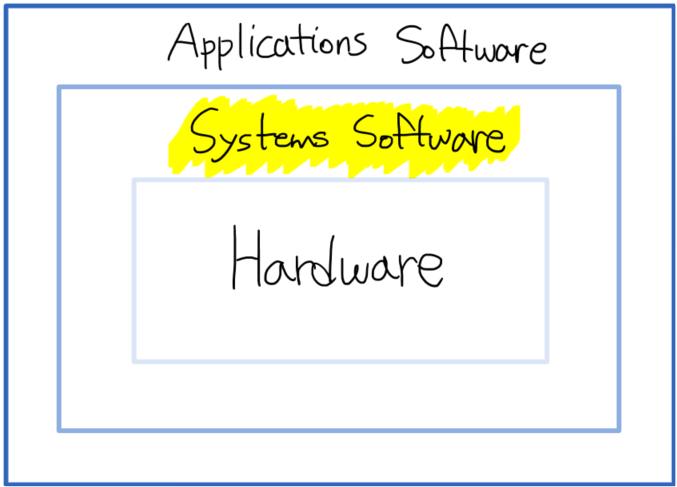
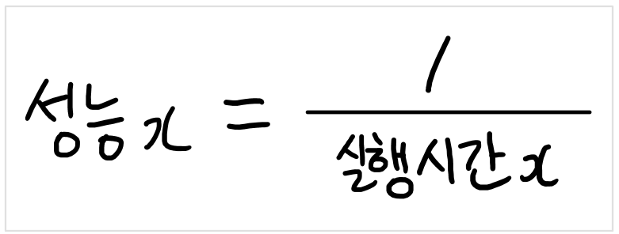
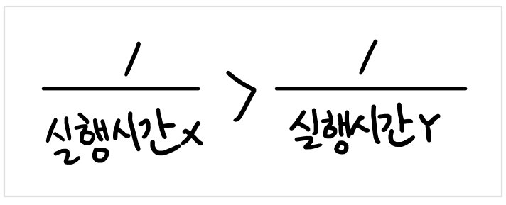
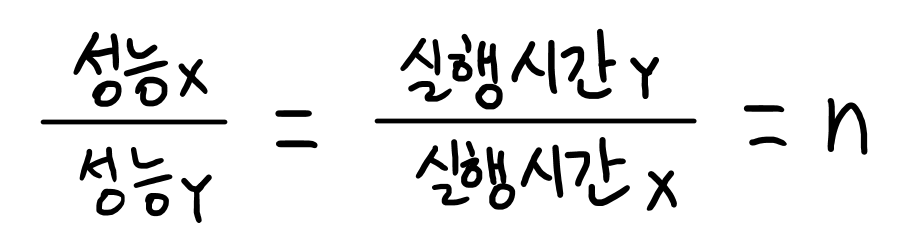
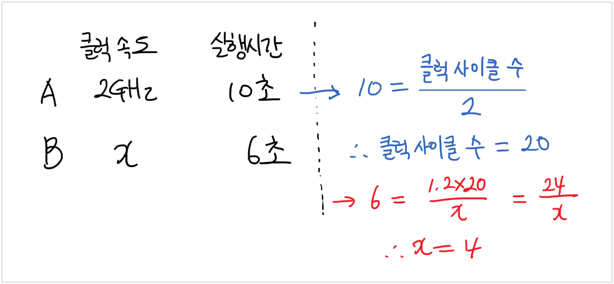
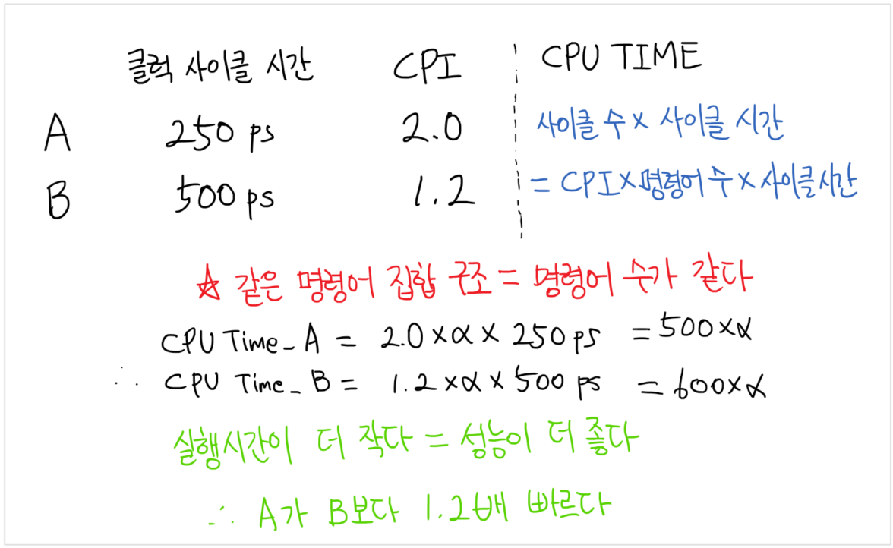

# CS - 컴퓨터구조 

## 1장 - 컴퓨터 추상화 및 관련 기술

### 1.1 서론

> 왜 컴퓨터 구조를 배워야하는가?

- 우수한 프로그래머들은 항상 자기가 작성한 프로그램의 성능에 신경을 쓴다.
  - 1960,70년대에는 메모리 사용을 최소화하기 위한 노력을 하였고, 최근에는 PMD(Personal Mobile Device)나 클라우드에서 수행되는 프로그램의 에너지 효율성에 신경을 쓴다.
- 이러한 프로그램의 성능 향상을 위해서는 우리가 작성한 코드 아래의 계층에서 어떤 일이 어떻게 일어나고 있는지를 이해해야한다.
  - 이러한 이해가 없다면, 프로그램의 성능을 개선하거나 컴퓨터 간의 성능 차이의 원인을 밝혀내는 작업이 과학적 절차에 따라 이루어지지 못하고, 시행착오를 반복하며 어렵게 진행될 수 밖에 없다.
- **즉, 경쟁력 있는 소프트웨어 개발을 위해서는 컴퓨터 구조에 대한 지식을 늘려나가야 한다**


### 1.2 컴퓨터 구조 분야의 8가지 위대한 아이디어

##### 1. Moore의 법칙을 고려한 설계

- 무어의 법칙 (Moore's Law) : 하나의 칩에 들어갈 수 있는 트랜지스터의 수가 매 2년마다 두배씩 증가할 것이다.
- 현재는 무어의 법칙이 유효하지 않음
  현재는 하나의 칩에 들어갈 수 있는 트랜지스터의 수가 제한됨. (2000년대 초반까지 무어의 법칙이 잘 맞아떨어짐)
- 즉, 컴퓨터 설계자는 프로젝트를 시작했을 때의 성능이 아닌 종료 시점의 기술을 예상해야한다. (= 빠른 변화를 고려한 설계)

##### 2. 설계를 단순화하는 추상화

- 추상화(Abstraction) 
  - 여러 수준에서의 설계를 명시하는 것
  - 하위 계층의 세세한 부분이 상위 계층에 보이지 않게 하는 것
  - 어떤 복잡한 것들을 단순화해서 표현한 것

##### 3. 자주 생기는 일을 빠르게

- 자주 생기는 일을 빠르게 만든다

##### 4. 병렬성을 통한 성능 개선

- 작업을 병렬적으로 수행하여 성능을 높이는 설계를 한다.

##### 5. 파이프라이닝을 통한 성능 개선

- 컴퓨터 구조에서 많이 볼 수 있는 병렬성의 특별한 형태

##### 6. 예측을 통한 성능 개선

- '예측을 잘못해서 이를 복구하는 비용이 비싸지 않고, 예측이 성공할 확률이 비교적 높은 경우 예측한대로 일을 미리 수행한다.'
- 위와 같은 관념대로 일을 수행하는 것이 평균적으로 빠른 경우가 종종 있었다.

##### 7. 메모리 계층구조

- 최상위 계층에는 비트당 가격이 제일 비싸지만 작고 빠른 메모리를 사용하고, 최하위 계층에는 느리지만 크고 비트당 가격이 제일 싼 메모리를 사용한다.

##### 8. 여유분을 이용한 신용도 개선

- 컴퓨터는 속도 뿐 아니라 신뢰도도 좋아야한다.
- 모든 물리 소자는 장애가 발생할 수 있으므로 장애가 난 소자를 대치할 수 있도록 여유분을 준비하여 컴퓨터의 신용도를 개선한다.


### 1.3 프로그램 밑의 세계 

#### 소프트웨어 계층

> 응용 프로그램은 수백만 줄의 코드와 복잡한 소프트웨어 라이브러리를 사용한다. 하지만, 하드웨어는 아주 단순한 저수준의 명령어만 실행할 수 있다.
>
> 따라서, 복잡한 응용 프로그램을 수행하기 위해 단순한 컴퓨터 명령어로 번역하는 과정이 필요하다.

- 소프트웨어 계층



- 시스템 소프트웨어 : 공통적으로 필요한 서비스를 제공하는 소프트웨어 (ex. 운영체제, 컴파일러, 로더, 어셈블러)

  - 운영체제(Operating System) 

    - 사용자 프로그램과 하드웨어 간의 인터페이스 역할 수행
    - 실행 프로그램을 위해서 컴퓨터 내의 자원을 관리하는 감독 프로그램
    - 기본적 입출력 작업 처리, 보조기억장치 및 메모리 할당, 컴퓨터를 동시에 사용하는 여러 응용 프로그램들 간의 컴퓨터 공유 방법 제공
    - ex) Windows, Linux, iOS

  - 컴파일러(Compiler)

    - C, C++, Java 같은 상위 수준 언어로 작성된 프로그램을 하드웨어가 실행할 수 있는 명령어로 번역한다.
    - 즉, 상위 수준 언어 문장을 어셈블리 언어 문장으로 번역하는 프로그램이다.

  - 어셈블러(Assembler)

    - 기호로 된 명령어(어셈블리 언어)를 이진수 프로그램으로 번역하는 프로그램

      ※ 어셈블리 언어 : 기계 명령어를 사람이 생각하는 것과 비슷한 표시 방법인 기호식 표현으로 나타낸 것 

      ​	 ↔ 기계어 : 기계 명령어의 이진 표현(이진수로 표현된 각 문자를 비트(bit)라고 한다.)

      

  - 명령어의 번역 과정

    


### 1.4 케이스를 열고

> 하드웨어의 기능
>
> 모든 컴퓨터의 하드웨어는 __데이터 입력, 데이터 출력, 데이터 처리, 데이터 저장__의 네 가지 기본 기능을 수행한다.


#### 컴퓨터의 표준(기본) 구성 요소

1. 입력

2. 출력

3. 메모리

4. 프로세서

   4.1 데이터패스

   4.2 제어


##### 입출력장치

- 입력장치 : 컴퓨터에 정보를 공급하는 장치 ex) 키보드,마우스,터치스크린, 카메라 등
- 출력장치 : 연산의 결과를 사용자나 다른 컴퓨터에 보내주는 장치 ex) 디스플레이 등


##### 프로세서(=CPU)

- 데이터 패스와 제어 유닛으로 구성된 컴퓨터의 핵심 부분

- 프로그램의 지시대로 일을 하는 부분으로 보드 내에서 가장 역동적인 부분
- 숫자를 더하거나 검사하고 입출력장치에 신호를 보내 활성화하는 일 모두 프로세서가 수행하는 일이다
- 데이터패스 (datapath) : 산술연산을 수행하는 프로세서 구성 요소
- 제어 유닛 (control) : 프로그램의 명령어에 따라 데이터패스, 메모리, 입출력장치에 지시를 하는 프로세서 구성 요소
- 집적회로(IC : Intergrated Circuit)
  - 칩(chip)이라고도 부르며 수천만 개의 트랜지스터가 결합된 부품


##### 메모리

- 실행 중인 프로그램과 프로그램 실행에 필요한 데이터의 저장소
- 휘발성 메모리 (=메인 메모리, 주기억장치)
  - 전원이 공급되는 동안만 데이터를 기억하는 기억장치 
  - DRAM 등

- 비휘발성 메모리 (= 보조기억장치)

  - 전원 공급이 끊어져도 데이터를 계속 기억하는 기억장치
  - 다음 실행될 때까지 프로그램을 저장하는데 사용한다.
  - 자기 디스크(=하드 디스크), DVD, 플래시 메모리 등
    - 플래시 메모리 : 비휘발성 반도체 메모리로 DRAM보다 싸지만 느리고, 자기 디스크보다는 비싸고 빠르다.

- DRAM (Dynamic Random Access Memory)

  - 집적회로로 만든 메모리의 일종으로 어떤 위치든지 임의로 접근할 수 있다.
  - DRAM 여러 개를 한데 묶어서 프로그램의 명령어와 데이터를 기억하는데 사용한다.

  ※ RAM : 자기 테이프 같은 순차 접근 메모리와는 반대로 메모리의 어떤 부분을 읽든지 같은 시간이 걸린다는 것을 의미한다.

- 캐시메모리 (Cache Memory)

  - 느리고 큰 메모리의 버퍼로 동작하는 작고 속도가 빠른 메모리
  - SRAM(Static Random Access Memory)을 이용하며 SRAM은 DRAM보다 빠르지만 집적도가 낮아 가격이 비싸다.


##### 명령어 집합 구조(ISA : Instruction Set Architecture)

> 하드웨어와 최하위 계층 소프트웨어 사이의 인터페이스
>
> 명령어, 레지스터, 메모리 접근, 입출력 등을 포함, 정확히 작동하는 기계어 프로그램을 작성하기 위해서 알아야 하는 모든 정보

- 컴퓨터 설계자로 하여금 실행 하드웨어와 독립적으로 컴퓨터의 기능을 생각할 수 있게 해준다.
- 명령어 집합 중 사용자 부분과 응용 프로그래머가 사용하는 운영체제 인터페이스를 합친 것을 ABI(Application Binary Interface)라고 한다.


### 1.5 프로세서와 메모리 생산 기술

- 트랜지스터(Transistor) : 전기 신호로 제어되는 온/오프 스위치

- 집적회로 제조 과정
  1. 실리콘 결정 괴를 0.1인치 이하의 두께로 얇게 잘라 웨이퍼(wafer)를 만든다.
  2. 한 웨이퍼에 독립적인 컴포넌트를 여러개 만들고 웨이퍼를 컴포넌트별로 잘라낸다.
     - 이 과정을 통해 웨이퍼에 결함이 생겼을 때 웨이퍼 전체를 버리는 대신 해당 다이만 버릴 수 있게 되어 효율성이 높아진다.
  3. 웨이퍼에서 잘라낸 개개의 사각형을 다이(die) 또는 칩(chip)이라고 한다.
     - 수율(yield) : 웨이퍼 상의 전체 다이 중 양호한 다이의 비율
  4. 다이의 크기가 커지면 웨이퍼에 넣을 수 있는 다이가 적어져 수율이 떨어지고 이는 집적회로 가격의 증가를 야기한다.
  5. 원가 절감을 위해 트랜지스터와 다이의 연결선 크기를 줄임으로써 다이를 축소시키기도 한다.
  6. 결함이 없는 다이는 패키지의 입출력 핀과 연결하는 본딩 과정을 거친다.


### 1.6 성능

#### 성능의 정의

- 응답시간 : 실행시간이라고도 하며, 컴퓨터가 task를 완료하기까지의 걸린 총 소요시간으로 응답시간이 적을수록 성능이 좋다고 판단한다
- 처리량 : 대역폭이라고도 하며, 단위시간당 완료하는 task의 수를 나타내는 응답시간과 다른 성능 척도 중 하나이다.
- 주로 개인 휴대용 기기의 경우 응답시간을, 서버의 경우 처리량을 성능 판단의 척도로 사용한다.

- 예시

  1. 컴퓨터의 프로세서를 더 빠른 버전으로 바꾼다

     → 응답시간을 단축시키게 되며 응답시간을 단축시키면 대부분 처리량이 좋아진다. 따라서 응답시간과 처리량 모두 개선된다.

  2. 여러 개의 프로세서가 각기 다른 task를 담당하는 시스템에 하나의 프로세서를 더 추가한다.

     → 위의 경우 처리량이 개선되는 경우이다. 하지만, 처리해야하는 task가 프로세서의 처리량보다 늘어나게 되면 일부는 대기시간이 필요하다. 이 경우 처리량이 커지면서 대기시간이 짧아지게 되므로 응답시간이 개선된다.

  ※  이와 같이 대부분의 실제 컴퓨터에서 실행시간이나 처리량 중 하나가 변하면 다른 쪽에도 영향을 끼치게 된다.

- 성능과 실행시간의 관계

  컴퓨터x의 성능과 실행시간의 관계는 다음과 같이 표현된다.

  

​	만약, 컴퓨터 x와 컴퓨터 y에 대해 x의 성능이 y의 성능보다 좋다면 다음과 같이 표현할 수 있다.




- x가 y보다 n배 빠르다면 다음과 같다

  


#### 성능의 측정

> 시간은 컴퓨터 성능의 가장 기본적인 척도이다.
>
> 같은 작업을 최단 시간에 실행하는 컴퓨터가 가장 빠른 컴퓨터이다.


##### 프로그램 실행시간의 정의

1. 응답시간(=경과시간)

   - 한 작업을 끝내는데 필요한 전체 시간

   - 디스크 접근, 메모리 접근, 입출력 작업, 운영체제 오버헤드 등의 모든 시간을 더한 것

   - 시스템 성능

     

2. CPU 실행시간(=CPU 시간)
   - 특정 작업의 실행을 위해 CPU가 소비한 실제 시간
   - 입출력에 걸린 시간이나 다른 프로그램을 실행하는데 걸린 시간은 포함되지 않는다
   - 사용자 프로그램 실행에 소요된 **사용자 CPU 시간**과 운영체제가 이 프로그램을 위한 작업을 수행하기 위해 소비한 **시스템 CPU 시간**으로 나눌 수 있다. (두 가지를 정확하게 나눠서 구하는 것은 매우 어려움)
   - CPU 성능

- 사용자가 느끼는 응답시간은 CPU 시간이 아니라 경과시간


##### 하드웨어의 함수 처리 성능

###### 클럭

> 컴퓨터의 모든 부품은 특정한 전기적 신호에 맞춰 동작하는데 이 신호를 클럭이라 한다
>
> - 0과 1로 모든 작동이 이뤄지는 시스템 상에서 0과 1을 오가는 것을 클럭이라고 함
>
> 단위는 Hz(헤르츠)이고 0과 1을 1초에 한번 오가면 1Hz로 표시한다


1. 클럭 사이클(=틱, 클럭 틱, 클럭 주기, 클럭, 사이클)
   - 일정한 속도를 가지고 동작하는 프로세서 클럭 한 주기 동안의 시간
2. 클럭 주기
   - 한 클럭 사이클에 걸리는 시간
   - 클럭 속도는 클럭 주기의 역수


##### CPU 성능과 성능 인자

> 사용자가 사용하는 척도와 설계자가 사용하는 척도가 서로 다른 경우가 많다.
>
> 서로 다른 척도 간의 상관관게를 구함으로써 설계상의 변화가 사용자가 느끼는 성능에 얼마나 영향을 미치는지 평가할 수 있다.

- 사용자는 주로 프로그램 실행시간을 설계자는 하드웨어의 처리 성능을 성능의 척도로 사용한다.


- CPU 시간

  <hr>

  $$
  프로그램의 CPU 실행시간 = 프로그램의 CPU 클럭 사이클 수 \times 클럭 주기
  $$

  

  <hr>

  - 클럭 속도와 클럭 사이클 시간은 역수 관계이므로 위 식은 다음과 같이 표현된다.
    $$
    프로그램의 CPU 실행시간 = \frac{프로그램의 CPU 클럭 사이클 수}{클럭 속도}
    $$
    
  - 위 공식을 통해 성능 개선을 위해서는 클럭 사이클의 수 혹은 주기를 줄여야함을 알 수 있음
  
  - 클럭 주기를 줄인다 = 클럭 레이트(=클럭 속도)를 늘린다
  
  - BUT 보통은 클럭 레이트를 높이면 클럭 사이클의 수가 증가한다.
    그렇기 때문에 이 두개의 비율을 잘 조정해서 성능이 제일 향상되는 포인트를 찾아야한다.
    
    

※ 예제

```tex
2GHz 클럭의 컴퓨터 A에서 10초에 수행되는 프로그램이 있다. 이 프로그램을 6초 동안에 실행할 컴퓨터 B를 설계하고자 한다. 클럭 속도는 얼마든지 빠르게 만들 수있는데, 이렇게 하면 CPU 다른 부분의 설계에 영향을 미쳐 같은 프로그램들에 대해 A보다 1.2배 많은 클럭 사이클이 필요하게 된다고 한다. 컴퓨터 B의 클럭 속도는 얼마로 해야하는가?
```




##### 명령어 성능

> 지금까지는 프로그램 수행에 필요한 명령어 수를 고려하지 않았으나, 실행시간은 프로그램의 명령어 수와 관련이 있을 수밖에 없다.

$$
CPU 클럭 사이클 수 = 명령어 수 \times CPI
$$

- 프로그램의 명령어 수는 컴파일러, 프로그램의 알고리즘, ISA(명령어 집합 구조) 등에 의해 결정된다
- CPI(=Clock Per Instruction) : 명령어당 클럭 사이클 수
  - 프로그램 전체 혹은 일부에서 명령어 하나의 실행에 필요한 평균 클럭 사이클 수
  - 명령어마다 실행시간이 다르기 대문에 CPI는 프로그램이 실행한 모든 명령어에 대해 평균값을 사용한다.
    - 명령어들의 비율을 계산한 CPI = Average cycles per instruction(acpi)
    - cpu 하드에 의해 결정되며 각각의 명령어는 각각의 cpi를 갖기 때문에, acpi를 활용해야하며 acpi는 명령어의 조합에 의해 영향을 받는다.
  - 명령어 집합 구조가 같으면 프로그램에 필요한 명령어 수가 같으므로 CPI는 서로 다른 구현을 비교하는 한 가지 기준이 될 수 있다.
    - isa가 같다 = 컴파일 했을 때 같은 명령어들의 조합이 나온다 = 명령어의 수가 같다

※예제

```tex
같은 명령어 집합 구조를 구현한 컴퓨터 두 종류가 있다. 컴퓨터 A의 클럭 사이클 시간은 250ps 이고 어떤 프로그램에 대한 CPI는 2.0이며, 컴퓨터 B의 클럭 사이클 시간은 500ps, CPI는 1.2이다. 이 프로그램에 관해서 어떤 컴퓨터가 얼마나 더 빠른가?
```




##### 고전적인 CPU 성능식

$$
CPU 시간 = 명령어 개수 \times CPI \times 클럭 사이클 시간
$$

- 클럭 사이클 시간은 클럭 속도의 역수이므로 

$$
CPU 시간 = \frac{명령어 개수 \times CPI}{클럭속도}
$$

- 성능에 영향을 미치는 세 가지 핵심인자로 표현한 식으로 매우 유용하게 사용된다.

- CPI와 명령어 수는 클럭 사이클의 수를 구하기도 한다
  $$
  클럭 사이클 수 = \displaystyle\sum_{i=1}^{N}(CPI\times명령어 수)
  $$
  

- 최종적으로 프로그램의 실행시간은 다음과 같다
  $$
  CPU실행시간 = \frac{명령어 수}{프로그램} \times \frac{클럭 사이클 수}{명령어} \times \frac{초}{클럭 사이클}
  			= 명령어 수\times CPI \times 클럭 주기
  $$
  

- 성능에 영향을 미치는 세가지 핵심인자
  1. CPU 실행시간
     - 실제 프로그램을 실행시켜 얻을 수 있음
  2. 클럭 사이클 시간
     - 컴퓨터 하드웨어 매뉴얼로부터 얻을 수 있음
  3. 명령어 개수와 CPI
     - 명령어 개수 : 소프트웨어 도구 혹은 컴퓨터 구조의 시뮬레이터를 이용해 측정 가능
     - 하드웨어 카운터로 두가지 모두 구할 수도 있다


전력장벽

더 이상 voltage를 낮출 수 없다(전력소비량) = 계속해서 전력을 사용해야함 = 열이 많이남 

높은 전력을 사용하면 되는데 그럴 수록 열이 높아져 이 열 문제를 해결할 수 없음

이러한 열 문제 때문에 clock frequency를 더 높이지 못하는 현상을 전력장벽이라고 함. 즉, 전력 때문에 더 이상의 성능향상이 어려워지는 현상


2004년 2005년 까지는 clock frequencey를 높임으로써 성능을 증가시켰다. 그런데 전력장벽으로 인해 더 이상 그 방법으로 성능향상이 불가해짐.

그렇다면 어떻게 성능을 증가시킬 것인가?

1. 멀티코어 : 하나의 칩에 여러개의 프로세서가 들어가있는 것

2. 멀티코어의 발생으로 여러개의 프로그램을 동시에 돌릴 수 있게 됨(parallel programming이 가능해짐)

   ※ instruction level parallelism

   	- 하드웨어가 한번에 여러 명령어를 수행
   	- 프로그래머는 관여하지 않고 하드웨어가 알아서 수행

3. parallel programming은 프로그래밍과 디버깅이 매우 어려움

4. parallel programming은 load inbalancing이 발생함 

5. 프로그램 간에 프로세서 간에 synchronization과 communication이 발생함


벤치마크

성능을 측정하기 위해 사용되는 프로그램 ex) SPEC CPU2006 : spec에서 만든 cpu 성능을 측정하는 벤치마크 

Reference machine에서 프로그램을 돌린 시간과 비교하여 성능 측정


