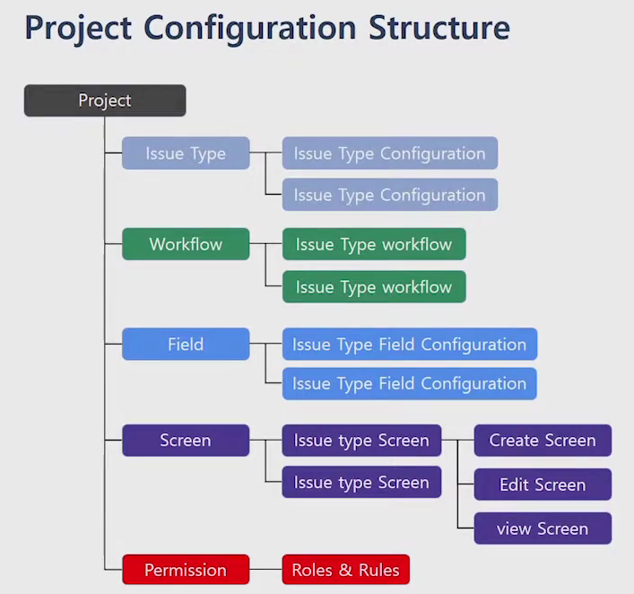
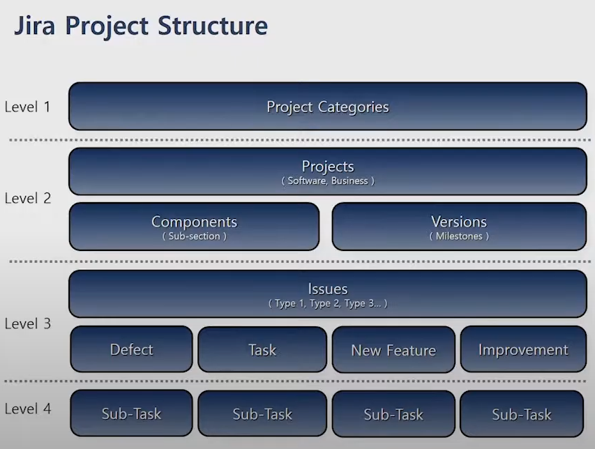
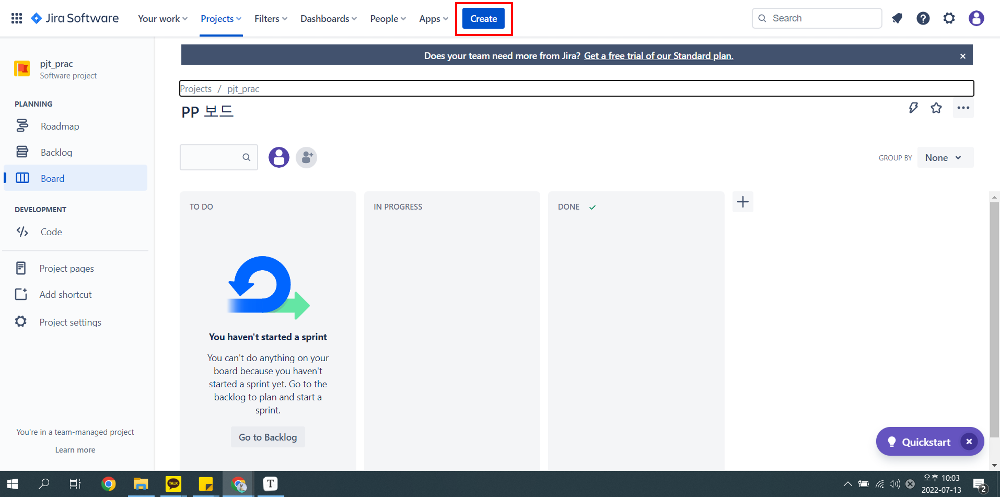
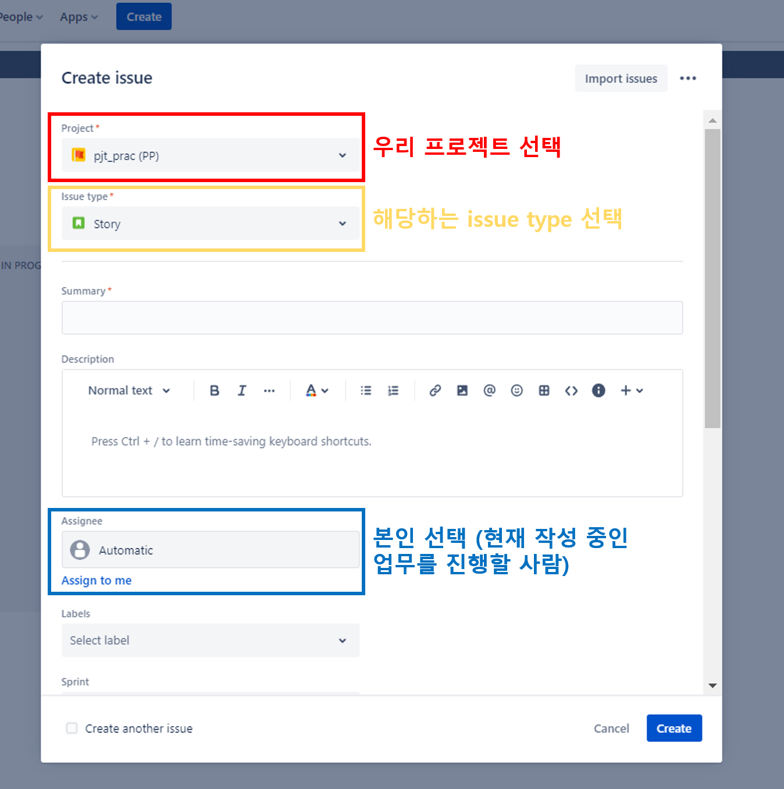
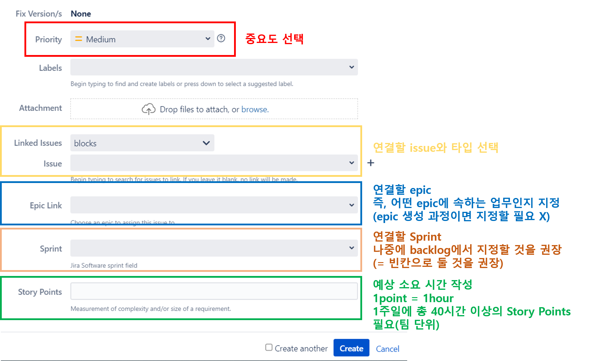
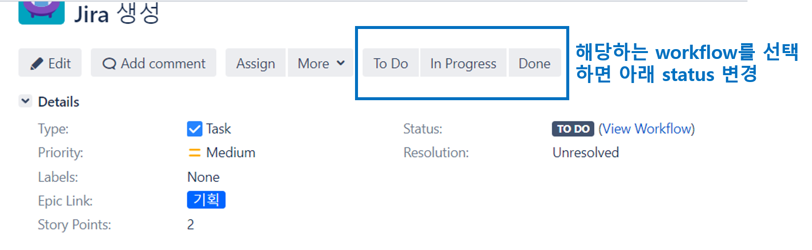
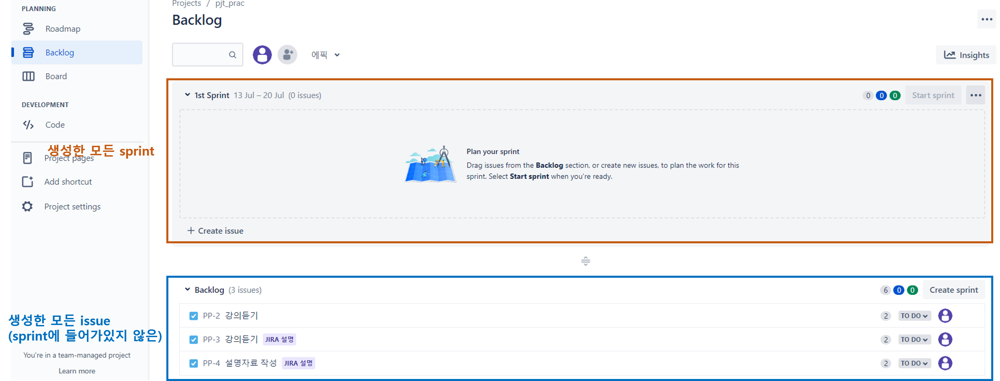
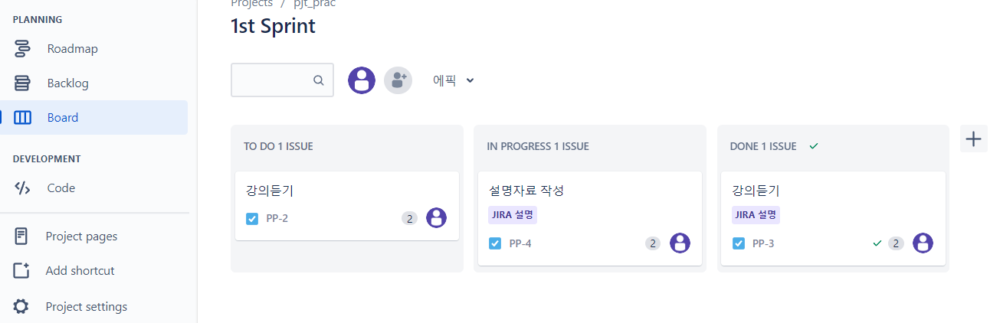

# JIRA

> 프로젝트 · 테스크 관리 솔루션

- 편리한 계획 수립 기능
- 작업 시간 관리
- 업무에 맞는 워크플로우 작성 

## Jira SW

> Software Project의 추적, 관리 보고를 위한 Agile 기반의 관리 솔루션
>
> 개발 방법론 기반의 Project & Issue Management 솔루션

#### Project & Issue Management

- Software Development Project는 Project 활동을 수행하기 위한 많은 Issue(수행해야할 과제)를 구성하여 수행
- Project는 Issue의 중첩, 비효율적 업무의 분배, Issue의 추적성 결여 등의 내부 문제들을 갖게 됨
  - 한명에게 너무 많은 issue가 몰려있지 않은지, 특정 issue의 진척도가 너무 낮지는 않은지 등을 체크해야함
- Project Management는 내부의 문제를 효율적으로 관리하여 Project 운영을 위한 체계를 구축함
  - 즉, 정책을 어떻게 가질 것이냐를 정하는 것
- Issue Management는 Issue의 owner/workflow 관리를 통한 정확한 업무의 진행 파악을 제공
  - workflow는 어떠한 업무 흐름을 가질 것인지를 의미
  - 즉, 이슈가 흘러가는 진행
    - ex) 작성 - 팀장 승인 - 개발 - 테스트 등

#### Jira SW 제공 기능

##### Project Management

- 프로젝트 정책을 어떻게 할 것이며, 아레나는 무엇인지, 어떠한 방법론을 기반으로 수행을 할 것이다 등을 정의 및 관리하는 것

  

##### Board Management

- Agile이 제공하는 Activity 보드들을 관리해서 이슈를 관리할 수 있는 방법 제공

  

##### Report & Dashboard

- 프로젝트가 잘 진행되고 있는지 아닌지 그렇다면 왜 잘 안되는지를 추적하기 위한 차트 및 가젯

##### Issue Management

- 사용자 레벨에서의 핵심
- 내가 할 일 들을 정확히 정보를 기입하고 정확하게 workflow를 추적시킬 수 있도록 status를 이동시키는 부분

#### Jira SW 사용자

##### 관리자 (administrator) 수행 역할

###### 1. Project Configurator 

1. Project 생성
   - 어떠한 방법론을 기반으로 만들 것인가?
2. Project Custom
   - 어떠한 형식으로 Project를 구성할 것인가? (project의 세부 구성 디자인 및 구현)
     - 관리 유형의 구성
     - Workflow 정의
     - 권한 및 역할 정의
     - 화면 UI 디자인

- Project Configuration Structure : Jira 안에서 만들어지는 프로젝트의 구조

  

  - 각 configuration은 모두 custom이 가능
  - JIRA는 하나의 프로젝트를 만들기 위한 기본적인 구성을 템플릿화해서 제공 (Create Project)

- JIRA에서 제공하는 템플릿 뿐 아니라 관리자가 직접 커스텀해서 사용할 수 있음
  - Issue Type, Workflow Design, Field Configuration, Screen 정의 및 구성, 역할 및 권한 설정 등을 Custom 할 수 있음
    - Issue에 대한 각종 정보는 `Field` 라는 이름으로 들어감
    - ex) 우선순위, model 등 다양한 정보
  - Custom 된 내용을 하나의 템플릿으로 저장할 수 있음

##### 사용자 (User) 수행 역할

- 사용자가 접하게 될 JIRA 프로젝트 구조

- Project Categories
  - 공통된 목적의 프로젝트를 하나의 집합으로 만들 수 있음
- Projects
  - 하나의 실제 프로젝트
- Versions
  - 이슈들의 버전 관리
- Components
  - 이슈들에 대해서 영역을 분리시킬 수 있음 (DB영역, UI영역 등)
- **Issues**
  - 실제 과제
  - Issue는 프로젝트에서 각 사용자가 수행하는 활동의 정의
  - Issue의 관리를 통하여 Project 업무 환경, 생산성, 가중치를 파악
  - 개발 방법론에 의한 다중의 유형으로 Issue를 관리 및 추적
  - Issue는 사용자 활동의 세부 정보를 기록 및 관리
    - 각 Issue 별로 관리하는 정보가 다름
      - 이를 Field로서 정의
      - 설명, 첨부파일, 우선순위, 중요도 등의 세부 정보
  - 각 Issue는 서로 관계성을 갖게 되며 관계성을 통해 추적성을 강화
    - 횡적으로 관계성을 가질 수도 있고 종적(Parent-Child 관계) 관계로 관계성을 가질 수도 있음

###### 2. Project Manager

1. Issue 생성
   - 요구사항 기반 개발 과제를 Issue로 등록
2. 담당 지정 및 진행 상태 관리
   - 효율적인 운영을 위한 담당자 분배 및 업무 진행 상태 관리
3. Board 관리
   - Scrum & Kanban Board를 통한 프로젝트 진행 관리
4. Dashboard 관리
   - 프로젝트 진행의 가시성을 확보하기 위한 Dashboard 운영 관리

###### 3. Project Member

1. Issue의 생성 및 진행
   - 프로젝트 내 자신이 수행 할 Issue를 등록 및 Manager에게 지정 받은 Issue의 진행
2. Issue의 종료
   - 개발 과제에 대한 정확한 완료 처리 수행
3. Board에서의 Issue 진행
   - Board에서 Issue에 대한 처리 및 작업 진행을 수행

#### Jira SW 사용자(User)가 수행할 업무

##### Create Issue(Manager)

- Jira Project의 사용자 활동은 Issue를 생성으로 활동 시작
- Issue는 다음의 활동을 기반으로 생성
  - 요구사항 기반의 기능 구현 (story, task)
  - 구현 과제의 세부 활동 (sub task)
  - 유지보수 기반의 수정 (Bug, Defact)
- 개발 방법론에 의한 다중의 유형으로 Issue를 관리 및 추적
- `Create` 버튼 클릭
  - 필요한 정보 입력 (담당자 지정)

##### Filter & Issue view(Member)

- 모든 생성된 Issue는 쉽게 추적할 수 있도록 Issue view를 제공
  - Issue List View : 전체 Issue List 및 컬럼 정보를 파악
  - Details View : Issue별 상세 페이지를 표시하여 정보를 파악
- Issue View 는 Filter(조회 조건)을 통하여 Issue List를 제공
- 사용자는 생성된 Filter (혹은 생성한 Filter)를 통하여 Issue의 접근 세부 작업을 수행
- 다양한 이슈들을 추적할 수 있도록 filter를 제공
- 이런 필터에 대한 결과를 쉽게 볼 수 있도록 view를 제공

##### Edit & Transition Issue (Member)

- Issue의 관리 되는 정보는 진행에 따라 다양하게 변경이 발생
  - 발생되는 변경은 손쉽게 사용자에게 편집 환경을 제공
  - 수정에 대한 이력 관리 제공
- Issue의 진행 상황은 Project Template에서 제공하는 Status & Transition 을 통하여 Issue 진행을 관리
  - workflow를 변경한다는 뜻
  - Transition 버튼을 누름으로써 변경됨
- 최종 작업이 끝난 Issue의 정확한 closed 상태를 관리하여 Project의 생산성을 관리할 정보를 관리
  - Issue가 끝났을 때 좀 더 디테일한 정보를 넣을 수 있음

##### Board Management(Manager)

- Jira Project template 중 Agile 방법 기반의 Template에서는 각 유형별 Board를 운영할 수 있도록 기능 제공
- Jira Project Board
  - Scrum Board 
    - 반복 주기(Sprint)에 따라 수행되는 Issue를 관리
    - Planning을 중시
    - 주기 안에 끝내야할 일들을 정의하고 해당 과제가 끝나지 않으면 왜 못 끝냈는지 이슈를 추적하는 과정
    - 이를 기반으로 Next Plan 설정
    - 모든 Issue들을 Backlog라고 부름
  - Kanban Board 
    - 제품 릴리즈 기반의 상태별 Issue를 관리
    - 실질적으로 어떤 일들이 얼마나 잘 처리되고 있는가
    - 유지 보수 레벨에서의 방법론
- Board 관리는 다음의 작업을 지원
  - Planning을 통한 Issue의 관리
  - Active Board를 통한 Issue의 진행 관리
  - Release 정의를 통한 Project 생산성 관리
  - Report를 통한 Issue의 추적 관리

##### Dashboard (Manager)

- Jira Project는 Dashboard를 사용하여 Issue의 현재 상황을 쉽게 파악할 수 있도록 지원
- Board는 Private / Public 형식으로 구성이 가능
- 다양한 유형의 Garget을 제공하여 손쉽게 구성이 가능
- 프로젝트의 진행도를 가시성 있게 표현할 수 있는 도구

※ 칸반 vs 스크럼 

https://velog.io/@dal-pi/Scrum-%EA%B3%BC-Kanban

https://pearlluck.tistory.com/649

### Jira 사용 전 해야 할 일

#### 1. 월요일 회의

- 각자 일주일 동안 할 일 공유하기

- 회의를 통해 이슈 추가 및 삭제

#### 2. 플래닝 포커(Scrum Time App 사용)

- 각 이슈마다 걸릴 시간 생각 및 공유하기

- 최대치와 최소치의 평균을 구해 Story Point 산정하기

- 5 포인트 이상 Story로 추정될 시 2개 이상의 Story로 쪼개기

- 한 Story를 최대한 단순하게 만들어 되도록 스프린트 내에 일정 맞추기

### 사용방법 (to 팀원들)

#### 1. Issue (할 일) 생성

- 최상단에 위치한 `Create` 클릭

  

- 각각의 내용 입력

  

  - issue type 

    - Epic
      - 대분류의 개념
      - 모든 이슈는 하나의 Epic에 속해야함
      - ex) FE, DB, 게시판, 기획 등등
    - Stroy
      - 하나의 기능을 구현하기 위한 스토리
      - 사용자의 이야기
      - ex) 회원가입을 한다, 유저가 로그인한다 등
    - Task
      - 실제 상세 업무
      - ex) 기본 폼 만들기, 유효성 검사 만들기, api 연결하기 등

  - summary & description

    - 해당 issue에 대한 설명 작성

    

  

  - Linked Issues 

    - 다른 issue와 연결할 때 사용
    - blocks : 연결된 issue는 해당 issue가 완료되어야만 시작 가능
    - is blocked by : 해당 issue는 연결된 issue가 완료되어야만 시작 가능

  - Story Points

    - 무작정 40시간을 채우기 위해 쉬운 업무에 많은 시간을 부여해서는 안됨
    - 추후에 확인해봤을 때 burndown chart에서 적절치 못한 일정관리로 평가될 수 있음

    

- 생성된 issue detail

  

  - 본인이 수행한 업무에 맞게 workflow 지정할 것

### 2. Sprint

- backlog 영역에서 생성된 모든 Sprint와 issue 확인 가능

  

  - 아래에 있는 issue를 sprint로 이동 시킬 수 있음 (Drag & Drop으로 가능)

- sprint에 할당하면 board에서 정리된 내용 확인 및 필터 처리(내가 해야하는 일만 보기 등) 가능 

  
