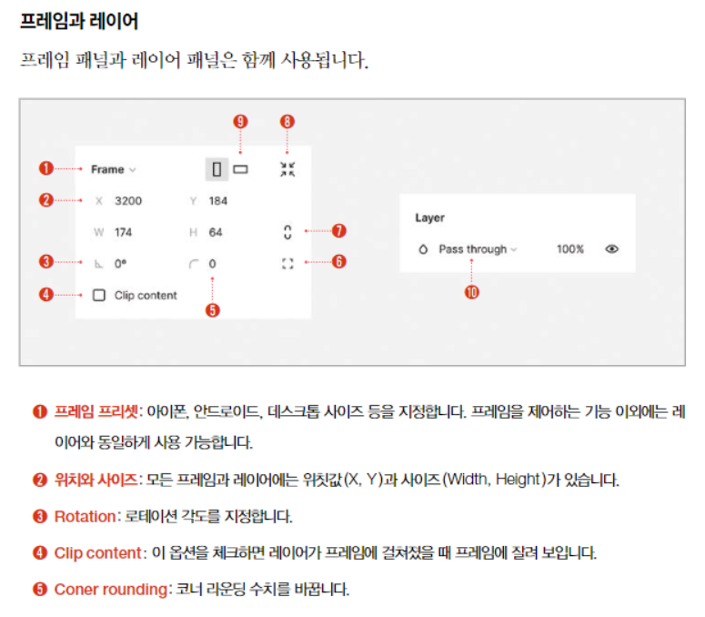
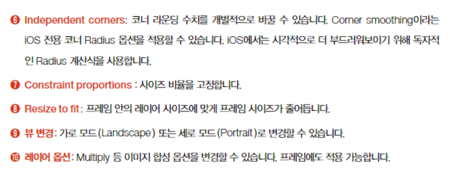
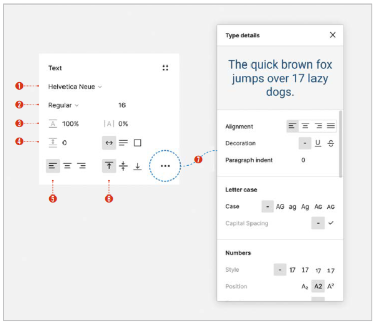
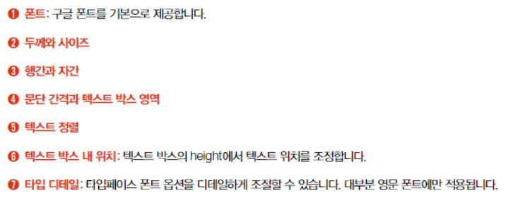
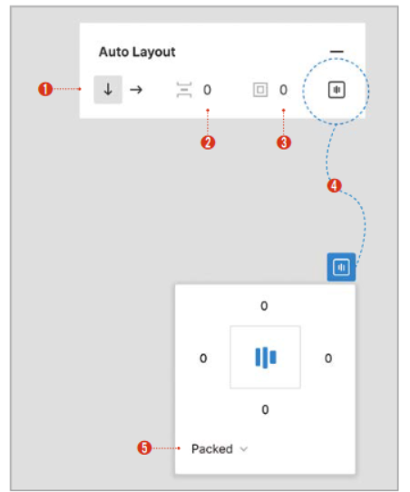
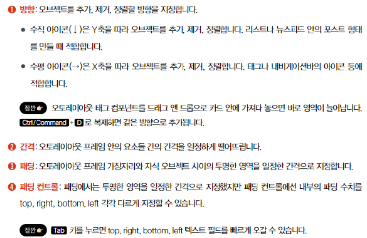
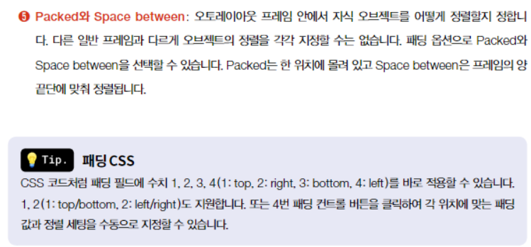

# UX/UI 디자이너를 위한 실무 피그마

## 피그마 기본 인터페이스

- 파일 캔버스 : 새파일 생성 후 나타나는 디자인 가능한 빈 영역
- FigJam : 온라인 화이트보드 & 프레젠테이션 툴, 피그마의 디자인을 피그잼으로 가져와서 시안을 공유하고 아이디어를 나누는 용도로 주로 사용

### 상단 도구 모음

- Frame
  - 디자인하는 영역을 지정하는 툴
  - 단축키 : `A` or `F`
- Slice
  - export할 이미지의 영역을 지정
  - 단축키 : `S`
- Move
  - 단축키 : `V`
- Scale
  - 오브젝트나 레이어 전체의 비율 변경 가능
  - 단축키 : `K`
- Pen
  - 도형을 더블클릭하여 벡터 편집 시작
    - `Enter` 키를 눌러 편집 오나료
    - 편집 도중에 펜툴로 원하는 위치를 선택하면 새로운 앵커 포인트 추가 가능
    - 단축키 : `P`
- Pencil
  - 자유 도형을 그릴 수 있으며 자동으로 자연스러운 곡선인 베지어 커브로 조절됨
  - 단축키 : `Shift` + `P`
- Text
  - 툴 선택 후 클릭시 텍스트 박스 생성
  - 툴 선택후 드래그할 경우 fixed 사이즈의 바운딩 박스 레이어 생성
  - 단축키 : `T`

### 뷰 세팅

- 줌(zoom) : 뷰를 확대하거나 축소. 디자인이 캔버스 내 어디에 있는지 보이지 않을 경우 Zoom to fit을 활용하여 캔버스에 전체 디자인이 나타나도록 할 수 있음
- 픽셀 프리뷰(Pixel Preview) : 줌을 확대했을 때 비트맵 이미지가 깨지는 정도를 확인할 수 있음. 1x,2x에서 어떻게 보이는지 export하지 않고도 체크할 수 있음
- 픽셀 그리드(Pixel Grid) : 줌을 확대했을 때 1px 단위의 그리드 선이 보이는 옵션을 끄고 켤 수 있음
- 스냅 투 픽셀 그리드 (Snap to Pixel Grid) : 디자인 요소가 1px 정수 단위로만 이동하게 만들 수 있음
- 레이아웃 그리드 (Layout Grid) : 레이아웃 그리드를 켜고 끔
- 자 (Rules) : 자 기능 on/off
- 아웃라인 (Outline) : 모든 백터 요소를 아웃라인으로 확인 가능
- 멀티플레이어 커서 (Multiplayer Cursors) : 디자인을 공유하고 실시간으로 작업할 때 다른 사람의 커서를 안 보이도록 할 수 있음

### 8px 그리드

- 디자인 에셋의 사이즈, 간격 및 모든 수치를 8단위로 맞추면 모든 디바이스에서 픽셀이 깨지지 않고 개발 친화적인 디자인이 가능
- 따라서, 디자인 요소들의 사이즈는 8의 배수로 결정해야 이미지가 깔끔하게 렌더링됨
- 8의 배수로만 디자인하면 단위가 너무 커질 수가 있어서 4,2 단위도 사용함
- 스크린 사이즈가 8bit를 기준으로 발전했기 때문에 이와 같은 현상 발생
- 8px 적용 가능 요소
  - Font Size, Line Height, Padding, Margin, Radius, Fixed Width, Fixed Height
- [Preferences > Nudge amount]에서 방향키를 눌렀을 때 변동되는 수치를 조절 할 수 있음
  - Big nudge 는 `shift`+ `방향키`를 입력했을 때 변동되는 수치로 기본은 10px이나, 8px로 변경하면 8px 그리드를 적용하기 편리함

### 패널 기능

#### 채우기

- Opacity : 불투명도
- Multiply : 곱하기
- image - crop : 원하는 만큼 자르기
- image - fill : 도형에 빈틈없이 이미지 채우기
- image - fit : 도형의 넓은 부분에 맞춰 이미지 넣기 (여백 생김)

#### 텍스트

## 레이아웃

### 스마트 셀렉션

- 2개 이상의 오브젝트를 선택했을 때, 정렬과 간격을 쉽게 조절할 수 있도록 하는 기능
- 즉, **복수의 오브젝트를 선택**하고 좌우 간격 혹은 상하 간격을 자동으로 분배할 수 있음
  - Distribute Vertically
  - Distribute Horizontally
  - TidyUp as Grid
- 균등 간격으로 분배된 복수의 오브젝트를 선택했을 때 나타나는 자주색 가이드 선과 핸들을 활용해서 훨씬 용이하게 조작 가능
  - 자주색 선 = 모든 오브젝트 간 간격 조절
  - 핸들 = (색이 칠해져있는 원) 해당 오브젝트 선택
    - 선택 후 이동시 다른 오브젝트와 위치 바꾸기
    - 선택 후 Ctrl + 드래그 : 해당 오브젝트만 사이즈 조절
    - 선택 후 Alt + 드래그 : 해당 오브젝트만 중심으로부터 리사이징
    - 선택은 복수로도 가능함

### 콘스트레인트

> 어떤 오브젝트의 위칫값을 상하좌우에 강제로 고정하는 기능
>
> 프레임은 부모, 오브젝트는 자식 요소이며 부모가 움직일 때 자식 요소도 영향을 받는다

##### 수평(Horizontal) 옵션

- Left : 프레임의 왼쪽에 오브젝트 위치 고정
- Right : 프레임의 오른쪽에 오브젝트 위치 고정
- Left and right : 오브젝트의 사이즈와 위치를 좌우 프레임에 상대적으로 고정. 오브젝트가 x축을 따라 늘었다 줄었다 한다.
- Center : x축 센터에 오브젝트의 위치 고정
- Scale : 프레임의 사이즈에 따라 오브젝트의 비율과 사이즈가 결정됨. 예를 들어 프레임의 width가 100px, 오브젝트의 width가 70px일 때, 프레임 width가 200px가 되면 오브젝트의 width는 140px가 된다.

##### 수직(Vertical) 옵션

- Top : 프레임의 위쪽에 오브젝트의 위치 고정
- Bottom : 프레임의 아래쪽에 오브젝트의 위치 고정
- Top and bottom : 오브젝트의 사이즈와 위치를 상하 프레임에 상대적으로 고정. 오브젝트가 y축을 따라 늘었다 줄었다 한다
- Center : y축 센터에 오브젝트의 위치를 고정
- Scale : 프레임의 사이즈에 따라 옵젝트의 비율과 사이즈가 결정

##### 그 외

- 그룹에 콘스트레인트를 적용하면 그룹에 포함된 오브젝트에 자동 적용됨
- 적용된 콘스트레인트를 해제하지 않고 콘스트레인트를 미적용하면서 리사이징하고 싶다면 Ctrl을 누른채로 리사이징한다.

### 레이아웃 그리드

- 간격 등을 쉽게 맞출 수 있도록 돕는 듯
- row, column 지정하여 칸을 동일하게 나눠줌
  - 즉, 격자를 볼 수 있는 느낌
  - `shift`+`ctrl`+`4` 

### 오토레이아웃

> 프레임과 컴포넌트에 추가 가능한 속성
>
> 내용이 변하면 그에 따라 디자인이 늘어나거나 줄어들도록 도와줌
>
> 오토레이아웃은 프레임에 적용되기 때문에 오브젝트를 선택하고 적용해도 그 위에 오토레이아웃 프레임을 새로 생성함

#### 오토레이아웃 패널

#### 리사이징

- 부모그룹의 사이즈를 변경할 때 안의 자식 콘텐츠가 어떤 기준으로 늘어나는지를 지정할 수 있음
- Hug contents : 콘텐츠 사이즈만큼 프레임이 줄어듦
- Fill Container : 부모 컨테이너 사이즈에 맞게 자식 컨테이너가 늘어남
- Fixed width/height : 고정된 콘텐츠 사이즈 유지

## 베리언츠

> 컴포넌트 세트를 만드는 것
>
> 상탯값, 속성별 특성을 손쉽게 바꿀 수 있음

- 속성(property)과 값(value)으로 이루어져있음
- 복수의 컴포넌트를 만들고 combine as variants로 베리언츠 생성
  - 이 때, 컴포넌트의 이름으로 속성과 상태값을 분리시킬 수 있음
    - ex) 1번 컴포넌트 : toggle/on. 2번 컴포넌트 : toggle/off
      => toggle 베리언츠의 프로퍼티1은 on/off로 구분됨
    - 생성 후 프로퍼티명을 바꿀 수 있음
  - 프로퍼티를 추가하고 싶은 경우 properties에서 + 버튼 클릭
    - 기본값과 이름 지정
    - 새로운 값에 해당하는 컴포넌트 생성 후 속성에 새로운 값 지정
- 컴포넌트 이름을 각 속성에 맞춰서 잘 지어야함
- 만약, 복수의 레이어를 한번에 변경하고 싶은 경우 Rename Layers 기능 사용
  - 마우스 오른쪽 클릭 > Rename Layers 
- 베리언츠는 해당 점선 영역 안에 포함된 컴포넌트만 베리언츠로 인식
