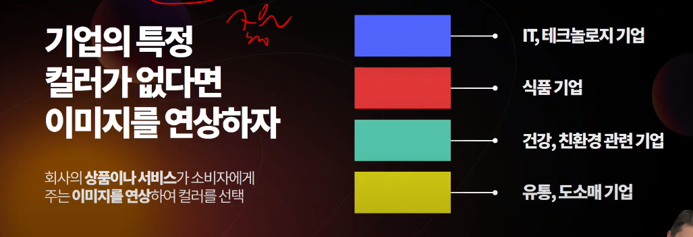

# 포트폴리오 디자인 업그레이드

## Principle 1 : Be Ready

- ppt 제작이 익숙하지 않다면 첫 장에 기준표를 제작해놓고 시작할 것

- 장표마다 디자인이 달라지면 안됨 (컬러, 폰트 등등) ppt는 디자인이 제한되어야함

- 글꼴 추천 : Noto Sans, 본고딕, HG 꼬딕씨, 삼성원

- 예시

  

- tip : 단축키 `Ctrl`+`Shift`+`C` or `V` 서식까지 복사 붙여넣기 가능

- 사이즈는 대부분 16:9 (사이즈 확정 뒤 수정은 사실상 불가), 4:3도 있음(but 잘 쓰지는 않음)

## Principle 2: Number

> 숫자가 없으면 상대는 설득되지 않음

- 근거를 모두 **수치화** 시켜야함
- 감정과 추상보다는 숫자로 설득시킨다
- 숫자는 PPT의 언어
- 내가 말할 대본을 똑같이 ppt에 적어놓으면 상대방은 지루해한다.
  - ex) 인간의 평균수명은 어쩌구저쩌구~ 보다는 26년이라는 수치를 강조하는 슬라이드
  - ex)

## Principle 3: Magic Number

> 템플릿을 찾지마라, 내용에 맞는 디자인이 붙어야되는데 남들이 만들어놓은 디자인에 내 내용을 붙여놓는 것 절대 잘못된 것

- 근거는 **3개**가 가장 적합

- 글을 뭉텅이로 넣어놓는 것은 별로

  - 차라리 해당 문장을 암호화 시키는 것이 좋음
  - 그리고 그 페이지를 여러 장으로 쪼개놓는 것이 좋음

- 예시

  - worst

    

  - best (암호화 예시)

    

    - 암호화 이후 쪼개기 예시

      

      

## Principle 4: 사람을 이해하는 PPT

#### 레이아웃 작성시 순서 기준

- Z형 : 사람의 시선은 Z 방향으로 흐른다
- LR형 : 왼쪽에서 오른쪽으로 인과가 이루어진다
  - 왼쪽 원인, 오른쪽 결과
- TB형 : Top → Bottom. 시간 순으로 위에서 아래로 흘러야함
  - 예외 : 연혁인 경우에만 가장 최근의 일을 맨 위에 위치
    - 

## Principle 5: Blind Text

> 보는 사람이 읽을 필요가 없는 Text를 의미
>
> 디자인 혹은 발표자를 위해 사용(읽는 사람을 위한 것이 아님)

- 디자인을 했는데 무언가 부족하고 허전하다고 느껴질 때, 사방에 못을 박아라!

  - 있다가 없어도 됨 (계속 갖고 있을 필요 없다는 것)

    

- 이미지를 사용할 때는 Behance에서 찾을 것

  - 구글보다 훨씬 ppt에 어울리는 이미지 나옴

- 블라인드 텍스트로 커닝페이퍼를 만들 수도 있음. 즉, 보는 사람이 읽기 위한 내용이 아닌 나를 위한 내용

  

  - 하단 문단이 블라인드 텍스트에 해당
  - 디자인을 해치지 않는 선에서 가능

## Principle 6: 덩어리감의 이해

- 자간은 줄이는 것이 better
- 여러 줄이 필요할 때는 텍스트 박스 여러개로 사용할 것 (한 텍스트 박스에 여러줄 x, 여러 텍스트 박스 o)
  - 3d 효과도 낼 수 있음
  - 어긋나있는 것을 쉽게 수정할 수 있음

## Principle 7: PowerPoint is not a Design Program

> ppt 내부에서 찾지말고 외부 툴을 사용하라!

- 컬러는 훔쳐서 써라!
  - 삼성, 애플 등의 홈페이지에서 색상 혹은 디자인을 차용하면 된다.
  - behance에 컬러를 입력해서 좋은 색상을 찾을 것
    - blue 검색, red 검색 등등
    - red blue 검색하면 두가지 모두 사용한 경우 확인 가능
- **Everypixel**: 모든 stock 사이트의 검색 결과를 보여줌
- **removebg** : 배경제거하기 가장 편한 사이트(ppt 내부 기능은 그닥 좋지 않음)
- 이모지 
  - ppt에는 무조건 icon을 넣어야된다 (X)
    - 실패할 확률이 높음, 올드한 느낌
  - 텍스트가 너무 차가워보일 때 사용
  - 크기는 무조건 글자와 동일하게
  - **emojipedia**: 모든 이모지를 모아놓은 사이트
- 목업
  - **placeit.net** : 목업 툴 쉽게 활용할 수 있음, 동영상도 가능
- 입체감 주기
  - **shapefest.com** : 입체감있는 도형을 제공
- 모션(움직이는 아이콘)
  - 말로 설명하기 어려운 생동감, 감정을 모션으로 채운다
  - **lottiefiles.com** : 모션을 gif 파일로 받을 수 있음
- 그래프
  - **magicpattern.design** 
    - chart generator :그래프의 여러 설정을 쉽게 설정 가능, 디자인은 덤
    - mesh gradients: grain 값을 쉽게 조정 가능
- PPT는 디자인용이 아니고 플랫폼이다!!!
  - 외부 요소를 마음껏 사용해라!!

## Principle 8: All about Color

- PPT 내에도 써야할 색이 있고 그렇지 말아야할 색이 있다.

  - 제출할 회사의 경쟁사가 떠오르는 색을 굳이 써야할 필요가 있을까?
  - 각 기업은 모두 특정 컬러를 갖고 있으니 참고할 것

- 애초에 괜찮은 이미지를 쓴다면 좋은 포인트 컬러를 가져올 수 있다.

  - 좋은 포인트 컬러를 가져와서 그라데이션까지 주면 금상첨화
  - 이미지와 컬러를 맞추지 않으면 튀는 느낌이 너무 강함 = 가독성 떨어짐
  - 
  - 

- 따라서, **애초에 좋은 이미지를 고르는게 매우 중요!!**

  - behance 이용
  - 포인트 컬러 고려해서 선택

- 빨강색으로 강조하는 것은 이제 그만

  - 빨강색의 의미 : 위험, 경고
  - 강조를 원한다면?
    - 볼드 차이를 준다
  - 나쁜 폰트는 두께의 선택권이 적다
  - 좋은 폰트는 여러 두께를 선택할 수 있어서 색상 없이도 강조를 할 수 있다
  - 폰트를 두껍게 쓸 계획이라면 Ctrl+B 보다는 글꼴 내에서 두꺼운 글꼴을 고르도록 한다.
    - Ctrl+B는 디자이너의 의도가 전혀 들어가지 않아서 쌓일 수록 이상해짐

- 기업의 특정 컬러가 없다면 기업의 이미지를 연상시키는 색상 선택

  

## Principle 9: Gradation

- 특정 이미지를 사용하고 싶은데 글자가 잘 안보일 경우

  - 이미지와 글자 사이에 사각 그라데이션 도형 삽입

  - 해당 사각형에 검정으로 시작해서 점점 투명해지는 사각형을 넣도록

    

- 디자인하다가 뭔가 과하다 라고 느껴질 때는 그라데이션을 줄 것

  - 
  - 

## Principle 10: Remove Text at Website

- 좋은 이미지인데 글자가 있다면?
  - 개발자 도구에서 html 문서 수정해서 캡쳐 

## Principle 11: Motion

- 3d 온라인 모델에서 움직이는 이미지를 가져올 수 있음
  - 버전 차이에 따라 동작 안할 수 있으니 주의
- 내용이 길고 어려울 때는 gif 파일로 지루하지 않도록 해야함
  - but, 너무 과하지 않도록 해야함
  - 시선이 뺏길 정도로 해서는 안됨

## Principle 12: Movie

- 동영상은 표지에 넣음으로써, '나'를 보지 말고 화면을 보고 있어달라는 뜻
  - 결국, 나에게 부담으로 다가오게되고 발표에 지장을 줌.
  - 표지에 동영상을 넣음으로써, 관심을 분산시킨다
- 내용이 긴 장표에는 의미없지만 미래 지향적인 동영상을 넣어놔도 괜찮음
- 자료의 개수가 적다면 굳이 그래프로 표현하려고 하지 않아도 됨
  - 글자로 상승효과를 충분히 보여줄 수 있음
    - 사이즈 조절
- 동영상을 사용할 때는 slow-motion, fast-motion, 흑백영상 등 광고에서 사용될법한 영상들을 사용한다
  - cloud fast, cloud black, cloud slow 등의 키워드로 검색

## Principle 13: Grey is the key

- 무언가를 강조하고 싶다면, 강조하고 싶은 내용은 냅두고 그렇지 않은 내용을 회색으로 처리한다.
- 강조는 나머지를 숨기는 것도 강조의 방법
  - 배경 컬러를 grey 처리
  - 중요하지 않은 글자를 grey 처리
  - 현재 순서가 아닌 키워드를 grey 처리 등

## Principle 14: Sections

- 목차는 없어도 되지만 각 파트 전에 색인 페이지가 필요함

- 즉, 간지(間紙)가 필요하다는 것

- 감성적인 내용을 넣을 수 있는 페이지 : 표지, 간지, 마지막 장

  - but, too much는 안됨

  
