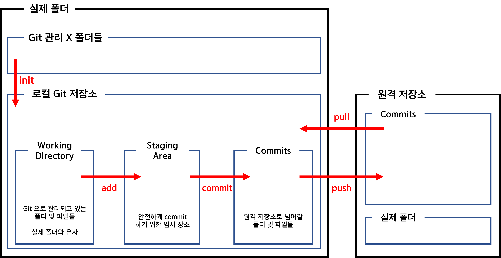

## GIT

### GIT 저장소

#### 로컬 저장소

- working directory : git으로 관리하고 있는 폴더 및 파일들
- staging area : 안전하게 commit 하기 위한 임시 장소
- commits : 원격 저장소로 넘어갈 폴더 및 파일들
- 로컬 저장소 = 내 PC 라고 생각하면 이해가 쉬움

### GIT 명령어

##### git config

> 기본 설정 명령어

- git config --global user.name [유저이름]
  - 유저의 이름을 설정하며, 변경 희망시 유저이름만 변경하여 재실행
- git config --global user.email [이메일주소]
  - 이메일 설정
- git config --global -l
  - 본인이 설정한 내역 확인

##### git init

> 해당 폴더를 git으로 관리하도록 하는 명령어

- __홈 디렉토리에서 git init 사용 금지__

- **이미 git으로 관리되고 있는 폴더의 하위 폴더에서 또 다시 init을 하지 않도록 주의**

- 명령어 실행시 .git 폴더가 생성되며 해당 폴더 삭제시 더 이상 git으로 관리되지 않음

- git으로 관리되고 있는 경우, bash의 디렉토리 경로에서 확인이 가능함

  	

  - 위 밑줄 친 부분에서 확인 가능

##### git status

> git의 관리 상태를 확인할 수 있는 명령어

- 파일 및 폴더에 대한 현재 상태 출력

  - add 작업이 수행된 파일들은 status로 확인했을 때 초록색, 그렇지 않은 파일은 빨간색으로 확인 가능
  - 결과를 통해 어떤 작업을 수행해야하는지 알 수 있음 (add or commit)

- 파일 및 폴더에 변동사항이 있을 경우 해당 내용을 알 수 있음

- 변동사항이 있으나 staging area에 올라가 있지 않은 경우 해당 내용 출력

  → 해당 파일을 add해야 commit이 가능해짐

##### git add

> 파일 혹은 폴더의 변경사항을 staging area로 이동시킴

- git add [파일 혹은 폴더명]
  - 폴더명 입력시 폴더 내에 위치한 모든 파일들의 변경사항들이 add 됨

- git add . 
  - 해당 폴더 내에 위치한 모든 파일에 add 실행

- 이미 add 된 파일 및 폴더는 자동으로 제외되고 그렇지 않은 폴더 및 파일들에만 해당 작업이 수행됨

##### git commit

> staging area에 위치한 파일 및 폴더의 변경사항들을 commits에 남기는 명령어

- git commit -m [메시지]

  - "메시지"라는 이름의 변경사항을 commits에 남김

  ※ 메시지 없이 git commit 만 실행시키는 경우

  	1. vim 에디터가 나오게 되며 i를 입력하여 insert 모드로 변경
  	1. 
