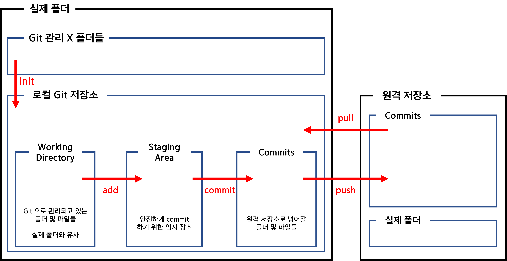
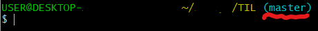
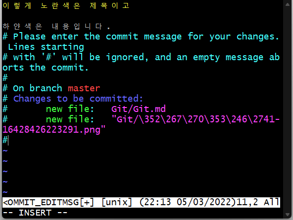
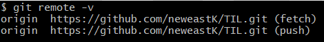
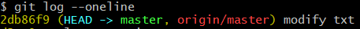
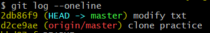

## GIT

### GIT 저장소

#### 로컬 저장소

- working directory : git으로 관리하고 있는 폴더 및 파일들
- staging area : 안전하게 commit 하기 위한 임시 장소
- commits : 원격 저장소로 넘어갈 폴더 및 파일들
- 로컬 저장소 = 내 PC 라고 생각하면 이해가 쉬움





### GIT 명령어

#### 업로드 

##### git init

> 해당 폴더를 git으로 관리하도록 하는 명령어

- __홈 디렉토리에서 git init 사용 금지__

- **이미 git으로 관리되고 있는 폴더의 하위 폴더에서 또 다시 init을 하지 않도록 주의**

- 명령어 실행시 .git 폴더가 생성되며 해당 폴더 삭제시 더 이상 git으로 관리되지 않음

- git으로 관리되고 있는 경우, bash의 디렉토리 경로에서 확인이 가능함

  	

  - 위 밑줄 친 부분에서 확인 가능


##### git status

> git의 관리 상태를 확인할 수 있는 명령어

- 파일 및 폴더에 대한 현재 상태 출력

  - add 작업이 수행된 파일들은 status로 확인했을 때 초록색, 그렇지 않은 파일은 빨간색으로 확인 가능
  - 결과를 통해 어떤 작업을 수행해야하는지 알 수 있음 (add or commit)

- 파일 및 폴더에 변동사항이 있을 경우 해당 내용을 알 수 있음

- 변동사항이 있으나 staging area에 올라가 있지 않은 경우 해당 내용 출력

  → 해당 파일을 add해야 commit이 가능해짐


##### git add

> 파일 혹은 폴더의 변경사항을 staging area로 이동시킴

- git add [파일 혹은 폴더명]
  - 폴더명 입력시 폴더 내에 위치한 모든 파일들의 변경사항들이 add 됨

- git add . 
  - 해당 폴더 내에 위치한 모든 파일에 add 실행

- 이미 add 된 파일 및 폴더는 자동으로 제외되고 그렇지 않은 폴더 및 파일들에만 해당 작업이 수행됨


##### git commit

> staging area에 위치한 파일 및 폴더의 변경사항들을 commits에 남기는 명령어

- git commit -m [메시지]

  - "메시지"라는 이름의 변경사항을 commits에 남김

  ※ 메시지 없이 git commit 만 실행시키는 경우

  

  1. 위와 같이 vim 에디터가 나오게 되며 `i`를 입력하여 insert 모드로 변경한다
  1. 첫 작성시 제목이 작성되며(노란색 글) `shift+enter`를 두번 입력하여 내용(하얀색 글)을 작성할 수 있다
  1. 입력 후 `ESC` 를 눌러 insert 모드에서 나올 수 있다.
  1. `:wq` 를 입력하여 저장하고 나오면 commit이 완료된다


##### git log

> commit 내역을 확인 할 수 있는 명령어

- commit이 제대로 되었는지 확인할 수 있음
- 내용이 너무 많아서 한번에 보이지 않을 경우 내용 하단에 `:`이 출력되며 `q`를 눌러서 나갈 수 있음
  `enter`를 누를 경우 한줄씩 페이지를 내릴 수 있고 `d`를 누를 경우 비교적 많은 부분이 내려감
- git log --oneline
  - 각 commit 내역을 한줄씩  짧고 간단하게 확인 가능


##### git remote 

> 현재 위치의 폴더와 git의 원격 저장소(repository)를 연결해주는 명령어

- git remote add [별칭] [레포지토리 주소]

  - 현재 위치의 폴더와 입력한 주소의 원격 저장소를 별칭을 지정하여 연결해줌
  - 별칭은 관행적으로 origin 으로 설정

- git remote -v 

  - 현재 폴더에 연결된 원격 저장소를 확인할 수 있음

    	

- git remote rm [별칭]

  - add와 반대로 연결을 해제하는 명령어


##### git push

> 원격 저장소로 commit된 내용들을 업데이트하는 명령어

- git push [별칭] [브랜치명]
  - 연결된 저장소의 입력한 브랜치로 commit 내용을 업로드 함
- git push -u [별칭] [브랜치명]
  - `-u` 사용시 이후에는 git push 만 입력해도 해당 저장소와 브랜치로 업로드됨

- git log 로 확인한 push 상태
  

  - head → master : 로컬 저장소 상태
    origin/master : github 업데이트 상태 
    위 그림은 모든 업데이트가 잘 되어있는 (= push가 잘되어있는) 상태

  	

  - 위 그림은 head → master 와 origin/master 가 서로 다른 commit을 가르키고 있음. 
  - head → master는 가장 최신의 commit을 가리키고 있고 origin/master는 그 이전 commit을 가리키고 있음.
    즉, 깃허브가 업데이트가 느리다는 뜻.


#### 다운로드

##### git clone

> github의 repository를 현재 위치에 복사해오는 명령어

- git clone [레포지토리 주소]
  - 해당 주소의 레포지토리를 복사해오며 주소는 해당 레포지토리에 접속해서 복사해올 수 있음
- 해당 레포지토리의 파일이나 디렉토리를 모두 복사해옴

- git clone을 수행한 경우 해당 폴더는 init 명령어를 사용하지 않아도 git으로 관리됨

  - why?) github 레포지토리를 완전히 복사해오기 때문에 .git 폴더도 복사를 해옴. 따라서, init이 이미 된 상태라고 볼 수 있음. 

- git clone url [폴더명] 

  - 지정한 폴더명을 가진 새로운 폴더를 생성하고 해당 폴더에 레포지토리를 복사

  

##### git pull

> 원격저장소의 업데이트 된 내용을 로컬 저장소에도 적용시키는 것

- 연결된 원격저장소의 업데이트 내용을 내려받아 현재 로컬 저장소를 최신화시킴


#### 브랜치

##### git branch

> 브랜치를 생성 및 조회하는 명령어

- 현재 있는 브랜치들의 목록을 나타내며 `*` 표시가 되어있는 브랜치는 현재 위치를 의미
- git branch [브랜치명]
  - 해당 이름을 가진 새로운 브랜치 생성
- git branch -d [브랜치명]
  - 해당 이름을 가진 브랜치 삭제


##### git switch

> 브랜치 이동

- git switch branch [브랜치명]
  - 해당 이름을 가진 브랜치로 이동
- git switch -c branch [브랜치명]
  - 해당 이름을 가진 브랜치를 새로 만들고 그 브랜치로 이동


##### git log

> 브랜치의 log를 확인할 수 있는 명령어

- git log --oneline -all
  - 모든 브랜치의 log를 보여줌
- git log --oneline --all --graph
  - 모든 브랜치의 구조를 그림으로 보여줌


##### git merge

> 브랜치를 병합하는 명령어

- git merge [브랜치명]

  - 현재 있는 branch를 기준으로 해서 입력한 브랜치를 병합시킴

    따라서, 기준이 되는 브랜치에서 실행을 해야하는 명령어

    

###### 	※ conflict가 발생했을 경우

- status 로 어떤 파일이 문제인지 확인
- 해당 파일을 수정 → vscode로 가능 
  conflict 발생한 파일을 vscode로 열어서 변경 방법을 선택하면 해당 파일이 기준에 맞게 수정되며, merge가 됨.
- 다시 add (왜냐하면 working directory에만 저장되어있기 때문에)로 추가하고 commit을 해야함


#### 기타

##### git config

> 기본 설정 명령어

- git config --global user.name [유저이름]
  - 유저의 이름을 설정하며, 변경 희망시 유저이름만 변경하여 재실행
- git config --global user.email [이메일주소]
  - 이메일 설정
- git config --global -l
  - 본인이 설정한 내역 확인


##### git restore

> git add 한 내용 취소하기

- git add 까지 한 파일을 취소할 수 있음

  ```bash
  git restore --staged 파일이름
  ```

  


#### 상황별 명령어 사용

###### 폴더와 레포지토리를 연결할 때 : 폴더 생성 → init → remote

###### Git에 올릴 때 : add → commit → push

