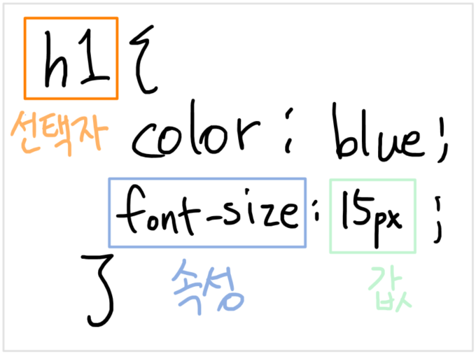
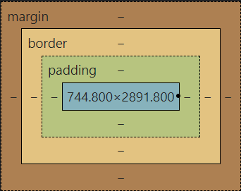

# CSS

> Cascading Style Sheets
>
> HTML로 작성된 문서의 표시 방법을 기술하기 위한 스타일 시트 언어
>
> CSS는 요소가 화면, 음성이나 다른 매체 상에 어떻게 렌더링되어야 하는지 지정

- 스타일을 지정하기 위한 언어. "선택하고 지정한다."

- 선택자를 통해 **스타일을 지정할 HTML 요소를 선택**
- 중괄호 안에서 속성과 값, 하나의 쌍으로 이루어진 선언을 진행
- 각 쌍은 선택한 요소의 속성, 속성에 부여할 값을 의미
  - 속성 :  어떤 스타일 기능을 변경할지
  - 값 : 어떻게 스타일 기능을 변경할지



### CSS 정의 방법

#### 1. 인라인 

- body의 html 태그에 style 속성을 지정하여 스타일 설정

  ```HTML
  <h1 style="color: blue; font-size: 10px;">Hello</h1>
  ```

  

#### 2. 내부참조 

- HTML head 부분에서 스타일 지정하기

  ```HTML
  <head>
    <style>
  	h1 {
      	color: blue;
      	font-size: 100px;
  	}
    </style>
  </head>
  ```

  

#### 3. 외부 참조 

- CSS 파일을 새로 만들고 스타일 지정후 불러오기

  ```HTML
  <head>
      <title>page상단의 title</title>
      <link rel="stylesheet" href="css파일이름.css">
  </head>
  ```

  


### 선택자 유형 

> 선택자에는 요소, 클래스, id(#), attribute([]), 자식 결합자(>), 형제 결합자(~,+) 등이 들어 갈 수 있다

##### 기본 선택자 

- 전체 선택자(*) : 모든 요소에 해당 스타일을 지정

     ```css
     * {
     	color: red;
     }
     ```

     

- 요소 선택자(태그 선택) : 특정 태그에 해당 스타일을 지정(태그 복수 선택 가능)

     ```css
     h1 {
         color: orange;
     }
     
     div {
         color: blue;
     }
     
     # 요소1, 요소2 로 활용하여 여러 요소를 한번에 선택 가능 
     h3,h4 {
         font-size: 10px;
     }
     ```

     

- 클래스 선택자 : \<태그 class = "내가 만들어 놓은 클래스"> 

  ```css
  #스타일을 지정할 때는 ".클래스이름" 으로
  .green { 
  	color : green;
  }
  
  <h1 class = 'green'>
      이렇게 작성하면 green 클래스의 스타일이 지정됨.
  </h1>
  ```

  

- `요소.클래스 { 스타일 }` 로 지정한 요소 중에서 해당 클래스를 가진 요소들만 선택

- 아이디 선택자 : `#아이디이름` 으로 지정하고 아이디에 해당 이름을 지정하면 스타일이 자동 지정됨.

     ```css
     #red {
         color: red;
     }
     
     <p id="red"> id 선택자 예시 </p>
     ```

     ※ 같은 아이디를 여러번 사용해도 동작하지만, 단일 id를 사용하는 것을 권장

- 속성 선택자 : 태그에 들어간 속성을 기준으로 스타일을 지정함. 

     - `[속성명]` 의 형식으로 스타일 지정
     - 주로 요소 속성자와 함께 쓰인다. ex) `요소(태그)명[속성명]`


##### 결합자

- 자손 결합자

  - selectorA 하위의 모든 selectorB 요소
  - `p span`

- 자식 결합자

  - selectorA 바로 아래의 selectorB 요소
  - `p > span`

  ```CSS
  #자식 결합자
  .box > p {
      font-size: 30px;
  }
  # box 바로 아래에 있는 p들에게만 해당 스타일을 지정
  
  
  #자손 결합자
  .box p {
      color : blue;
  }
  # box의 아래에 있는 모든 p들에게 해당 스타일을 지정
  ```

  

- 일반 형제 결합자

  - selectorA의 형제 요소 중 **뒤에 위치**하는 모든 selector
  - `p ~ span`  :  p와 같은 라인에 있는 **뒤 애들** 중 span

  ```CSS
  p ~ span {
      color : red;
  }
  ```

  ```html
  <span>p태그의 앞에 있기 때문에 형제가 아니다. 즉, 빨강x</span>
  <p>여기 p태그가 있고</p>
  <b>코드가 있어도</b>
  <span>이 태그는 p 뒤에 있기 때문에 형제태그가 된다. 즉, 빨강o</span>
  <b>또 다른 코드가 있더라도</b>
  <span>이 태그도 p 뒤에 있어서 형제태그이다.</span>
  ```

- 인접 형제 결합자

  - selectorA의 형제 요소 중 **바로 뒤**에 위치하는 selector

  - `p + span`  :  p와 같은 라인에 있으면서 바로 뒤에 있는 span

    ※ 위 예시에서 바로 뒤에 span 이 없으면 당연히 적용 안된다. 
    	바로 뒤에 다른 요소가 있고 그 다음에 바로 지정한 형제 요소가 있어도 적용되지 않는다.
    	무조건 바로 뒤여야만 적용된다.

  ```css
  p + span {
      color : blue;
  }
  ```

  ```html
  <span>p태그의 앞에 있기 때문에 형제가 아니다. 즉, 파랑x</span>
  <p>여기 p태그가 있고</p>
  <span>p 바로 뒤에 span 태그가 있기 때문에 인접형제태그가 된다. 즉,파랑o</span>
  <b>하지만 일반 형제와는 다르게 사이에 다른 코드가 있으면</b>
  <span>이 태그는 인접형제태그가 아니다.</span>


##### CSS 우선순위

1. 중요도 - `!important`
   - `속성: 속성값 !important;` 형식으로 사용 
   
     ```css
     h2 {
         color: darkviolet !important;
     }
     ```
   
   - 가장 우선적으로 적용됨
   
     
   
2. 선택자 우선순위 
   - **인라인 > id > class, 속성, pseudo-class > 요소, pseudo-element**
   
     
   
3. CSS 파일 로딩 순서대로
   - 뒤에 적용된 스타일이 덮어 씌워짐.
   - 로딩 순서는 스타일을 설정해놓은 순서를 의미.  (스타일을 불러오는 순서가 아님)


### CSS 상속

- css는 상속을 통해 부모 요소의 속성을 자식에게 상속한다.
- 속성 중에는 상속이 되는 것과 되지 않는 것들이 있다.
- **Text 관련 요소는 상속이 가능 (color는 상속 가능)**
- **Box 관련 요소와 Position 관련 요소는 상속 불가능**


### CSS 기본 스타일

##### 크기 단위

> 크기를 지정하지 않을 경우 기본값은 16px

- px

  - 픽셀의 크기는 변하지 않기 때문에 고정적인 단위 

- %

  - 백분율 단위로 가변적인 레이아웃에서 자주 사용
  - **부모 태그를 기준**으로 함

- em 

  - **바로 위, 부모 요소에 대한 상속**의 영향을 받음
  - 배수 단위, 요소에 지정된 사이즈에 상대적인 사이즈를 가짐

- rem(root + em)

  - 바로 위, 부모 요소에 대한 상속의 영향을 받지 않음
  - **최상위 요소(html)의 사이즈를 기준**으로 배수 단위를 가짐
  - html의 텍스트 기본 사이즈는 16px이며 최상위요소를 기준으로 하기 때문에 어디에서 사용해도 똑같은 결과값을 가짐.

- viewport

  - vw, vh, vmin, vmax 등이 있음

  - 100vw 의 경우 전체 가로 길이, 100vh 의 경우 전체 세로 길이

  - 1vw의 경우 전체 가로의 100분의 1 길이, 1vh의 경우 전체 세로의 100분의 1 길이

  - vmin 은 가로와 세로 중 작은 것을 기준으로 비율을 따지며 vmax는 큰 것을 기준으로 함. 따라서, vmax는 화면에서 잘릴 수도 있음. 따라서, 크기가 가변적임.
  
    

##### 색상 단위

- 색상 키워드
  - 대소문자 구분이 없으며 red,blue,black 과 같은 특정 색을 직접 글자로 나타냄
- RGB 색상 
  - \# + 16진수 표기법
  - rgb(x,y,z) 
- HSL 색상
  - hsl(색상,채도,명도)
- a는 alpha(투명도) 1로 갈수록 진해짐.
  - `rgba(x,y,z,a);` / `hsla(x,y%,z,a);` 의 방법으로 사용


<hr>

## CSS 원칙

> 1. 모든 요소는 박스모델이며, 좌측상단에 배치된다.
> 2. display 설정에 따라 요소간 배치가 달라진다.
> 3. position 설정에 따라 위치의 기준을 변경한다.


### box 모델

- 모든 **HTML 요소는 네모(박스모델)**이고, 위에서부터 아래로, 왼쪽에서 오른쪽으로 쌓인다.

- **블럭이면 한칸을 전부 차지**하고, **인라인은 본인의 크기만큼 차지**한다.


#### 구성



- content : 글이나 이미지 등 요소의 실제 내용

- border : 박스를 이루는 테두리 영역
              
              ※ border-width : 테두리 두께
              	border-style : 선 스타일
              	border-color : 선 색깔
              	(이 순서대로 shorthand 가능)
          
- padding : 테두리 안쪽의 내부 여백, **요소에 적용된 배경색**이나이미지는 padding까지 적용 (content와 border 사이 공간)

- margin : 테두리 바깥의 외부 여백. **배경색을 지정할 수 없음**.
  
  - 하나의 박스모델과 서로 다른 박스모델 간 겹치는 부분이 없도록 하기 위함.
  - 상하좌우의 여백을 설정할 수 있음. 
    (shorthand 설정도 가능:위 > 오른쪽 > 아래 > 왼쪽 순서)
  
  예시)
  
  ```css
  .margin정하는법{
      margin-top: 10px;
      margin-bottom: 10px;
      margin-left: 20px;
      margin-right: 30px;
  }
  
  #shorthand로도 지정 가능
  #순서는 위 → 오른쪽 → 아래 → 왼쪽
  .margin-3개일때{
      margin: 10px 20px 30px;
  }
  #3개인 경우 하나가 부족한데 하나는 어떻게? → 건너편의 값을 가져옴.(상=>하 / 좌=>우)
  #위 예시는 마지막 왼쪽의 margin 값이 20이 됨. why?)오른쪽 margin이 20이기 때문
  
  .margin-padding{
      margin: 10px;
      padding: 30px;
  }
  #margin값이 하나인 경우에는 전체가 10px로 지정됨.
  
  .border정하는법{
      border-width: 2px;
      border-style: dashed;
      border-color: black;
  }
  
  .border{
      border:2px dashed black;
  }
  ```


#### box 사이즈

- 박스의 사이즈는 width와 height로 지정 가능

- 기본적으로 모든 요소의 box-sizing은 content-box 의 사이즈를 표시함 ( = Padding을 제외한 영역)

- border까지의 너비(패딩 포함 넓이)를 100px로 보고 싶다면 box-sizing을 `border-box`로 설정해야함

  ```css
  .box-sizing정하는법 {
      box-sizing: border-box;
      width: 100px;
  }
  ```
  
  


### display

> CSS 제 2원칙 : display 설정에 따라 요소간 배치가 달라진다.
>
> 모든 요소는 normal flow에 따라 배치가 되지만, display를 어떻게 지정하느냐에 따라 크기와 배치가 달라짐


#### display 종류

##### block 

- 줄 바꿈이 일어나는 요소로 화면 크기 전체의 가로 폭을 차지
- 만약 요소의 contents 너비가 전체를 가질 수 없다면 나머지 부분은 margin이 자동으로 부여됨
-  블록레벨 요소 안에 인라인 레벨 요소가 들어갈 수 있음
- div, p, hr, form,h1 등
- 수평 정렬이 가능함 (스타일 속성)
  - `margin-right: auto;`  :  공백을 오른쪽에 두고 박스를 왼쪽 정렬 (= text-align : left;)
  - `margin-left: auto;` : 공백을 왼쪽에 두고 박스를 오른쪽 정렬 (= text-align : right;)
  - `margin-rignt: auto;` &`margin-left: auto;`  :  공백을 양쪽에 두고 박스를 가운데 정렬 (= text-align : center;)

##### inline

- 줄 바꿈이 일어나지 않는 행의 일부 요소
- content 너비만큼 가로 폭을 차지함(인라인의 기본 너비는 content길이만큼)
- **width, height을 지정할 수 없으며 상하 margin도 지정할 수 없다.** 
- 상하 여백은 line-height로 지정하며 요소의 크기보다 크면 다른 영역을 침범하게 된다
- span, a, img, input, label, b, em, i, strong 등


##### inline-block

- inline 처럼 한 줄에 표시가 가능하고, block처럼 width, height, margin 속성을 모두 지정할 수 있음.


##### none

- 해당 요소를 화면에 표시하지 않고, 공간조차 부여되지 않음.
- hidden의 경우 공간을 차지하고 있으나 화면에 보이지 않음.


##### flex

- 별도 파일 참조


<hr>

### CSS position

> CSS 제 3원칙 : position 설정에 따라 위치의 기준을 변경한다.

- 문서 상에서 요소 위치를 지정하기 위함
- 특정 요소의 위치 기준점은 좌측 상단! 좌측 상단 모서리의 위치를 지정
- `position: 포지션종류;` 로 설정


#### 종류 

##### static 

- 모든 태그의 기본 값, HTML에 따른 위치


##### relative 

- 상대 위치

- **자기 자신의 static 위치를 기준**으로 이동
- 레이아웃에서 요소가 차지하는 공간은 static일 때와 같음
- normal flow 유지 = 눈으로 보이는 위치만 이동한 것


##### absolute 

- 절대 위치

- 요소를 일반적인 문서 흐름에서 제거 후 **레이아웃에 공간을 차지하지 않음**

  ※ 레이아웃에 공간을 차지하지 않는다 = 빈공간이 생겨 기존에 있던 다른 요소들의 위치도 변경된다.

- 기준점이 존재하지 않아서 기준으로 잡을 무언가가 필요
  따라서, 가장 가까이 있는 **부모/조상 요소를 기준**으로 이동 (없는 경우 body를 기준으로)

- normal flow에서 벗어남 = 실제 위치가 변동이 되고 나머지 요소들도 위치가 조정됨.


##### fixed 

- 고정 위치

- 부모 요소와 관계없이 **viewport를 기준**으로 위치 차지
- 요소를 일반적인 문서 흐름에서 제거 후 **레이아웃에 공간을 차지하지 않음**.


#### 구체적인 위치 지정 방법

- 위 position 요소들은 모두 top, left, right, bottom 의 좌표 프로퍼티를 사용하여 이동 가능

  - 예시

  ```css
  relative지정 {
      position: relative;
      top: 50px; 
      left: 10px;
  }
  #위 예시는 자기 자신의 static 위치를 기준으로 위에서 50px, 좌에서 10px 떨어뜨리도록 함.
  
  absolute지정 {
      position: absolute;
      top: 30px;
      right: 20px;
  }
  #부모 요소를 기준으로 위에서 30px, 오른쪽에서 20px 떨어뜨리도록 함.
  
  fixed지정 {
      position: fixed;
      bottom: 0px;
      right: 0px:
  }
  #viewport를 기준으로 바닥과 오른쪽에서 0px 떨어뜨리도록 함.
  ```

  
