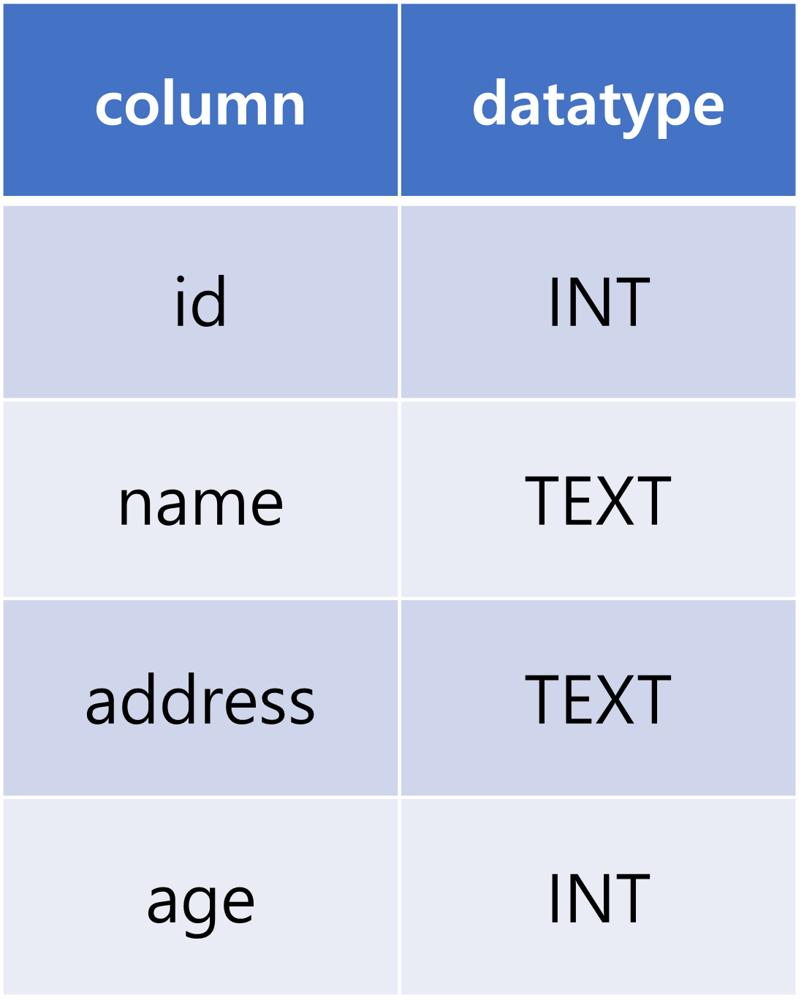
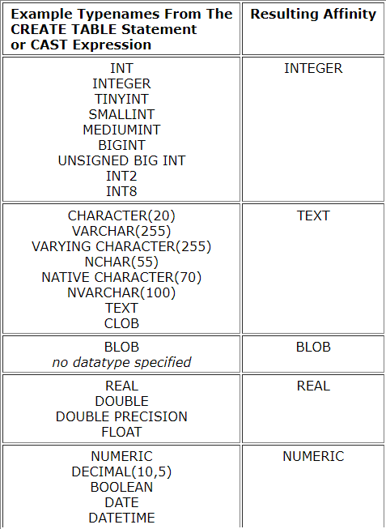

# DB

[toc]


## DATABASE

> - 데이터베이스는 체계화된 데이터의 모임
> - 여러 사람이 공유하고, 사용할 목적으로 통합 관리되는 정보의  집합
> - 논리적으로 연관된 하나 이상의 자료 모음으로, 그 내용을 고도로 구조화 함으로써 검색과 갱신의 효율화를 꾀한 것
> - 즉 몇개의 자료 파일을 조직적으로 통합하여 자료 항목의 중복을 없애고 자료를 구조화하여 기억시켜 놓은 자료의 집합체


####  데이터베이스로 얻는 장점들

1. 데이터 중복 최소화
2. 데이터 무결성 (정확한 정보를 보장)
3. 데이터 일관성
4. 데이터 독립성 (물리적/논리적)
5. 데이터 표준화
6. 데이터 보안 유지


### RDB (관계형 데이터베이스)

> Relational Database

- 키와 값들의 간단한 관계를 표 형태로 정리한 데이터베이스
- 우리가 일반적으로 엑셀에서 볼 수 있는 테이블이 관계형 데이터베이스의 형태이다.
- 흔히 표를 관계라고 이야기하기도 한다


#### 용어

1. 스키마

   - 데이터베이스에서 자료의 구조, 표현방법, 관계 등 전반적인 명세를 기술한 것

   - 어떤 데이터타입과 이름을 갖고 있는지 등 데이터에 대한 정보를 나타냄

     

2. 테이블
   - 열(컬럼,필드)과 행(레코드,값)의 모델을 사용해 조직된 데이터 요소들의 집합

3. 열 (column)
   - 각 열에는 고유한 데이터 형식이 지정됨

4. 행(row)
   - 실제 데이터가 저장되는 형태 

5. 기본키(primary key)

   - 각 행의 고유한 값

   - 반드시 설정해야 하며, 데이터베이스 관리 및 다른 데이터베이스 간의 관계 설정시 주요하게 활용됨


### RDBMS(관계형 데이터베이스 관리 시스템)

> Relational Database Management System

- 관계형 모델을 기반으로 하는 데이터베이스 관리시스템을 의미
- 관계형 데이터베이스를 관리하는 시스템

- 예시 : MySQL, SQLite, PostgreSQL, ORACLE, MS SQL 등


#### SQLite

- 서버 형태가 아닌 파일 형식으로 응용 프로그램에 넣어서 사용하는 비교적 가벼운 데이터베이스
- 구글 안드로이드 운영체제에 기본적으로 탑재된 데이터베이스며, 임베디드 소프트웨어도 많이 활용됨
- 관리가 간편하고 가볍기 때문에 로컬에서 간단한 데이터베이스를 구성할 수 있으며 오픈소스 프로젝트이기 때문에 자유롭게 사용이 가능하다


##### Data Type

1. NULL:데이터가 없음을 나타내는 타입
2. INTEGER: 부호 있는 정수
3. REAL : 부동 소수점 숫자
4. TEXT : 문자열
5. BLOB : 별다른 타입 없이 입력된 그대로 저장되는 것


##### 데이터 선호도 (Type Affinity)

- 특정 컬럼에 저장하도록 권장하는 데이터 타입
- 실제로 데이터 타입이 type affinity로 변환되어 저장됨

- 같은 정수형이어도 굉장히 많은 데이터 타입이 있음. ex) INT, INTEGER, SMALLINT, BIGINT 등등

  - BUT 이 모든 것을 INTEGER 라는 데이터 선호도로 저장됨


- 문자열도 CHARACTER, VARCHAR 등 많은 데이터타입이 있지만 결국 TEXT라는 Affinity로 저장됨



<hr>

### SQL(Structured Query Language)

- 관계형 데이터베이스 관리시스템의 데이터 관리를 위해 설계된 특수 목적으로 프로그래밍된 언어
- 데이터베이스 스키마 생성 및 수정, 자료 검색 및 관리, 데이터베이스 객체 접근 조정 관리 등의 역할 수행
- 즉, RDBMS 에서 사용하는 프로그래밍 언어

<hr>

※ sqlite 명렁어

.database : 데이터베이스 생성

.mode csv : csv 모드 적용 (CSV를 import 하기 위한 사전 작업)

.import [csv파일이름.csv] [테이블이름] : csv파일을 테이블에 넣는다

.tables : 테이블 목록 조회

.headers on : 데이터의 header(=필드명)를 보여줌

.mode column : 테이블을 간략한 표 형식으로 보여줌

.schema [테이블이름] : 테이블의 스키마를 보여줌

<hr>

#### 분류

1. DDL - 데이터 정의 언어(Data Definition Language)

   - 관계형 데이터베이스 구조(테이블, 스키마)를 정의하기 위한 명령어
   - CREATE, DROP, ALTER 

2. DML-데이터 조작 언어(Data Manipulation Language)

   - 데이터를 저장,조회,수정,삭제 등을 하기 위한 명령어
   - INSERT, SELECT, UPDATE, DELETE

3. DCL-데이터 제어 언어(Data Control Language)

   - 데이터베이스 사용자의 권한 제어를 위해 사용하는 명령어
   - GRANT, REVOKE, COMMIT, ROLLBACK

   

※ sql에서는 세미클론까지 하나의 명령어로 판단

※ .을 붙여서 명령어를 실행하는건 sqlite 프로그램의 기능을 수행하는 것


<hr>

##### sqlite 확장프로그램 사용하기

- sqlite3 파일 우클릭 - Open Database
- new query 클릭 - (파일 저장) - 해당 파일에서 sql명령어 작성 - 우클릭 후 run
- run Query는 모든 명령어 수행 , run selected qurey 블록 지정한 혹은 커서가 위치한 명령어만 수행

<HR>

#### DDL

###### CREATE

> 데이터베이스에 테이블 생성

```sql
CREATE TABLE [테이블이름]();
```

- () 안에 스키마 지정

  ex) CREATE TABLE 테이블이름 ( id INTEGER PRIMARY KEY, name TEXT)

  - Primary key를 지정할 때는 반드시 INTEGER 라고 지정해야함 (INT도 안됨)

  - PRIMARY KEY를 따로 지정 안해줘도 SQLite에서 자동으로 "증가하는 PK 옵션을 가진 rowid 컬럼"을 정의해줌

  - primary key를 넣는 부분에 not null 이라는 설정도 넣어줄 수 있음

    - 반드시 데이터가 채워져야하는 부분이라면 not null 지정

    - 데이터베이스에서는 기본적으로 데이터가 빈 문자열이라도 데이터가 채워져있어야함

    

###### DROP

> 테이블 삭제

```sql
DROP TABLE [테이블이름];
```


#### DML

##### _CREATE

###### INSERT 

> 테이블에 단일 행 삽입

```sql
INSERT INTO 테이블이름 (컬럼1, 컬럼2, ...) VALUES (값1, 값2, ...);
```

- INSERT는 특정 테이블에 레코드(행)을 삽입

- 모든 열에 데이터가 있는 경우 컬럼을 명시하지 않아도 됨

- 테이블 생성시 만약 스키마에서 PK를 직접 지정해줬다면?

  1.  INSERT할 때 컬럼명을 안쓸 경우 : VALUES에 PK 값을 꼭 첨부

     ```sql
     INSERT INTO 테이블이름 VALUES (pk값, 값1, 값2, ...);
     ```

  2.  INSERT할 때 컬럼명을 쓸 경우 : PK를 제외한 모든 컬럼과 VALUES를 함께 기재해야함

     (첫 예시 구문과 동일)

- 한번에 많은 행을 삽입하고자 한다면 `INSERT INTO [테이블이름]` 까지는 한번만 쓰고 각 행에 맞는 VALUES들을 괄호로 묶어 모두 적는다


##### _READ

###### SELECT

> 테이블에서 데이터를 조회

```SQL
SELECT 컬럼1, 컬럼2 FROM 테이블이름;
```

- 어떤 테이블에서 특정 컬럼들을 조회

```SQL
SELECT * FROM 테이블이름; 
```

- 어떤 테이블에서 모든 컬럼 조회

```SQL
SELECT rowid, * FROM 테이블이름;
```

- PK를 포함한 모든 컬럼을 조회

- SELECT 문은 SQLite에서 가장 복잡한 명령어이며 다양한 절과 함께 사용

- 함께 사용하는 clause(절)

  - LIMIT : 쿼리에서 반환되는 행 수를 제한 (x개의 행만 보겠다!)

    - 특정 행부터 시작해서 조회하기 위해 OFFSET 키워드와 함께 사용하기도 함 
      ex) 3번째 행부터 조회하겠다 : offset=2

    - `SELECT 컬럼1, 컬럼2 FROM 테이블이름 LIMIT 1;` : 특정 테이블의 컬럼1과 컬럼2를 하나의 행만 조회하라

    - `SELECT 컬럼1, 컬럼2 FROM 테이블이름 LIMIT 1 OFFSET 2;` : 세번째부터 시작하여 한개의 행만 조회하라

    - `SELECT * FROM MY_TABLE LIMIT 10 OFFSET 5;` : "MY_TABLE" 테이블의 모든 컬럼에 대하여 6번째부터 시작하여 10개의 행을 조회하라

      

  - WHERE : 쿼리에서 반환된 행에 대한 특정 검색 조건을 지정

    - IF와 같은 역할
    - `SELECT 컬럼1, 컬럼2 FROM 테이블이름 WHERE 컬럼1="A";` : 컬럼1이 A인 행의 컬럼1,컬럼2를 조회하라

    

  - DISTINCT : 조회 결과에서 중복 행을 제거

    - **SELECT 키워드 바로 뒤에 작성해야함**
    - `SELECT DISTINCT 컬럼 FROM 테이블이름;` : 명시한 컬럼값을 중복없이 전체 조회

    

  

##### _DELETE

###### DELETE

> 테이블에서 행을 제거

```SQL
DELETE FROM 테이블이름 WHERE 조건;
```

- 조건을 통해 특정 레코드 삭제하기
- 어떤 조건을 사용할까 ? UNIQUE한 값인 PK를 기준으로!
- SQLite는 삭제하고 나서 데이터를 생성할 때, id를 재사용함(즉, 삭제됐던 id값을 다시 쓴다는 뜻)

- **AUTOINCREMENT**

  - 이전에 삭제된 행의 값을 재사용하는 것을 방지하는 COLUMN 속성

  - django에서는 기본적으로 사용하는 속성이지만 SQLite에서는 따로 지정해줘야함

    ```sql
    CREATE TABLE 테이블이름 (id INTEGER PRIMARY KEY AUTOINCREMENT,...);
    ```


##### _UPDATE

###### UPDATE

> 기존 행의 데이터를 수정

```SQL
UPDATE 테이블이름 SET 컬럼1=값1, 컬럼2=값2, ... WHERE 조건;
```

- SET 절을 이용해서 테이블의 각 열에 대해 새로운 값을 설정한다

```SQL
UPDATE 테이블이름 SET name="kim", address='경기' WHERE rowid=5;
```

- pk가 5인 행을 name 컬럼은 'kim'값으로 address 컬럼은 '경기'로 변경하라


#### 조건을 활용한 SELECT

##### Aggregate function(집계함수)

> 값 집합에 대한 계산을 수행하고 단일값을 반환

- 여러 행으로부터 하나의 결과값을 반환하는 함수

- SELECT 구문에서만 사용됨

  ```sql
  SELECT aggregate_function(컬럼) FROM 테이블이름;
  ```

- 종류 : COUNT, AVG, SUM, MIN, MAX

  - COUNT(*) : 테이블 전체 행의 갯수 반환
  - AVG(age) : age 컬럼 전체의 평균 값을 반환
  - MAX(컬럼명) : 지정한 컬럼 전체 값 중 최댓값을 반환
  - MIN(컬럼명) : 지정한 컬럼 전체 값 중 최솟값을 반환
  - SUM(컬럼명) : 지정한 컬럼 내 모든 값의 합을 반환

  - 예시

    - 계좌 잔액(balance)이 가장 높은 사람(first_name)과 그 액수를 조회하려면?

      ```sql
      SELECT first_name, MAX(balance) FROM users;
      ```

    - 30살 이상인 사람들의 평균 나이(age)는?

      ```sql
      SELECT AVG(age) FROM users WHERE age>=30;
      ```

    - 나이가 30 이상인 사람의 계좌 평균 잔액을 조회하려면?

      ```sql
      SELECT AVG(balance) FROM users WHERE age>=30;
      ```


##### LIKE

> 패턴 일치를 기반으로 데이터를 조회하는 방법

- SQLite는 패턴 구성을 위한 2개의 와일드카드를 제공

<hr>

※ 와일드카드 (Wildcard Character)

- 파일을 지정할 때, 구체적인 이름 대신에 여러 파일을 동시에 지정할 목적으로 사용하는 특수 기호
- 주로 특정한 패턴이 있는 문자열 혹은 파일을 찾거나, 긴 이름을 생략할 때 쓰임
- 텍스트 값에서 알수 없는 문자를 사용할 수 있는 특수 문자로, 유사하지만 동일한 데이터가 아닌 여러 항목을 찾기에 매우 편리한 문자
- 지정된 패턴 일치를 기반으로 데이터를 수집하는데도 도움이 될 수 있음

<hr>

```sql
SELECT * FROM 테이블이름 WHERE 컬럼 LIKE 와일드카드패턴;
```

- 특정 컬럼의 값이 와일드카드패턴을 따르는 모든 테이블 조회

- % (percent sign)

  - 0개 이상의 문자
  - 이 자리에 문자열이 있을 수도 없을 수도 있다

- _  (underscore)

  - 임의의 단일 문자
  - 반드시 이 자리에 한개의 문자가 존재해야한다.

- 와일드카드 패턴 예시

  - 2% : 2로 시작하는 값
  - %2 : 2로 끝나는 값
  - %2% : 2가 들어가는 값
  - _2% : 두번째가 2로 시작하는 값
  - 1_ _ _ : 1로 시작하는 4자리 값
  - 2\_%\_% or 2_ _% : 2로 시작하는 최소 3자리인 값

- LIKE 활용 예시

  - users 테이블에서 나이가 20대인 사람만 조회한다면?

    ```sql
    SELECT * FROM users WHERE age LIKE '2_';
    ```

  - users 테이블에서 지역 번호(phone)가 02인 사람만 조회한다면?

    ```sql
    SELECT * FROM users WHERE phone LIKE '02-%'
    ```

  - users 테이블에서 이름(first)이 '준'으로 끝나는 사람만 조회한다면?

    ```sql
    SELECT * FROM users WHERE first_name LIKE '%준'
    ```

  - users 테이블에서 중간번호(phone)가 5114 인 사람만 조회한다면?

    ```sql
    SELECT * FROM users WHERE phone LIKE '%-5114-%'
    ```

    

##### ORDER BY

> 조회 결과 집합을 특정 컬럼을 기준으로 정렬

```SQL
SELECT * FROM 테이블 ORDER BY 컬럼1,컬럼2 DESC;
SELECT * FROM 테이블 ORDER BY 컬럼 ASC;
```

- SELECT 문에 추가하여 사용

- 정렬 순서를 위한 2개의 keyword 제공

  - ASC - 오름차순 (기본값)
  - DESC -  내림차순 

- 정렬 기준이 여러개일 경우 처음에 지정한 기준을 우선으로 데이터를 정렬 후, 그 안에서 2번째 기준을 기준점으로 삼아 정렬

- 예시

  - users에서 나이(age) 순으로 오름차순 정렬하여 상위 10개만 조회한다면?

    ```sql
    SELECT * FROM users ORDER BY age LIMIT 10;
    ```

  - users에서 나이 순, 성(last_name) 순으로 오름차순 정렬하여 상위 10개만 조회한다면?

    ```sql
    SELECT * FROM users ORDER BY age, last_name ASC LIMIT 10;
    ```

  - users 테이블에서 계좌 잔액 순으로 내림차순 정렬하여 해당 유저의 성과 이름을 10개만 조회한다면?

    ```sql
    SELECT last_name, first_name FROM users ORDER BY balance DESC LIMIT 10; 
    ```

    

##### GROUP BY

> 행 집합에서 요약 행 집합을 만듦

- SELECT 문의 optional 절

- 선택된 행 그룹을 하나 이상의 열 값으로 요약 행으로 만듦 = 새로운 테이블을 만들어낸다

- 문장에 WHERE 절이 포함된 경우 반드시 WHERE 절 뒤에 작성해야함

- 데이터가 변경된 것은 아니고 단순히 조회할 때만 적용됨

- GROUP BY에서 지정된 기준에 따라서 그룹으로 묶고 그렇게 묶은 결과값을 집계함수로 처리한다

  

- 예시

  - users에서 각 성(last_name)씨가 몇 명씩 있는지 조회한다면?

    ```SQL
    SELECT last_name,COUNT(*) FROM users GROUP BY last_name;
    ```

    - AS를 활용하면 컬럼명을 지정할 수 있음

    ```sql
    SELECT last_name, COUNT(*) AS name_count FROM users GROUP BY........
    ```

    

##### ALTER TABLE

- table 이름 변경

  ```SQL
  ALTER TABLE 기존테이블이름 RENAME TO 새로운테이블이름;
  ```

- 테이블에 새로운 컬럼 추가

  ```SQL
  ALTER TABLE 테이블이름 ADD COLUMN 컬럼이름 데이터타입설정;
  ```

  ```sql
  ALTER TABLE news ADD COLUMN created_at TEXT NOT NULL;
  ```

  - NOT NULL 설정을 할 경우 오류 발생

    - why?) 기존 레코드들에는 새로 추가할 필드에 대한 정보가 없기 때문

    - 해결1. NOT NULL 설정 없이 추가하기

    - 해결2. 새로운 컬럼에 기본값을 지정해주기

      ```sql
      ALTER TABLE news ADD COLUMN subtitle TEXT NOT NULL DEFAULT '소제목';
      ```

- 컬럼 이름 변경

  ```sql
  ALTER TABLE 테이블이름 RENAME COLUMN 현재컬럼이름 TO 새로운컬럼이름;
  ```

- 컬럼 삭제 (3.8 이상의 버전에서 사용 가능)

  ```sql
  ALTER TABLE 테이블이름 DROP COLUMN 컬럼이름;
  ```

  

## Foreign Key

> 외래키(외부키)
>
> 관계형 데이터베이스에서 한 테이블의 필드 중 다른 테이블의 행을 식별할 수 있는 키

- 참조하는 테이블에서 속성(필드)에 해당하고 이는 참조되는 테이블의 기본키(PK)를 가리킴

- 참조하는 테이블의 외래키는 참조되는 테이블 행 1개에 대응됨

  - 이 때문에 참조하는 테이블에서 참조되는 테이블의 존재하지 않는 행을 참조할 수 없음

- 참조하는 테이블의 행 여러개가 참조되는 테이블의 동일한 행을 참조할 수 있다.

- 게시글과 댓글로 예시를 들면 일반적으로 게시글이 참조하고 댓글이 참조될 것이라 생각. 
  but, 1:N의 관계에서는 N이 참조를 하고 1에 해당하는 데이터가 참조된다. 
  따라서, 게시글이 참조가 되며, 댓글이 참조를 한다.

- 외래키의 특징

  - 키를 사용하여 부모 테이블(=참조되는 테이블)의 유일한 값을 참조(참조 무결성)
    - 참조 무결성
      - 데이터베이스 관게 모델에서 관련된 2개 테이블 간의 일관성을 말함
      - 외래키가 선언된 테이블(=참조하는 테이블)의 외래키 속성(열)의 값은 그 테이블의 부모가 되는 테이블의 기본키 값으로 존재해야함
  - 외래키의 값이 반드시 부모 테이블의 기본키일 필요는 없지만 유일한 값이어야 함

  

### models.Foreign Key

- 2개의 위치 인자가 반드시 필요
  1. 참조하는 model class
  2. on_delete 옵션
- **migrate 작업시** 필드 이름에 _id를 추가하여 데이터베이스 열 이름을 만든다
  - 내부에서 자동으로 만들어주기 때문에 따로 지정할 필요 없음
- 참조하는 모델명의 '소문자 단수형'을 인스턴스명으로 지정할 것을 권장
  - 명시적인 모델 관계 파악을 위함
  - 다대다의 관계에서는 복수형을 사용

##### on_delete

- 외래 키가 참조하는 객체가 사라졌을 때 외래키를 가진 객체를 어떻게 처리할지를 정의

  ※ 즉, 게시글을 지웠을 때, 댓글을 어떻게 할 것인가?

- 데이터 무결성을 위해서 매우 중요한 설정이며 7가지 옵션 제공(공식 문서 참고)

  - CASECADE : 부모 객체(=참조된 객체)가 삭제 됐을 때 이를 참조하는 객체도 삭제
  - PROTECT : 부모 객체가 삭제될 때 참조하는 객체가 삭제되지 않도록 ProtectError 발생
  - SET_NULL : 부모 객체가 삭제될 때 외래키 값을 null로 바꿈(null=True 일 때만 가능)
  - SET_DEFAULT : 부모 객체가 삭제될 때 외래키 값을 default 값으로 바꿈(default값이 있을 때만 가능)
  - SET : 부모 객체가 삭제될 때 외래키 값을 SET에 설정된 함수 등에 의해 설정
  - DO_NOTHING : 부모 객체가 삭제될 때 아무런 행동을 취하지 않음. 참조 무결성을 해칠 위험이 존재
  - RESTRICT : 참조하는 객체에 행이 남아있는 경우에는 부모 객체를 갱신하거나 삭제할 수 없으며 이 경우에는 데이터 변경이 이루어지지 않음


※ 데이터 무결성

> 데이터의 정확성과 일관성을 유지하고 보증하는 것을 가리키며, 데이터베이스나 RDBMS 시스템의 중요한 기능

- 무결성 제한의 유형
  1. 개체 무결성(Entity integrity)
     - PK의 개념과 관련
     - 모든 테이블이 PK를 가져야하며 PK로 선택된 열은 고유한 값이어야 하고 빈 값은 허용치 않음을 규정
  2. 참조 무결성 (Referential integrity)
     - FK(외래키) 개념과 관련
     - FK 값이 데이터베이스의 특정 테이블의 PK값을 참조하는 것
  3. 범위(도메인) 무결성 (Domain integrity)
     - 정의된 형식에서 관계형 데이터베이스의 모든 컬럼이 선언되도록 규정


##### 사용 예시

```python
#참조하는 객체 comment(댓글) 모델 생성
class Comment(models.Model):
    #참조되는 객체 Article과 on_delete 인자를 넣어줌으로써 외래키 필드 생성
    article = models.ForeignKey(Article, on_delete=models.CASCADE) 
    content = models.CharField(max_length=200)
    created_at = models.DateTimeField(auto_now_add=True)
    updated_at = models.DateTimeField(auto_now=True)
    
    def __str__(self):
        return self.content
```

- migrate시 article 필드는 article_id 필드명으로 생성됨

- 부모 객체가 있어야만 Comment 객체 생성 가능

- 예시

  ```shell
  article = Article.objects.get(pk=1)
  article # Output : <Article:title>
  comment = Comment(content='comment content', article=article)
  comment.save()
  comment.pk # Output : 댓글 번호 (comment의 id번호)
  comment.article # Output : <Article:title>
  comment.article_id # Output : 1 (article의 id번호)
  ```

  

#### 역참조

- 참조된 객체가 참조하는 객체를 조회하는 것
- objects 와 같은 `model_set` 이라는 manager가 생성됨, 여기서 model은 참조하는 객체의 이름
- `참조하는객체명_set` 사용 
  - 위 예시를 활용하면 `article.comment_set.all()` 와 같이 사용
  - 참조된 객체에 참조하는 객체가 몇개나 있는지 보장 할 수 없기 때문에 `article.comment` 와 같이 사용 불가 
- models.py에서 ForeignKey를 지정할 때 related_name 옵션을 사용하여 model_set 의 이름을 변경할 수 있음. 하지만 1:N의 관계에서는 수정하지 말 것을 권장
- 역참조시 사용할 이름을 수정 후, migration 과정 필요

<hr>

질문1

참조하는 모델에서 foreign key는 참조되는 모델의 유니크한 값을 가르킨다고 했는데, PPT의 comment 모델 foreign key에는 Article 행의 pk값이 아니고 행 자체가 들어간건가요?  

- DB 자체에는 unique한 값이 들어가지만, 우리가 사용할 때는 article 인스턴스처럼 사용할 수 있다.


질문2

그러면 uique한 값이 무엇인지는 장고가 알아서 선택해주는건가요? pk를 unique한 값으로 지정하는 로직이 보이지를 않습니다.

- 장고에서 내부적으로 알아서 해주는것!
- pk가 어차피 유니크한 값인데 굳이 다른걸 할 필요는 없으니까 ㅎ

<hr>

#### save(commit=False)

- 아직 데이터베이스에 저장되지 않은 인스턴스를 반환
- 저장하기 전에 객체에 대한 사용자 지정 처리를 수행할 때 유용하게 사용
- 예시
  - comment_form에 request.POST로 받은 정보들을 할당한 후 바로 저장할 수 없음
  - article_id가 비어있기 때문
    - form을 받을 때, 사용자가 직접 해당 속성을 정의할 수 없도록 하기 위해 exclude시킴
  - 따라서, article 정보를 추가해주기 위해 commit=False 옵션을 사용 

##### point

- 댓글을 생성할 때, article의 pk는 왜 함께 인자로 받는가?
  - comment의 article_id에 해당하는 부분이기 때문에 나중에 article 객체를 받아야함
  - 그때, comment에 맞는 article을 찾을 수 있어야하므로 article의 pk 필요

- 댓글을 삭제할 때, 필요한 인자의 개수는?
  - article_pk, comment_pk
  - article_pk : detail 페이지로 redirect 할때 해당 article의 detail로 가기 위해 pk 필요
  - comment_pk : 지우려는 댓글이 무엇인지 알아야하기 때문에 필요
- 댓글 생성 form은 detail.view에서 지정해주고 form에 작성된 댓글을 전송하는 것은 create.view에서 담당한다

- `for ... empty ... endfor ` 구문으로 댓글이 없을 때 대체 컨텐츠 출력이 가능
- 댓글의 개수를 출력할 수 있는 방법
  `{{ comments|length }}` `{{ article.comment_set.all|length }}` `{{ comments.count }}` 


## Customizing Authentication in Django

### 대체 User model

- 일부 프로젝트에서는 django의 내장 User 모델이 제공하는 인증 요구사항이 적절하지 않을 수 있음
  - ex) username 대신 email을 식별 토큰으로 사용하는 것이 더 적합한 사이트가 있음
- Django는 User를 참조하는데 사용하는 `AUTH_USER_MODEL` 값을 제공하여, default user model을 재정의 할 수 있도록 함
- Django는 새 프로젝트를 시작하는 경우 기본 사용자 모델이 충분하더라도, 커스텀 유저 모델을 설정하는 것을 강력하게 권장함
  - 즉, 애초에 처음에 대체를 하고 시작해라
  - 단, 프로젝트의 모든 migrations 혹은 첫 migrate를 실행하기 전에 이 작업을 마쳐야함


#### AUTH_USER_MODEL

- User를 나타내는데 사용하는 모델
- 프로젝트가 진행되는 동안 변경할 수 없음
- 프로젝트 시작 시 설정하기 위한 것이며 ,참조하는 모델은 첫번째 migration에서 사용할 수 있어야함. 
- 기본값은 'auth.User' 이므로 해당 값을 변경함으로써 User 모델 대체
- 프로젝트 중간에 AUTH_USER_MODEL을 변경하는 것은 모델 관계에 영향을 미치기 때문에 훨씬 더 어려운 작업이 필요함. 따라서, 중간 변경은 권하지 않고 초기에 설정하는 것을 매우 강력하게 권장하고 있음


#### Custom User 모델 정의하기

1. 관리자 권한과 함께 완전한 기능을 갖춘 User 모델을 구현하는 기본 클래스인 AbstractUser를 상속받아 새로운 User 모델 작성

   ```python
   # accounts/models.py
   
   from django.contrib.auth.models import AbstractUser
   
   class User(AbstractUser):
       pass
   ```

2. settings.py에서 AUTH_USER_MODEL 을 'user를설정한app.User' 로 변경

   - 예시

   ```python
   # settings.py
   AUTH_USER_MODEL = 'accounts.User'
   ```

   

   <hr>


   ※ 만약 중간에 모델을 재정의해야한다면?

   1. 데이터베이스 초기화
      1. db.sqlite3 파일 삭제
      2. migrations 파일 모두 삭제(파일명에 숫자가 붙은 파일만 삭제)
         - 모든 app 폴더에서 삭제해야함(migrations 폴더를 삭제하면 안됨)
   2. migration
      1. AUTH_USER_MODEL을 수정하고, User 모델을 만들었다면 새로 makemigration
      2. 이후 migrate 진행

   <hr>

3. admin site에 Custom User 모델 등록

   ```python
   # accounts/admin.py
   from django.contrib import admin
   from django.contrib.auth.admin import UserAdmin
   from. .models import User
   
   admin.site.register(User, UserAdmin)
   ```


4. 대체하고 나서 기존 내장 User 모델을 사용하던 ModelForm들에서 오류가 발생함.

   - 예시 : UserCreationForm 과 UserChangeForm 등

   1. UserCreationForm 을 상속받고  class Meta의 model 부분을 수정해준 CustomUserCretaionForm 생성

      - django는 User 클래스를 직접 참조하는 대신, 함수 등과 같은 간접적인 방법으로 참조할 것을 강조

      - get_user_model :현재 django 프로젝트에서 활성화된 User 모델을 반환

   2. Meta 클래스에서 부모 클래스의 Meta를 상속받아서 fields도 customizing 가능

   ```python
   class Meta(UserCreationForm.Meta):
       model = get_user_model
       fiedls = UserCreationForm.Meta.fields + ('email',) 
   ```

   3. Q. forms.py에서 그냥 해당 Form의 model만 수정하면 되는거 아닌가?!
      A. built_in_form 이기 때문에 forms.py에 없다!
   
   

### User 모델 참조

> django에서는 User모델을 Custom하는 경우를 대비해서 User 모델은 직접 참조하지 않는다.
>
> 따라서, 간접적인 방법을 통해 User 모델을 참조해야하며 방법은 아래와 같다


#### 1. settings.AUTH_USER_MODEL

- User 모델에 대한 외래키 또는 다대다 관계를 정의할 때 사용해야함
- 문자열(str)을 반환함
- **models.py에서 User 모델을 참조할 때 사용해야함**

#### 2. get_user_model()

- 현재 프로젝트에서 활성화된 User 모델을 반환
  - 현재 활성화된 사용자 모델이란 ?
    - settings.py의 AUTH_USER_MODEL 에서 설정한 model
- customizing 한 user 모델이 있을 경우는 Custom User 모델, 그렇지 않으면 User 반환
- 객체를 반환함
- models.py가 아닌 다른 모든 곳에서 User 모델을 참조할 때 사용


#### User 모델 참조 방법이 다른 이유

- django에서 app이 실행되는 순서

  1. INSTALLED_APP 에서 순차적으로 APP을 import (model 제외)
  2. 이 때, 각 app을 import 한 이후에 각 앱의 models를 import

- 그러다보니 아직 model이 import 되지 않은 app의 model을 부르는 경우 발생

- 따라서, 아무런 문제가 발생하지 않을 수 있도록, str로 model을 불러와야하는 경우 필요.

  즉, get_user_model 이 아닌 settings.AUTH_USER_MODEL의 방법이 필요

  - str로 불러오는 경우, 아직 하위 model이 import 되지 않았어도 문제 발생 x
  - 그래서, models.py 에서는 settings.AUTH_USER_MODEL 사용


#### 모델 관계 정의 후 발생하는 문제

- null 값이 허용되지 않는 user_id 필드가 별도의 값 없이 article에 추가되려 하면 기본값 설정 요구
  1. 현재 화면에서 기본 값을 설정할 것인가? → 1번 : yes
  2. 기존 테이블에 추가되는 user_id 필드의 값을 어떤 것으로 채울 것인가? → 1 : 1로 채운다.
     - 주로 1번은 admin이므로 기존의 게시글들은 모두 admin을 작성자로 하겠다는 뜻

- model을 나중에 설정해서 발생하는 문제

