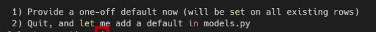
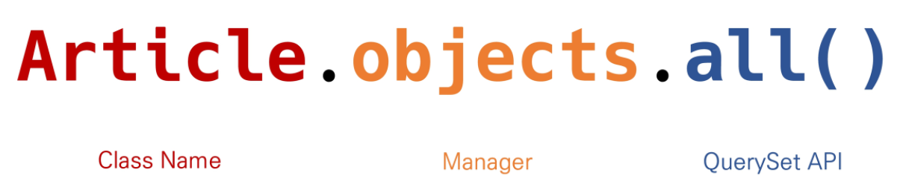
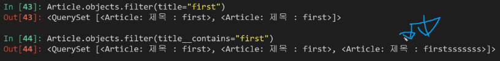
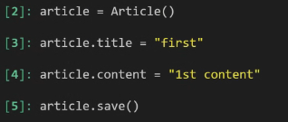
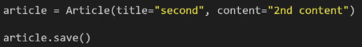
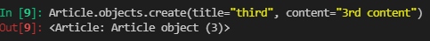

# Django_Model

[toc]

## Model

> 웹 애플리케이션의 데이터를 구조화하고 조작하기 위한 도구

- 단일한 데이터에 대한 정보를 가짐
  - 사용자가 저장하는 데이터들의 필수적인 필드(열)들과 동작들을 포함
- 저장된 데이터베이스의 구조
- **django는 model을 통해 데이터에 접속하고 관리**
- 일반적으로 각각의 model은 하나의 데이터베이스 테이블에 매핑 됨.


### Database

> 체계화된 데이터의 모임

- 쿼리
  - 데이터를 조회하기 위한 명령어
  - 조건에 맞는 데이터를 추출하거나 조작하는 명령어
  - query를 날린다 = DB를 조작한다


- 데이터베이스의 기본구조

  - 스키마(Schema)

    - 데이터베이스에서 자료의 구조, 표현방법, 관계 등을 정의한 구조

    - 데이터베이스의 구조와 제약조건에 관련한 전반적인 명세를 기술한 것

  - 테이블(Table) (=관계)

    - 열과 행의 모델을 사용해 조직된 데이터 요소들의 집합
    - 열(column) : 필드(field) or 속성
      - 각 열에는 고유한 데이터 형식(타입)이 지정되어있음
    - 행(row) : 레코드(record) or 튜플
      - 테이블의 데이터는 행에 저장된다.

  - 기본키(Primary key)

    - 각 행(레코드)의 고유값으로 반드시 설정하여야하며, 데이터베이스 관리 및 관계 설정시 주요하게 활용됨.


### ORM

> Object-Relational-Mapping 
>
> 객체 지향 프로그래밍 언어를 사용하여 호환되지 않는 유형의 시스템 간(ex. django-sql)에 데이터를 변환해주는 프로그래밍 기술

- OOP 프로그래밍에서 RDBMS을 연동할 때, 데이터베이스와 객체 지향 프로그래밍 언어간의 호환되지 않는 데이터를 변환하는 프로그래밍 기법

  ※ 쉽게 말하면, object를 통해서 파이썬을 이용하여 SQL을 쓰겠다

  Django는 내장 Django ORM을 사용함

- 장점 

  - SQL을 잘 알지 못해도 DB 조작이 가능
  - SQL의 절차적 접근이 아닌 객체 지향적 접근으로 인한 높은 생산성

- 단점

  - ORM만으로 완전한 서비스를 구현하기 어려운 경우가 있음

- 즉, 데이터베이스를 객체로서 조작하기 위해 ORM을 사용한다.


### models.py

- 각 모델은 models.Model 클래스를 상속 받음

  - django.db.models 모듈의 Model 클래스를 상속받음

- models 모듈을 통해 어떠한 타입의 DB 컬럼을 정의할 것인지 정의

  ```python
  class Article(models.Model):
      title = models.CharField(max_length=10)
      content = models.TextField()
  ```

  - 위에서 title과 content는 속성이므로 필드(열)와 매핑됨

  - CharField(max_length=None, **options)

    - 길이의 제한이 있는 문자열을 넣을 때 사용

    - max_length는 필수인자

    - 필드 최대 길이(문자), 데이터베이스 레벨과 Django의 유효성 검사(값을 검증하는 것)에서 활용

  - TextField(**options)

    - 글자의 수가 많을 때 사용
    - max_length 옵션 작성시 자동 양식 필드인 textarea 위젯에 반영은 되지만 모델과 데이터베이스 수준에는 적용되지않음
      - 즉, 프론트엔드에서는 제한되지만 데이터베이스에서는 제한되지 않음

  - DataField

    - auto_now_add
      - 최초 생성 일자
      - Django ORM이 최초 insert시에만 현재 날짜와 시간으로 등록
    - auto_now
      - 최종 수정 일자
      - Django ORM이 save할 때마다 현재 날짜와 시간으로 갱신


### Migrations

>  Django가 model에서 생긴 변화를 DB에 반영하는 방법


#### makemigrations 

> model에서 만든 설계도를 저장

```bash
$ python manage.py makemigrations
```

- 모델을 변경한 것에 기반한 새로운 migration을 만들 때 사용
- 모델을 작성한다 = 데이터베이스의 기본적인 구조를 만든다 = 데이터베이스의 설계도를 작성한다
- migrations 폴더 내에 _\_init__ 반드시 필요


#### migrate

> 설계도를 바탕으로 DB에 반영

```bash
$ python manage.py migrate 
#sqlte 익스텐션 설치 후
#sqlite3 파일에서 우클릭 - open database 를 통해 왼쪽 하단부에서 확인 가능
```

- migration을 DB에 반영하기 위해 사용
- 설계도를 실제 DB에 반영하는 과정
- 모델에서의 변경사항들과 DB의 스키마를 동기화시킴
- showmigrations을 통해 설계도가 제대로 반영됐는지 확인 가능


#### sqlmigrate 

> 원하는대로 작동하는지 확인하는 법

```bash
python manage.py sqlmigrate [설계도파일]
```

- 해당 migrations 에 대한 SQL 구문을 보기 위해 사용
- migration이 SQL문으로 어떻게 해석되어서 동작할지 미리 확인할 수 있음


#### showmigrations 

```bash
python manage.py showmigrations
```

- 프로젝트 전체의 migrations 상태를 확인하기 위해 사용
- migration 파일들이 migrate 됐는지 안됐는지 여부를 확인할 수 있음


※ 모델을 수정하고 싶은 경우

- 모델은 가능하면 수정이 없어야함. 즉, 처음에 완벽한 상태로 만들어야함

- 그럼에도 수정해야한다면 ??

  - models.py를 수정하고 다시 makemigrations 실행

  - 그때 두가지 옵션이 생기고 그 중 하나를 선택하면 됨 (1번 선택)

  - 

    


### DB API

> DB를 조작하기 위한 도구

- Django는 기본적으로 ORM을 제공함에 따른 것으로 DB를 편하게 조작할 수 있도록 도움

- model을 만들면 django는 객체 생성, 조회, 수정, 삭제가 가능한 database-abstract API를 자동으로 만든다.

- 구문

  

  - Manager 

    - Django model에 데이터베이스 query 작업이 제공되는 인터페이스
    - 기본적으로 모든 django 모델 클래스에 objects라는 Manager를 추가

  - QuerySet

    - 데이터베이스로부터 전달받은 객체 목록
    - QuerySet 안의 객체는 0개, 1개 혹은 여러개일 수 있음
    - 데이터베이스로부터 조회, 필터, 정렬 등을 수행할 수 있음

    

- django 프로젝트 설정이 load 된 python shell을 활용하면 DB API 구문을 테스트할 수 있음

  ※ shell_plus는 django-extensions 라이브러리의 기능 중 하나로 기본 django shell 보다 더 많은 기능을 제공함

  1. 라이브러리 설치

     ```bash
     pip install ipython
     pip install django-extensions
     ```

  2. 라이브러리 등록

     - settings.py에 등록

     ```python
     INSTALLED_APPS = [
         ...,
         'django_extensions'
         ...,
     ]
     ```

  3. 라이브러리 실행

     ```bash
     python manage.py shell_plus
     ```

     ※ powershell 의 경우 다운 받을 때는 하이폰, but 실행할 때는 언더바

     - 종료는 exit


### CRUD

> Create, Read, Update, Delete

#### Read

- Class_Name.objects.all() 

  - 클래스의 전체 객체 조회
  - 현재 Queryset의 복사본을 반환

- Class_Name.objects.get() 

  - 주어진 lookup 매개변수와 일치하는 객체를 반환

  - 객체를 찾을 수 없으면 DoesNotExist 예외를 발생시키고, 둘 이상의 객체를 찾으면 MultipleObjectsReturned 예외를 발생시킴

  - 때문에 primary key와 같이 고유성을 보장하는 조회에서 사용해야함

  - 예시

    ```python
    # primary key가 100인 객체를 조회
    article = Article.objects.get(pk=100)
    
    # content가 first인 객체를 조회
    article = Article.objects.get(content="first")
    
    ```

- filter()

  - 주어진 lookup 매개변수와 일치하는 객체를 포함하는 새 QuerySet을 반환

  - 예시

    ```python
    # content가 django! 인 객체 탐색 
    Article.objects.filter(content='django!')
    
    # pk가 2보다 큰 객체들 탐색
    Article.objects.filter(pk__gt=2)
    
    # "ja"를 포함하는 객체들 탐색
    Article.objects.filter(content__contains='ja')
    ```

    


- get vs filter

  - get 은 없으면 error / filter는 없으면 빈칸
  - get은 중복이면 오류 / filter는 전부 보여줌
  - get 의 결과값은 인스턴스 / filter는 쿼리셋

  

- 순서 변경

  - Class_Name.objects.all()[::-1]  or  Class_Name.objects.order_by('-pk') 
  - DB로부터 받은 쿼리셋을 역순으로 반환


#### Create

- 인스턴스 하나는 하나의 레코드(= 하나의 행)

- str() 을 정의할 경우 각각의 객체가 사람이 읽을 수 있는 문자열을 반환하도록 할 수 있음

  ```python
  def __str__(self):
      return self.title
  ```

  

<hr>
##### save

- 객체를 데이터베이스에 저장하는 메서드
- **단순히 모델을 인스턴스화 하는 것은 DB에 영향을 미치지 않기 때문에** 반드시 save()가 필요함
- save() 이전에는 데이터에 ID 값이 부여되지 않음

<hr>


- Create 첫번째 방법 _ 인스턴스 생성 후 인스턴스 변수 설정

  ```python
  instance = Class()	
  instance.attribute = ""
  instance.attribute2 = ""
  instance.save()
  ```

  


- Create 두번째 방법 _ 초기 값과 함께 인스턴스 생성

  ```python
  instance = Class(attribute1="", attribute2="")
  instance.save()
  ```




- Create 세번째 방법 _ QuerySet API 사용(create)

  ```PYTHON
  Class.objects.create(attribute1="", attribute2="")
  ```

  

  -  save 메서드가 필요없고, return 값이 있음


#### Update

- 인스턴스 객체의 인스턴스 변수의 값을 변경 후 저장


#### Delete

- QuerySet의 모든 행에 대해 SQL 삭제 쿼리를 수행

- 수행 후 삭제된 객체 수와 객체 유형당 삭제 수가 포함된 딕셔너리를 반환

  ```powershell
  >> instance = Class.objects.get("조건1") #ex) pk=1
  >> instance.delete()
  >> Class.objects.get("조건1")
  #결과 : DoesNotExist
  ```

  

### Admin Site

> 사용자가 아닌 서버의 관리자가 활용하기 위한 페이지

- Model class를 admin.py에 등록하고 관리
- django.contrib.auth 모듈에서 제공됨
- 레코드 생성 여부 확인에 매우 유용하며, 심지어는 직접 레코드를 삽입하는 것도 가능함


#### admin 생성

- 관리자 계정 생성

  ```bash
  python manage.py createsuperuser
  ```

- 서버를 실행하고 '/admin'으로 이동하면 관리자 페이지에 로그인 할 수 있음

- 내가 만든 Model을 보기 위해서는 admin.py에 작성하여 Django 서버에 등록

- auth에 관련된 기본 테이블이 생성되지 않으면 관리자 계정을 생성할 수 없음


#### admin 등록

```python
# admin.py
from jango.contrib import admin
from .models import Class_Name

# 지정한 클래스 객체가 관리자 인터페이스를 갖고 있도록 등록
admin.site.register(Class_Name)
```

- `admin.site.register(Article)`의 경우 Article 객체가 관리자 인터페이스를 갖고 있다는 것을 알려주는 것
- models.py에 정의한 _\_str__의 형태로 객체가 표현됨


#### ModelAdmin options

> ModelAdmin 클래스에서 제공하는 다양한 옵션들을 사용할 수 있음
>
> [공식문서](https://docs.Djangoproject.com/en/3.2/ref/contrib/admin/#modeladmin-options)에서 확인 가능

- admin.py에서 새로운 class를 생성함으로써 옵션 사용 가능

  ```python
  # admin.py
  from jango.contrib import admin
  from .models import Class_Name #적용시킬 클래스 import
  
  # list_display : models.py에서 정의한 각각의 속성들의 값을 admin 페이지에 출력하도록 설정
  class ArticleAdmin(admin.ModelAdmin):
      list_display = ('pk', 'title', 'content')
  
  # 지정한 클래스 객체가 관리자 인터페이스를 갖고 있도록 등록
  admin.site.register(Class_Name)
  ```

- list_filter, list_display_links 등 다양한 ModelAdmin 옵션 참고


### GET vs POST

> HTTP에서 데이터를 주고 받을 때 사용하는 방식

#### GET

- 특정 리소스를 가져오도록 요청할 때 사용
- 반드시 데이터를 가져올 때만 사용해야함
- DB에 변화를 주지 않음
- CRUD에서 R 역할을 담당


#### POST

- 서버로 데이터를 전송할 때 사용
- 리소스를 생성/변경하기 위해 데이터를 HTTP body에 담아 전송
- 서버에 변경사항을 만듦
- CRUD에서 C/U/D 역할을 담당


#### GET & POST in views

- html에서 form을 통해 데이터를 전송할 때 form 태그의 method 속성에 적용

  ex) `<form action="#" method="POST"></form>` 또는 `<form action="#" method="GET"></form>`

  ※ POST Method로 전송하는 경우 csrf token 필요 (하단 참조)

- views에서 데이터를 전송 받을 때 request 사용

  ```python
  request.[Method].get('name') #get의 인자인 name은 input에서 지정해준 name값
  
  #예시
  title = request.POST.get('title')
  content = request.GET.get('content')
  ```

  

#### 사이트 간 요청 위조 (CSRF : Cross-site request forgery)

> 웹 애플리케이션 취약점 중 하나로 사용자가 자신의 의지와 무관하게 공격자가 의도한 행동을 하여 특정 웹페이지를 보안에 취약하게 하거나 수정, 삭제 등의 작업을 하게 만드는 공격 방법

- Django는 CSRF에 대항하여 middleware와 template tag를 제공


##### CSRF 공격 방어

- Security Token 사용 방식 (CSRF Token)

  - 사용자의 데이터에 임의의 난수 값을 부여해, 매 요청마다 해당 난수 값을 포함시켜 전송 시키도록 함
  - 이후 서버에서 요청을 받을 때마다 전달된 token 값이 유효한지 검증

- 일반적으로 데이터 변경이 가능한 POST, PATCH, DELETE Method 등에 적용 (GET 제외)

- Django는 CSRF token 템플릿 태그를 제공

  ```django
  
  ```

  - CSRF 보호에 사용

  - input type이 hidden으로 작성되며 value는 Django에서 생성한 hash 값으로 설정됨

  - 해당 태그 없이 요청을 보낸다면 Django 서버는 403 forbidden을 응답

  - 따라서, POST로 데이터를 전송할 때의 코드는 다음과 같아야함

    ```html
    <!-- html 파일 -->
    <form action="#" method="POST">
        
        ...
    </form>
    ```

    

##### CsrfViewMiddleware

- CSRF 공격 관련 보안 설정은 settings.py에서 MIDDLEWARE에 작성되어있음

- 실제로 요청 과정에서 urls.py 이전에 Middleware의 설정 사항들을 순차적으로 거치며 응답은 반대로 하단에서 상단으로 미들웨어를 적용시킴

  <hr> ※ Middleware

  - 공통 서비스 및 기능을 애플리케이션에 제공하는 소프트웨어
  - 데이터관리, 애플리케이션 서비스, 메시징, 인증 및 API 관리를 주로 미들웨어를 통해 처리
  - 개발자들이 애플리케이션을 보다 효율적으로 구축할 수 있도록 지원하며, 애플리케이션, 데이터 및 사용자 사이를 연결하는 요소처럼 작동

  <hr>


### redirect

> 새 URL로 요청을 다시 보내는 기능

- 인자에 따라 HttpResponseRedirect를 반환

- 브라우저는 현재 경로에 따라 전체 URL 자체를 재구성

- 사용 가능한 인자

  1. model
  2. view name : URL pattern name 이 될 수도 있고 view object가 될 수도 있음
  3. 절대경로 혹은 상대경로

- redirect 함수 import 필요

  ```python
  from django.shortcuts import render, redirect
  ```

  
