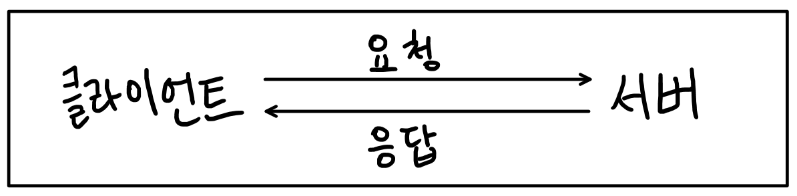

# Django

> **High-level Python ①<u>Web Framework</u>** that encourages rapid development and clean, pragmatic design


## Web Framework

### Web(World Wide Web)

> 인터넷에 연결된 컴퓨터를 통해 정보를 공유할 수 있는 전 세계적인 정보 공간 (=인터넷공간)


#### 종류 

##### ① Static Web page(정적 웹 페이지) (=flat page)

- 서버에 미리 저장된 파일이 사용자에게 그대로 전달되는 웹 페이지
- 서버가 정적 웹 페이지에 대한 요청을 받은 경우 서버는 추가적인 처리 과정 없이 클라이언트에게 응답을 보냄
- 모든 상황에서 모든 사용자에게 동일한 정보를 표시
- 일반적으로 HTML, CSS, Javascript로 작성


##### ② Dynamic Web Page(동적 웹 페이지)

- 웹 페이지에 대한 요청을 받은 경우 서버는 **추가적인 처리 과정 이후** 클라이언트에게 응답을 보냄
- 동적 웹 페이지는 방문자와 상호작용하기 때문에 페이지 내용은 상황마다 그리고 사용자마다 다름
- 서버 쪽을 구성하는 프로그래밍 언어를 서버사이드 프로그래밍 언어라고 하며 대표적으로 Python, Java, C++ 등이 있음
- 이 언어들은 파일을 처리하고 데이터베이스와의 상호작용을 통해 수정,저장,조회,삭제 등의 작업을 수행함


### Framework

> 프로그래밍에서 특정 운영 체제를 위한 __응용 프로그램 표준 구조를 구현하는 클래스와 라이브러리 모음__

- 재사용할 수 있는 수많은 코드를 프레임워크로 통합함으로써 개발자가 새로운 애플리케이션을 위한 표준 코드를 다시 작성하지 않아도 같이 사용할 수 있도록 도움
- 즉, 개발을 위한 기본적인 환경을 제공하는 것(=개발을 0부터 시작하지 않도록 여러 기능을 제공해주는 것)
- application framework라고도 하며 bootstrap도 일종의 framework


### Web Framework

- 웹 페이지를 개발하는 과정에서 겪는 어려움을 줄이는 것을 주 목적으로하며 데이터베이스 연동, 템플릿 형태의 표준, 세션관리, 코드 재사용 등의 기능을 포함
- 동적인 웹 페이지나, 웹 애플리케이션, 웹 서비스의 개발 보조용으로 만들어지는 application framework의 일종


### Web의 작동 과정



##### 클라이언트

- 네트워크라는 시스템을 통해서 서버라고 하는 컴퓨터 시스템 상의 원격 서비스에 접속할 수 있는 응용 프로그램 혹은 디바이스
- 서버에서 제공하는 정보, 자원을 얻기 위해 무언가 **요청**을 할 수 있는 시스템
- 데스크탑, 스마트폰, 웹 브라우저 등

##### 서버

- 클라이언트에게 네트워크 환경을 통해 정보나 서비스를 제공하는 컴퓨터 시스템 (=**응답**)
- django는 서버를 구축하는 프로그램 중 하나


## django

<hr>※  LTS


- Long Term Support (장기 지원 버전)
- 일반적인 경우보다 장기간에 걸쳐 지원하도록 고안된 소프트웨어의 버전
- 컴퓨터 소프트웨어의 제품 수명주기 관리 정책
- 배포자는 LTS 확정을 통해 장기적이고 안정적인 지원을 보장함
- django의 경우 3.2.12 버전이 LTS이기 때문에 4.0이 아닌 3.2.12 버전 사용

<hr>

### Framework Architecture

<hr> ※ MVC Design Pattern (Model-View-Controller) 

- Framework가 어떤 식의 구조로 디자인 되어 있는가?에 대한 답
- 소프트웨어 공학에서 사용되는 디자인 패턴 중 하나
- UI로부터 프로그램 로직을 분리하여 시각적인 영역과 그 이면의 부분을 서로 영향 없이 개발할 수 있음
- __Django는 MTV Pattern 이라고 함__


<hr>

#### MTV Pattern

- Model

  - 응용프로그램의 **데이터 구조를 정의하고, 데이터베이스의 기록을 관리**

  - 데이터에 대한 추가, 수정, 삭제를 관장

- Template (View of MVC)

  - 파일의 **구조나 레이아웃**을 정의
  - 실제 내용을 보여주는데 사용(presentation)
  - 사용자에게 보여지는 부분을 관장
  - 주로 HTML 양식

- View(Controller of MVC)
  - **HTTP 요청을 수신하고 HTTP 응답을 반환**
  - 특정 데이터가 필요할 경우, Model과의 소통을 통해 필요한 데이터에 접근
  - template에게 응답의 서식 설정을 맡김
  - 함수의 역할

- Djang 전개 과정


### project와 application

#### project

- project는 application의 집합

- 프로젝트에는 여러 앱이 포함될 수 있음

  ※ 앱도 여러 프로젝트에 속해 있을 수 있음 (프로젝트가 큰 경우)

- 프로젝트 디렉토리 구조

  - \__init__.py
    - python에게 현재 파일이 위치한 폴더를 하나의 Python 패키지로 다루도록 지시(즉, import 해올 수 있도록 지시하는 파일)
  - asgi.py 
    - Django 애플리케이션이 비동기식 웹 서버와 연결 및 소통하는 것을 도움. 배포 작업시 사용 (Asynchronous Server Gateway Interface)
  - **settings.py** 
    - 애플리케이션의 모든 설정을 포함 (언어 및 시간 표시 기준도 설정 가능)
  - **urls.py** 
    - 사이트의 url과 적절한 views의 연결을 지정, HTTP 요청을 받아서 알맞은 view로 전달
    - urls 지정
      - urlpatterns 부분에 `path('주소', view 함수)` 사용

        - view 함수는 application에서 작성한 함수
        - "주소"로 요청이 오면 지정한 view 함수를 실행하겠다!
      - 다른 프로젝트에서 만든 함수를 사용하기 위해 `from`과 `import` 사용

        - 함수를 만들 때는 무조건 request 가 필수 argumnet로 사용됨
  - wsgi.py 
    - Django 애플리케이션이 웹서버와 연결 및 소통하는 것을 도움. 배포 작업시 사용 (Web Server Gateway Interface)
  - manage.py 
    - Django 프로젝트와 다양한 방법으로 상호작용 하는 커맨드라인 유틸리티 (각종 명령을 수행시킴)


#### application

- 앱은 실제 요청을 처리하고 페이지를 보여주는 등의 역할 담당
- 일반적으로 앱은 하나의 역할 및 기능 단위로 작성함
- 앱을 만들고나서 반드시 프로젝트에 등록을 시켜야함 (**반드시 생성 후 등록할 것!**)
  - project - settings.py - INSTALLED_APPS - 앱 이름 추가
    - INSTALLED_APPS : Django installation에 활성화 된 모든 앱을 지정할 수 있는 문자열 목록
  - 앱등록시 권장 순서에 따라 기재할 것 : Locals apps → Third party apps → Django apps
- 애플리케이션 디렉토리 구조
  - admin.py 
    - 관리자용 페이지를 설정하는 곳
  - apps.py 
    - 앱의 정보가 작성된 곳
  - **models.py** 
    - 앱에서 사용하는 Model을 정의하는 곳
  - tests.py 
    - 프로젝트의 테스트 코드를 작성하는 곳
  - **views.py** 
    - view 함수들의 정의되는 곳
    - 함수를 정의하고 해당 함수는 template을 렌더링한다.(= 응답 서식을 불러온다)
    - 이 때, render는 자동으로 애플리케이션 폴더 내에서 templates 폴더를 찾고 해당 위치에 없으면 템플릿을 가져올 수 없다


### Django 기본 시작과정

1. 가상환경 생성 및 활성화

   ```bash
   python -m venv venv
   ```

   ```bash
   source venv/Scripts/activate #터미널을 실행할 때마다 활성화시켜야함
   ```

2. django 설치

   ```bash
   pip install django==3.2.12
   ```

3. 프로젝트 생성

   ```bash
   django-admin startproject {프로젝트이름} . 
   #마지막 .을 통해 현재 디렉토리에 프로젝트를 생성하도록 명령
   ```


4. 서버 켜서 작동 확인하기(로켓 이미지 확인 가능)

   ```bash
   python manage.py runserver
   ```

5. 새로운 애플리케이션 생성

   ```bash
   python manage.py startapp {app이름}
   ```

6. 앱 등록

   - settings의 INSTALLED_APPS에 추가

7. urls.py에서 `from 어플리케이션 이름 import 함수 ` 실행 

8. urls.py의 urlpatterns에 path로 주소명이랑 함수 설정 (= urls.py를 통해 url과 view를 매핑)

   - `path("주소명/", views.함수)`

9. views.py에서 HTTP 요청을 수신하고 HTTP 응답을 반환하는 함수 만들기 = 관련 html 파일 렌더한다

10. 어플리케이션 내에 새로운 폴더(templates) 만들고 해당 폴더 내에 templates.html 에서 파일의 레이아웃 정의


※ **코드 작성 순서**

- URL → View → Template


### Django Template

- 데이터 표현을 제어하는 도구이자 표현에 관련된 로직
- Django template language : Django Template 위에서 쓸 수 있는 별도의 문법
- Template 파일 탐색 기본 경로는 app 폴더 안의 templates 폴더로 이미 지정되어 있음


#### Django template language(DTL)

- Django template 에서 사용하는 built-in template system
- 조건, 반복, 변수, 치환, 필터 등의 기능을 제공
- Python처럼 일부 프로그래밍 구조(if,for 등)를 사용할 수 있지만, Python코드로 실행되는 것은 아님
  즉,  Django template language(DTL)의 모양일 뿐 파이썬 기능과는 상관 없음
- Python이 HTML에 포함 된 것이 아니며 프로그래밍적 로직이 아니라 단순히 프레젠테이션을 표현하기 위한것


##### DTL 문법 

1. Variable(변수)

```python
{{variable}}
```

- render()를 사용하여 __views.py에서 정의한 변수__(주로 context안에 들어가있는 요소)를 template 파일에서 사용
  - context에 {key:value}와 같이 딕셔너리 형태로 넘겨줌
  - 여기서 정의한 key 이름이 template에서 사용 가능한 변수명이 됨.
  - 만약, key가 여러개라면 template.html에서 원하는 key 이름을 넣어주면 됨
  - 즉, view에서 작성한 딕셔너리의 key값을 template.html에서 `{{ }}` 안에 넣으면 value가 웹상에 출력

- 변수명은 영어, 숫자와 밑줄의 조합으로 구성 가능 but 밑줄로 시작할 수는 없음
- dot(.)를 사용하여 변수 속성에 접근할 수 있음 ex) dic.animal
- views.py의 render()의 세번째 인자에 할당해줌 ex) render(request, 'greeting.html', context)
- value가 인덱싱이 가능할 경우 `key.숫자` 로 인덱싱 가능 


2. Filters

```python
{{ variable|filter }}
```

- 표시할 변수를 수정할 때 사용 ex) {{ name|lower }} → name 변수를 모두 소문자로 출력

- 여러 개의 필터끼리 chained가 가능(ex. variable|filter|filter)하며 일부 필터(ex:join)는 인자를 받기도 함

- 공식 문서에서 여러 filter 요소를 확인 가능

  

3. Tags

```python

```

- 출력 텍스트를 만들거나, 반복 또는 논리를 수행하여 제어 흐름을 만드는 등 변수보다 복잡한 일들을 수행
- 일부 태그는 시작과 종료 태그가 필요 ex) `` / ` `
- if나 for라는 이름은 같지만 파이썬이 구동되는 것은 아님!


4. Comment

- 한줄 주석

```python
{# 내용 #}
```

- 여러줄 주석

```html

    내용1
    내용2

```

- 단축키 Ctrl + /로 사용 가능


#### Template Inheritance (템플릿 상속)

- 템플릿 상속은 기본적으로 코드의 재사용성에 초점을 맞춤

- 템플릿 상속을 사용하면 사이트의 모든 공통 요소를 포함하고 하위 템플릿이 재정의(override) 할 수 있는 블록을 정의함. 따라서, 기본 뼈대가 되는 템플릿을 만들 수 있음

- 부모 템플릿은 주로 base로 지정

- 부모 템플릿의 위치는 새로운 templates 폴더를 생성해서 해당 폴더로 지정

- 템플릿 추가 경로 설정

  - 본래는 template 파일을 찾을 때 application 폴더 안에 있는 templates 폴더로부터 탐색함

  - settings.py 내에서 TEMPLATES 중 빈 리스트로 되어있는 DIRS에 새로운 템플릿 탐색 경로 기입 ex) 'DIRS' : [BASE_DIR / 'templates',]

  - BASE_DIR : 현재의 장고 프로젝트 폴더가 위치해있는 폴더 (manage.py가 존재하는 폴더)

    먼저는 application 폴더 내에 있는 templates 폴더에서 템플릿 파일을 찾고 없다면 base_dir에 지정한 위치에서 찾는다


##### 템플릿 관련 태그

1. extends

```python

```

- 자식템플릿이 부모 템플릿을 확장(상속)한다는 것을 알림
- **반드시 템플릿 최상단**에 작성 되어야 함


2. block

```python
 
```

- 하위 템플릿에서 재지정(override)할 수 있는 블록을 정의
- 즉, 하위 템플릿이 채울 수 있는 공간
- 부모 템플릿에도 작성하고 자식 템플릿에도 작성함
  - 블록 이름을 통해서 매핑됨

- block은 여러개가 될 수 있다


3. include tag

```python

```

- 템플릿을 로드하고 현재 페이지로 렌더링
- 템플릿 내에 다른 템플릿을 포함하는 방법
- 파일명 앞에 주로 언더바(_)를 사용함으로써 다른 템플릿들과 구분함(기능은 따로 없음)
  - include되도록 만든 템플릿이라는 것을 표시하는 방법


#### Django 설계 철학

1. 표현과 로직을 분리
   1. 템플릿 시스템은 표현을 제어하는 도구이자 표현에 관련된 로직일 뿐이다.
   2. 즉, 템플릿 시스템은 이러한 기본 목표를 넘어서는 기능을 지원하지 말아야한다.
   3. 즉, 템플릿은 잘 보여주는 것만 집중, 나머지 연산 및 기능은 view에서 설정
2. 중복을 배제
   1. 대다수의 사이트가 갖는 공통 디자인은 한곳에 저장하여 중복코드를 없앤다.
   2. 템플릿 상속을 활용한다.
3. 트레일링 콤마
   1. django에서는 항상 끝에 (,)를 넣어준다(관행적 요소)

4.  앤드 슬래쉬
   1. django에서는 url을 적을 때 뒤에 /를 넣어준다(관행적 요소)

