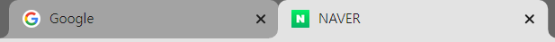
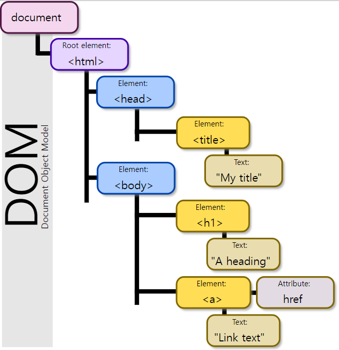
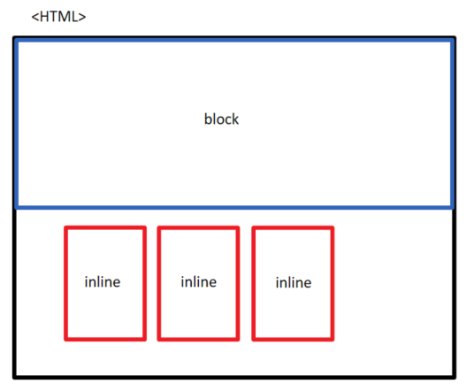

# HTML

> ## Hyper Text Markup Language
>
> - 웹 페이지를 작성(구조화)하기 위한 언어
> - Hyper Text : 참조(하이퍼링크)를 통해 사용자가 한 문서에서 다른 문서로 즉시 접근할 수 있는 텍스트
> - Markup Language : 태그 등을 이용하여 __문서나 데이터의 구조를 명시__하는 언어 ex) HTML, Markdown
>   - 마크업은 프로그래밍 언어가 아님.


### HTML의 기본 구조

```html
<!DOCTYPE html>
<html>
    <head>
        
    </head>
    <body>
        
    </body>
</html>
```


#### html  

> 문서의 최상위(root) 요소

- html 위에 `<!DOCTYPE html> ` 을 기재함으로써 어떤 문서인지 확인시켜줌

  ※ 쓰지 않는다고 해서 기능에 이상이 생기지는 않지만 예전부터 행해오던 관습적인 부분

- ! 하고 tab 누르면 자동으로 골격이 완성됨.


#### head 

> 문서 메타데이터 요소

- 메타데이터 : 데이터를 설명하기 위한 데이터 `ex) 사진의 메타데이터 : 촬영일, 카메라 기종, 촬영위치(GPS) 등등`

- 문서 제목, 인코딩, 스타일, 외부 파일 로딩 등

- 일반적으로 브라우저에 나타나지 않는 내용

- 예시
  - \<title> : 브라우저 상단 타이틀 (탭 영역에 나타나는 페이지 이름)
  
    
  
  - \<meta> : 문서 레벨 메타데이터 요소
  
  - \<link> : 외부 리소스 연결 요소 (CSS 파일, favicon 등을 사용할 때)
  
  - \<script> : 스크립트 요소 (JavaScript 파일/코드를 사용할 때)
  
  - \<style> : CSS 직접 작성 (문서의 디자인적인 요소를 작성하는 부분)
  
    

#### body 

> 문서 본문 요소

- 실제 화면 구성과 관련된 내용

​	※ html의 \<head>나 \<body>는 시맨틱 태그는 아님. 기본구조라고 생각하면 됨.
​    	만약 html 파일에 아무것도 작성하지 않고 브라우저로 호출해도 자동으로 head와 body가 생성되는 것을 확인할 수 있음.


#### DOM 트리

> 텍스트 파일인 **HTML 문서를 브라우저에서 렌더링(표현) 하기 위한 구조**

- HTML 문서에 대한 모델을 구성함

- HTML 문서 내의 각 요소에 접근 및 수정에 필요한 프로퍼티와 메서드를 제공함



​																																			출처 : [위키백과](https://ko.wikipedia.org/wiki/%EB%AC%B8%EC%84%9C_%EA%B0%9D%EC%B2%B4_%EB%AA%A8%EB%8D%B8)


#### 요소

- HTML의 요소는 **태그와 내용(Contents)**로 구성되어 있음  ex)  (여는/시작 태그)\<h1> contents \</h1>(닫는/종료 태그)
  
- 내용(content)이 없는 태그들도 존재함.
  
  → 내용이 없는 태그들 = 닫힌 태그가 없는 태그들  ex) br, hr, img, input, link, meta
  
  ※ input 안에 적혀있는 text는 value 속성을 활용한 결과물 ex) id 입력칸 내부의 "id를 입력하세요"

- 요소는 중첩 될 수 있음
  - 요소의 중첩을 통해 하나의 문서를 구조화
  
    - 여는 태그와 닫는 태그의 쌍을 잘 확인해야함
  
      why?) __HTML은 오류를 반환하지 않고 그냥 레이아웃이 깨진 상태로 출력됨__. 즉, 틀렸음에도 인지를 못할 수도 있음.
  
    

#### 속성

>  속성을 통해 태그의 부가적인 정보 설정이 가능함

- 요소는 속성을 가질 수 있으며, 경로나 크기와 같은 추가적인 정보를 제공

- 요소의 시작 태그에 작성하며 보통 이름과 값이 하나의 쌍으로 존재 ex) `<태그 속성명="속성값"></태그>`

- 태그별로 사용할 수 있는 속성은 다름

- 속성명, 속성값을 적을 때 공백은 사용하지 않고, 속성값은 큰따옴표로 감싸야함

  태그와 속성 사이 그리고 속성과 다른 속성 사이에 공백을 사용하기 때문에 다른 경우에는 공백을 쓰지 않음.

- 태그와 상관없이 사용 가능한 속성(HTML global attribute)들도 있음

  - 모든 HTML 요소가 공통적으로 사용할 수 있는 대표적인 속성

    1. id : 문서 전체에서 유일한 고유 식별자 지정

    2. class : 공백으로 구분된 해당 요소의 클래스 목록 (CSS, JS에서 요소를 선택하거나 접근)  하나의 요소에 복수의 클래스를 선정 할 수 있음 (띄어쓰기로 구분)
    3. data-* : 페이지에 개인 사용자 정의 데이터를 저장하기 위해 사용
    4. style : inline 스타일
    5. title : 요소에 대한 추가 정보 지정 (마우스를 해당 요소 위에 위치시 추가 정보 확인 가능)
    6. tabindex : 요소의 탭 순서
       ex) \<p tabindex="1"> : 첫번째로 가겠어\</p>
             \<p tabindex="2"> : 두번째로 가겠어\</p>
       ※ p 태그의 경우 브라우저에서 제공하는 기본 글꼴로 기록됨.


#### 시맨틱 태그

> 아무런 기능이 없지만, 각각의 태그를 통해 영역에 대한 설명을 해줌. (**의미론적인 요소**를 담은 태그)

- 기존에는 div만을 사용했었으나 div를 대체하여 사용
- h1 태그도 제목이라는 의미를 나타내기 때문에 시맨틱 태그라고 할 수 있음(다만, h1 태그의 경우 기능이 있다는 차이)
- 적극적으로 사용하는게 좋음
- 본래는 div로만 나눠져있던 것을 header, section, footer등으로 나눠준다면 더 가독성이 좋아지고, 유지보수가 쉬워짐
  (구글 뉴스에서 개발자도구로 확인해 볼 수 있음)
- 검색엔진 최적화를 위해서도 적극적으로 활용해야함.
- 예시
  - header : 문서 전체나 섹션의 헤더
  - nav : 내비게이션
  - aside : 사이드에 위치한 공간, 메인 콘텐츠와 관련성이 적은 콘텐츠
  - section : 문서의 일반적인 구분, 컨텐츠의 그룹을 표현
  - article :  문서, 페이지, 사이트 안에서 독립적으로 구분되는 영역
  - footer : 문서 전체나 섹션의 마지막 부분

- non semantic 요소는 div,span 등이 있음


#### 인라인/블록 요소

- 인라인 : 작성한 만큼만 자리를 차지함

  - html의 경우 엔터를 친다고 해서 줄바꿈이 되는 것이 아님. 블록 태그를 활용하거나 \<br>을 이용해야함.

- 블록 : 나머지 부분이 남아도, 빈칸으로 자리를 차지함

  ​			


#### HTML 문서 구조화

##### 각종 요소 예시

- <h1 title = "haha">
        h1 예시.볼드체와 좀 커진 글씨
    </h1>
    <p title="안녕!">
        마우스 올리면 타이틀을 확인 가능
    </p>
    
    <a href="https://www.naver.com">네이버로 갈 수 있음. 해당url이 하이퍼링크로 작성됨.</a>


##### 텍스트 요소

- \<a>\</a> : href 속성을 활용하여 다른 URL로 연결하는 하이퍼링크 생성
- \<b>\</b> / \<strong>\</strong>  : 굵은 글씨 요소
  - \<b>와 \<strong> 의 차이 : strong은 중요한 요소라는 것을 명시하기 위한 시맨틱 요소(볼드체도 적용되긴 함)
  - em 도 마찬가지 em은 시맨틱적인 요소, i는 단순히 기울임.
- \<i>\</i> / \<em>\</em> : 기울임 글씨 요소
- \<br> : 텍스트 내에 줄 바꿈 생성 (닫힘 태그 없음)
- \ : 이미지 표현 (닫힘 태그 없음)
  ex) \
- \<span>\</span> : 의미없는 **인라인 컨테이너**
  


##### 그룹 요소

- \<p>\</p> : 하나의 문단

- \<hr> : 수평선 표현

- \<ol>\</ol> : 순서가 있는 리스트 ex) 1. 내용    2. 내용2    3. 내용3)

- \<ul>\</ul> : 순서가 없는 리스트 ex) 말머리 기호

- \<pre>\</pre> : HTML에 작성한 내용을 그대로 표현

- \<blockquote>\</blockquote> : 텍스트가 긴 인용문 / 주로 들여쓰기를 한 것으로 표현됨

- \<div>\</div> : 의미없는 블록 레벨 컨테이너

  

##### 테이블

- thead, tbody, tfoot 로 구분해줌.


  - 테이블이라는 태그 안에 만들어줘야함


  - \<tr> 은 라인을 의미, \<td>는 안의 내용, \<th> 는 제목을 의미


  - \<td colspan=2> 로 한다면, 열 2개를 합쳐주겠다 라는 의미
    \<td rowspan=2> 로 한다면, 행 2개를 병합하겠다는 의미.

    <table> 
        <thead>
            <tr>
                <th>ID</th>
                <th>name</th>
                <th>major</th>
            </tr>
        </thead>
        <tbody>
            <tr>
                <td>값</td>
                <td>값</td>
                <td>값</td>
            </tr>
        </tbody>
        <tfoot>
            <tr>
            <td>총계</td>
            <td colspan = "2"> 2 </td></td>
            </tr>
        </tfoot>
    </table>
    
  - 테이블의 기본 구성을 잘 숙지할 것

    ```html
    <thead>
        <tr>
            <th></th>
        </tr>
    </thead>
    <tbody>
        <tr>
            <td></td>
        </tr>
    </tbody>
    <tfoot>
        <tr>
        	<td></td>
        </tr>
    </tfoot>
    ```


##### 기타


- form

  - 정보를 서버에 제출하기 위한 영역으로 form 태그에 갇힌 내용들을 모두 action에 적은 서버로 보낸다

    ```html
    <form action="url">contents</form>
    ```

  - form의 method : 어떠한 형식으로 정보를 전달할 것인지 선정 가능 (get = 확인가능, post = 확인 불가(숨김))

- input
  - form은 전달을 받는 방법을 설정한다면, input은 전달 하는 방법을 설정. 즉, __input은 사용자에게 어떠한 입력값을 받기 위해 있는 것__

  - 대표적인 속성
    - name : form control에 적용되는 이름 (`이름 = 값` 페어로 전송됨)
    - value : form control에 적용되는 값 (`이름 = 값` 페어로 전송됨)
      
      ex) 구글 검색창에 Kim을 검색하면 q라는 name에 Kim이 할당되고 q=Kim 형식으로 전송됨
      
      `https://www.google.com/search?q=Kim` (search는 form의 action 속성의 값)
    - autofocus : 자동으로 커서가 지정한 곳에 위치함.
    - disabled : 특정 조건을 만족했을 때만 보여지도록 함.
    
  - 각종 타입이 존재 (타입은 input의 속성을 지정하는 것처럼 type=x 로 지정)
    - text : 일반 텍스트 입력
    
    - password : 입력시 값이 보이지 않고 문자를 특수기호(*)로 표현
    
    - emaili : 이메일 형식이 아닌 경우 form 제출 불가
    
    - number : min, max, step 속성을 활용하여 숫자 범위 설정 가능
    
    - file : accept 속성을 활용하여 파일 타입 지정 가능
    
    - checkbox : 다중 선택
    
    - radio : 단일 선택 / name에 같은 값을 지정하면 같은 name 내에서 하나만 선택 가능(복수 응답 불가)
      
      ※ name이 다르면 중복체크가 가능. but, 중복체크를 하고 싶으면 checkbox 를 사용하면 됨
      
      ★★ checkbox와 radio 는 value를 지정해줘야함. ★★
      value = 해당 박스나 라디오를 선택했을 때 서버에 전송할 값. 다른 type 들은 사용자가 입력하는 값이 value로 적용됨
      
    - submit : form의 내용을 서버로 제출시킬 수 있도록 함 (form 태그의 action에서 설정해놓은 곳으로 전송)
                      ※ 흔히 볼 수 있는 제출 버튼의 역할 
    
    - color : 색 선택 picker 제공
    
    - date : 날짜 선택 picker 제공
    
    - hidden : 사용자에게 보이지 않는 input으로 사용자 입력을 받지 않고 서버에 전송되어야하는 값을 설정
    
      
    
  
- input label 
  
  - label : label을 통해 input의 범위를 넓게 지정할 수 있음
    체크박스를 예로 생각하면 좋음. 원래는 박스를 클릭해야하지만 라벨을 통해 범위를 넓힐 수 있음.
  
  - \<input>에 id 속성을, \<label>에는 for 속성을 활용하여 상호 연관 시킴
    즉, 연결시킬 input의 id를 label에서 `for="id"` 형식으로 지정
  
  - for와 id 가 같이 쓰이고, name과 value가 같이 쓰임
  
    
  
- select 

  - 선택 목록 박스 제공 
  - 자식 요소로 option tag와 value를 통해 값 설정

  ```html
  <selct name="region" id="region">
      <option value="">선택</option>
      <option value="서울">서울</option>
      <option value="경기">경기</option>
      <option value="부산">부산</option>
  </selct>
  ```

