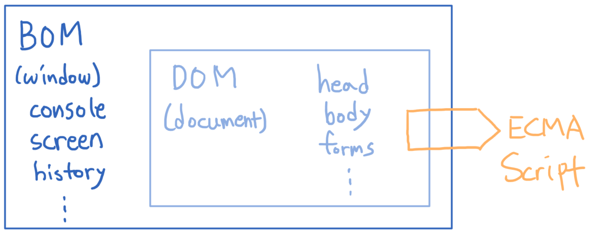

# JavaScript

[toc]

## JavaScript

- 이전까지의 영역이 server side  였다면 지금부터는 client side
- front-end의 대부분이라고 볼 수 있음

------

※ JavaScript의 필요성

- 브라우저 화면을 '동적'으로 만들기 위함
- 브라우저를 조작할 수 있는 유일한 언어
  - RDBMS가 이해할 수 있고 RDBMS를 조작할 수 있는 언어는 SQL이 유일
  - but, 브라우저의 경우에는 JavaScript가 유일

- **웹사이트가 로딩된 이후에 CSS와 HTML 구성요소들을 변경할 수 있게 해주며, 이를 통해서 웹사이트를 보다 interactive하게 만들고 사용자의 참여율도 높일 수 있음** (from. wishket)
- HTML로 웹페이지의 뼈대를 만들고 CSS로 웹 페이지의 옷을 입히고, Javascript로 기능을 추가한다고 할 수 있음
  - HTML-CSS-JS 의 기능 [비교 사이트](https://html-css-js.com/)


<hr>

### 브라우저(browser)

- URL로 웹(www)을 탐색하며 서버와 통신하고, HTML 문서나 파일을 출력하는 GUI 기반의 소프트웨어
- 인터넷의 컨텐츠를 검색 및 열람하도록 함
- "웹 브라우저"라고도 함
- 주요 브라우저
  - Google Chrome, Mozilla Firefox, Microsoft Edge, Opera, Safari


#### 브라우저에서 할 수 있는 일

- DOM(Document Object Model) 조작
  - 문서 (HTML) 조작
- BOM(Browser Object Model) 조작
  - navigator, screen, location, frames, history, XHR
- JavaScript Core (ECMAScript)
  - Data Structure(Object, Array), Conditional Expression, Iteration
- 브라우저(BOM)과 그 내부의 문서(DOM)를 조작하기 위해 ECMAScript(JS)를 학습하는 것
  - 즉, ECMAScript를 활용하여 BOM과 DOM을 조작할 수 있음





#### DOM

- HTML, XML과 같은 문서를 다루기 위한 프로그래밍 인터페이스
- 문서를 구조화하고, 구조화된 구성 요소를 하나의 객체로 취급하여 다루는 논리적 **트리 모델**
- 문서가 객체(object)로 구조화되어 있으며 key로 접근 가능
- 단순한 속성 접근, 메서드 활용뿐만 아니라 프로그래밍 언어적 특성을 활용한 조작 가능
- 주요 객체
  - window : **DOM을 표현하는 창(브라우저 탭), 최상위 객체** 
    - 때문에 본래는 `window.console.---` 등과 같이 입력하는 것이 이론상으론 맞지만 JS에서 window는 생략해도 되도록 설정
    - 즉, `document` === `window.document`
  - document : 페이지 컨텐츠의 Entry Point 역할을 하며, \<head>,\<body> 등과 같은 수많은 다른 요소들을 포함
    - 값 뿐만 아니라 메서드, 속성들을 갖고 있음
    - [document의 속성 및 메서드](https://developer.mozilla.org/ko/docs/Web/API/Document)
  - navigator, location, history, screen
- 파싱(Parsing)
  - 구문 분석, 해석
  - 브라우저가 문자열을 해석하여 DOM Tree로 만드는 과정
- HTML 역시도 결국은 string 덩어리일 뿐, 이러한 string 덩어리를 구조화시키는 과정 즉, 파싱이 필요하고 그 **구조화된 트리 모습의 자료구조를 DOM**이라고 부른다
- console 에서 document 입력 후 범위 확인해볼 것


#### BOM

- Browser Object Model
- 자바스크립트가 브라우저와 소통하기 위한 모델
- 브라우저의 창이나 프레임을 추상화해서 프로그래밍적으로 제어할 수 있도록 제공하는 수단
  - 버튼, url 입력창, 타이틀 바 등 브라우저 윈도우 및 웹 페이지 일부분을 제어 가능
  - 예시
    - widow.cofirm, window.print() 등등
- window 객체는 모든 브라우저로부터 지원받으며 브라우저의 창(window)을 지칭하고 브라우저의 탭을 상징


#### JavaScript Core

- 브라우저을 조작하기 위한 명령어 약속

- 기본적인 언어적 문법

- 즉, 위 두가지 DOM과 BOM을 조작하기 위한 문법

  

#### ECMAScript

- ECMA(ECMA International)
  - 정보 통신에 대한 표준을 제정하는 비영리 표준화 기구
- ECMAScript는 ECMA ECMA-262* 규격에 따라 정의한 언어
  - ECMA-262*: 범용적인 목적의 프로그래밍 언어에 대한 명세
- ECMAScript6는 ECMA에서 제안하는 6번째 표준 명세를 말함
  - ECMAScript6 의 발표 연도에 따라 ECMAScript2015라고도 말함


#### 세미콜론(Semicolon)

- 자바스크립트는 세미콜론을 선택적으로 사용 가능
- 세미콜론이 없으면 ASI에 의해 자동으로 세미콜론이 삽입됨
  - ASI : 자동 세미콜론 삽입 규칙 (Automatic Semicolon Insertion)

```javascript
// 세미콜론이 있는 경우
const greeting = 'Hello world!';
console.log(greeting);

// 세미콜론이 없는 경우
const greeting = 'Hello, world!'
console.log(greeting)
```


#### 코딩 스타일 가이드

- 코딩 스타일의 핵심은 합의된 원칙과 일관성
  - 절대적인 하나의 정답은 없으며, 상황에 맞게 원칙을 정하고 일관성 있게 사용하는 것이 중요
- 코딩 스타일은 코드의 품질에 직결되는 중요한 요소
  - 코드의 가독성, 유지보수 또는 팀원과의 커뮤니케이션 등 개발 과정 전체에 영향을 끼침
- 다양한 자바스크립트 코딩 스타일 가이드
  - Airbnb Javascript Style Guide
  - Google Javascript Style Guide
  - standardjs


#### 변수와 식별자

#### 식별자(identifier)

- 변수를 구분할 수 있는 **변수명**

- 식별자는 반드시 문자, 달러($) 또는 밑줄(_)로 시작

- 대소문자를 구분하며, 클래스명 외에는 모두 소문자로 시작

- 예약어 사용 불가능 ex) for, if, function 등

- 작성 스타일

  1. 카멜 케이스(camelCase)

     - 두 번째 단어의 첫 글자부터 대문자 ex) userInfo, getName

     - 변수, 객체, 함수에 사용
     - 띄어쓰기나 언더스코어 대신 대문자를 사용하는 것

  2. 파스칼 케이스 (PascalCase)

     - 모든 단어의 첫 번째 글자를 대문자로 작성 ex) CodeTest, ModelAdmin
     - **클래스, 생성자**에 사용

  3. 대문자 스네이크 케이스 (SNAKE_CASE)

     - 모든 단어를 대문자로 작성 & 단어 사이에 언더스코어 삽입 ex) API_KEY, PI
     - **상수**(constants)에 사용
     - 상수란 개발자의 의도와 상관없이 변경될 가능성이 없는 값을 의미


#### 변수

##### 변수 선언 키워드

> 변수를 선언할 때 변수명 앞에 변수 선언 키워드를 지정해줘야함

|                let                |                 const                  |                     var                     |
| :-------------------------------: | :------------------------------------: | :-----------------------------------------: |
| 재할당 할 예정인 변수 선언시 사용 | 재할당 할 예정이 없는 변수 선언시 사용 | ES6 이전에 변수를 선언할 때 사용되던 키워드 |
|        변수 재선언 불가능         |           변수 재선언 불가능           |                 재선언 가능                 |
|            블록 스코프            |              블록 스코프               |                 함수 스코프                 |
|            호이스팅 X             |               호이스팅 X               |                 호이스팅 O                  |

- 선언(Declaration)

  - 변수를 생성하는 행위 또는 시점

    ```javascript
    let foo
    console.log(foo) //결과 : undefined
    ```

    ※ console.log 는 파이썬의 print와 같은 역할

    - Js는 python과 달리 할당 없이 선언만 할 수도 있음. 단, 해당 변수는 undefined

  - 재선언 let vs const

    ```javascript
    let number = 10 //선언 및 할당
    let number = 50 //재선언
    ```

    ```javascript
    const number = 10 //선언 및 할당
    const number = 50 //재선언
    ```

    - 둘 다 Uncaught SyntaxError 오류 발생

  

- 할당(Assignment)

  - 선언된 변수에 값을 저장하는 행위 또는 시점

    ```javascript
    let foo
    foo = 11
    console.log(foo) //결과 : 11
    
    let bar = 0 // 선언 + 할당
    ```

  - 재할당 let vs const 

    ```javascript
    //let
    let number1 = 10 //할당
    number1 = 10 //재할당
    console.log(number) //결과 : 10
    
    
    //const
    const number2 = 10 //할당
    number2 = 10 //재할당 
    // 결과 : Uncaught Type Error
    ```

    - const의 경우 할당한 객체의 변동은 가능, but 변수에 다른 값을 할당하는게(==재할당) 안되는 것뿐.

      간단하게 말하면 `=` 을 통해 새로운 값을 넣는 것이 안된다는 것

  

- 초기화

  - 선언된 변수에 처음으로 값을 저장하는 행위 또는 시점

    ```javascript
    let bar = 0
    console.log(bar) //결과 : 0
    ```

    

- 블록 스코프(block scope)

  - if, for, 함수 등의 **중괄호 내부**를 가리킴
  - 블록 스코프를 가지는 변수는 **블록 바깥에서 접근 불가**
  - 즉, 밖에서 중괄호 안으로 접근이 불가함

  

##### var

- ES6 이전에 변수를 선언할 때 사용되던 키워드

- 재선언, 재할당 모두 가능

  ```javascript
  var number = 10 // 선언 및 할당
  var number = 50 // 재할당
  console.log(number) //결과 : 50
  ```

  

- **호이스팅** 되는 특성으로 인해 예기치 못한 문제 발생 가능

  - 따라서, ES6 이후부터는 var 대신 const와 let을 사용하는 것을 권장

  - 호이스팅

    - 변수를 선언 이전에 참조할 수 있는 현상

    - 변수 선언 이전의 위치에서 접근시 undefined를 반환

      ```javascript
      console.log(username) // 결과 undefined
      var username = '홍길동' // 오류발생 x
      
      console.log(username) // 결과 Uncaught ReferenceError
      let email = 'gildong@mail.com' // 오류발생 
      
      console.log(age) // 결과 Uncaught ReferenceError
      const age = 50 // 오류발생
      ```

      

- 함수 스코프

  - 파이썬과 같은 함수 스코프
  - 함수의 중괄호 내부를 가리킴
  - 함수 스코프를 가지는 변수는 함수 바깥에서 접근 불가능
  - let 이나 const의 경우 블록 스코프 이기 때문에 if,for 문 등에서도 중괄호 외부에서 접근이 불가했음. but, var는 함수에 한해서만 접근이 불가하고, if,for문 등에서는 접근이 가능해져버림
  


- 만약 변수를 선언할 때 아무 키워드도 지정하지 않으면? => [문서 참조](https://www.geeksforgeeks.org/what-happen-when-we-directly-assign-the-variable-without-declaring-it-in-javascript/)


### 데이터 타입

> 자바스크립트의 모든 값은 특정한 데이터 타입을 가짐
>
> 크게 원시타입(Primitive type)과 참조타입(Reference type)으로 분류됨
>
> 즉, 직접 값을 갖고 있는지 아니면 참조하는지의 차이


#### 원시타입(Primitive type)

- 객체(object)가 아닌 기본 타입
- 변수에 해당 타입의 **값**이 담김
- 다른 변수에 복사할 때 **실제 값이 복사**됨

```javascript
let message = '안녕하세요!' //원시타입 데이터 할당

let greeting = message //값이 복사됨
console.log(greeting) //'안녕하세요!' 출력

message = 'Hello, world!' //message 재할당
console.log(greeting) //그대로 '안녕하세요!' 출력
```


##### 숫자 (Number) 타입

- 정수, 실수 구분 없는 하나의 숫자 타입
- 부동소수점 형식을 따름
- NaN(Not A Number)
  - 계산 불가능한 경우 오류가 아닌 해당 NaN이 반환
  - NaN은 문자열이 아니고 숫자 타입
  - 즉, '숫자가 아니야!' 라고 알려주는 역할. but, type은 숫자임


##### 문자열(String) 타입

- 텍스트 데이터를 나타내는 타입

- 16비트 유니코드 문자의 집합

- 작은옴표, 큰따옴표 모두 가능

- 템플릿 리터럴(Template Literal)

  - 파이썬의 f-string과 같은 기능
  - ES6부터 지원
  - 따옴표 대신 backtick(\`)으로 표현하며 \`${exression}`형태로 표현식 삽입

  ```javascript
  const firstName = 'Brandan'
  const lastName = 'Eich'
  const fullName = `${firstName} ${lastName}`
  
  console.log(fullName) //결과 : Brandan Eich
  ```


##### undefined

- 변수의 값이 없음을 나타내는 데이터 타입

- 개발자의 의도한게 아님

- 변수 선언 이후 직접 값을 할당하지 않으면, **자동**으로 undefined가 할당됨

  ```javascript
  let firstName
  console.log(firstName) // 결과 : undefined
  ```

  

##### null

- 변수의 값이 없음을 **의도적으로** 표현할 때 사용하는 데이터 타입
  - 따라서, **자동으로 할당되지 않으며 직접 할당해야함**
  
    ```javascript
    let firstName = null
    ```
  
- '없다' 라고 표현하고 싶을 때 사용

- null의 typeof 결과
  - typeof : 자료형 평가를 위한 연산자
  - null 타입은 ECMA에 따라 원시타입에 속하지만, typeof 연산자의 결과는 객체(object)로 표현

| undefined                                                  | null                                   |
| ---------------------------------------------------------- | -------------------------------------- |
| 빈 값을 표현하기 위한 데이터 타입                          | 빈 값을 표현하기 위한 데이터 타입      |
| 변수 선언 시 아무 값도 할당하지 않으면, JS가 자동으로 할당 | 개발자가 의도적으로 필요한 경우에 할당 |
| `typeof(undefined)` = undefined                            | `typeof(null)` = object                |


##### Boolean 

- 논리적 참 또는 거짓을 나타내는 타입

- true 또는 false로 표현

  - 파이썬은 True, False 지만 파이썬과는 다르게 쓰임

- 조건문 또는 반복문에서 boolean이 아닌 데이터 타입은 자동 형변환 규칙에 따라 true 또는 false로 변환됨

  - 자동 형변환 규칙

  | 데이터 타입 | 거짓      | 참                                 |
  | ----------- | --------- | ---------------------------------- |
  | undefined   | 항상 거짓 | X                                  |
  | Null        | 항상 거짓 | X                                  |
  | Number      | 0,-0,NaN  | 나머지 모든 경우                   |
  | String      | 빈 문자열 | 나머지 모든 경우                   |
  | Object      | X         | 항상 참 <br />(비어있는 배열도 참) |
  
  - 파이썬에서는 비어있는 배열이 False지만 Js에서는 true
  
  

#### 참조 타입(Reference type)

- 객체(object) 타입의 자료형
- 변수에 해당 객체의 **참조 값이 담김**
- 다른 변수에 복사할 때 **참조 값이 복사됨**

```javascript
const message = ['안녕하세요!'] //참조타입 데이터 할당
 
const greeting = message //참조값 복사
console.log(greeting) // '안녕하세요!' 출력

message = 'Hello, world!' //message 재할당
console.log(greeting) //['Hello, world!'] 출력
```

- 함수, 배열, 객체 등이 있음

  


### 연산자

#### 할당 연산자

> 오른쪽에 있는 피연산자의 평가 결과를 왼쪽 피연산자에 할당하는 연산자

- 다양한 연산에 대한 단축 연산자 지원
- Increment : `++` 피연산자의 값을 1 증가시키는 연산자
- Decrement : `--` 피연산자의 값을 1 감소시키는 연산자
  - but, `++`나 `--` 보다 `+=1` `-=1` 로 사용할 것을 권장
- `+=`, `-=`, `/=` 등의 연산자 사용 가능


#### 비교 연산자

> 피연산자들(숫자, 문자, Boolean 등)을 비교하고 결과값을 boolean 으로 반환하는 연산자

- 문자열은 유니코드 값을 사용하며 표준 사전 순서를 기반으로 비교
  - 알파벳끼리의 비교
    - 알파벳 순서상 후순위가 더 크다 ex) 가>나 = false
    - 소문자가 대문자보다 더 크다 (== 소문자가 후순위다)
  - 즉, 글자마다 고유한 숫자가 부여되어있고 해당 숫자의 크기를 비교한다
- `<`, `>`, `<=`, `>=` 등의 연산자 사용 가능


#### 동등 비교 연산자

> 두 피연산자가 같은 값으로 평가되는지 비교 후 boolean 값을 반환

- **비교할 때 암묵적 타입 변환을 통해 타입을 일치시킨 후에 같은 값인지 비교**
- 두 피연산자가 모두 객체일 경우에는 같은 객체를 참조하고 있는지 판별
- 예상치 못한 결과가 발생할 가능성이 매우 크므로 **특별한 경우를 제외하고는 사용하지 않음**

```javascript
const a = 1004
const b = '1004'
console.log(a == b) // 결과: true

const c = 1
const d = true
console.log(c == d) // 결과: true

// 자동 타입 변환
console.log(a+b) // 결과: 10041004
console.log(c+d) // 결과: 2
```


#### 일치 비교 연산자

> 두 피연산자가 같은 값으로 평가되는지 비교 후 boolean 값을 반환

- 엄격한 비교가 이뤄지며 암묵적 타입변환이 발생하지 않음
  - 엄격한 비교 : 두 비교 대상의 타입과 값 모두 일치하는지 비교하는 방식
- 두 피연산자가 모두 객체일 경우 **메모리의 같은 객체를 바라보는지 판별**

```javascript
const a = 1004
const b = '1004'
console.log(a === b) // 결과: false

const c = 1
const d = true
console.log(c === d) // 결과: false
```

- `===`의 반대는 `!==`


#### 논리 연산자

- 세가지 논리 연산자로 구성

  - and 연산 : `&&`

    ```javascript
    console.log(4 && 7) // 결과 : 7
    console.log('' && 5) // 결과 : ''
    ```

    - 최종적으로 검사한 값을 반환 (파이썬과 동일)

  - or 연산 : `||`

    ```javascript
    console.log(1||0) // 결과 : 1
    console.log(''||5) // 결과 : 5
    ```

    - 최종적으로 검사한 값을 반환 (파이썬과 동일)

  - not 연산 : `!`

    ```javascript
    console.log(!true) // 결과: false
    console.log(!'Bonjour!') // 결과: false
    console.log(!!true) // 결과: true
    ```

    

- 단축 평가 지원

  ```python
  # python
  True and True = True
  True or False = True
  ```

  ```javascript
  // javascript
  false && true => false
  true || false => true
  ```


#### 삼항 연산자

- 세 개의 피연산자를 사용하여 조건에 따라 값을 반환하는 연산자
- 가장 왼쪽의 조건식이 참이면 콜론(:) 앞의 값을 사용하고 그렇지 않으면 콜론(:) 뒤의 값을 사용
- **삼항 연산자는 결과값을 반환하기 때문에 변수에 할당 가능**
- 한줄에 표기하는 것을 권장

```javascript
console.log(true ? 1:2) // 결과 : 1  조건식이 참이므로 콜론 앞의 값
console.log(false ? 1:2) // 결과 : 2 조건식이 거짓이므로 콜론 뒤의 값

const result = Math.PI > 4 ? 'Yes':'No'
conslole.log(result) // 결과 : No
```


### 조건문

#### 'if' statement

> 조건 표현식의 결과값을 Boolean 타입으로 변환 후 참/거짓을 판단

- if, else if, else 사용
  - 파이썬과는 다르게 elif가 아닌 else if 사용
  
- 조건은 소괄호 안에 작성

- 실행할 코드는 중괄호 안에 작성

- **블록 스코프** 생성 

  ※ let과 const는 블록스코프, var는 함수스코프

```javascript
if (조건) {
    //실행할 코드
} else if (조건) {
    // 실행할 코드
} else {
    // 실행할 코드
}
const nation = 'Korea'

if (nation === 'Korea') {
    console.log('안녕하세요!')
} else if (nation === 'France') {
    console.log('Bonjour!')
} else {
    console.log('Hello!')
}
```


#### 'switch' statement

> 조건 표현식의 결과값이 어느 값(case)에 해당하는지 판별

- 주로 특정 변수의 값에 따라 조건을 분기할 때 활용하며 조건이 많아질 경우 if문보다 가독성이 좋을 수 있음
- 표현식의 결과값을 이용한 조건문
- 표현식의 결과값과 case 문의 오른쪽 값을 비교
- break 및 default 문은 선택적으로 사용 가능
- break문이 없는 경우 break문을 만나거나 default문을 실행할 때까지 다음 조건문을 계속 실행
- **블록 스코프** 생성

```javascript
switch(표현식) {
    case 'first value': {
        //실행할 코드
        [break] //선택적으로 활용
    }
    case 'second value': {
        //실행할 코드
        [break]
    }
    [default: {
     //실행할 코드 (default는 어떠한 case에도 걸리지 않았을 경우를 의미)
     }]
}
const nation = 'Korea'

switch(nation) {
    case 'Korea': {
        console.log('안녕하세요!')
        break
    }
    case 'France': {
        console.log('Bonjour!')
        break
    }
    default: {
        console.log('Hello!')
    }
}
```

- **break가 없으면 조건에 해당하는 case 이후부터 모든 case의 함수들이 실행됨**
- default 는 if문에서의 else와 유사


### 반복문

#### while

- 조건문이 참인 동안만 반복 실행
- 조건은 소괄호 안에 작성
- 실행할 코드는 중괄호 안에 작성
- **블록 스코프 생성**. 따라서, while문 안에서 선언된 let과 const는 while문 밖에서 참조 불가

```javascript
while (condition) {
    //실행할 코드
}
```


#### for

- 세미콜론(;)으로 구분되는 세 부분으로 구성
- initialization
  - 최초 반복문 진입시 1회만 실행되는 부분
- condition
  - 매 반복 시행 전 평가되는 부분
  - condition을 만족할 때만 반복
- expression
  - 매 반복 시행 이후 평가되는 부분
- **블록 스코프** 생성

```javascript
for (initialization; condition; expression) {
    // 실행할 코드
}
```

```javascript
for (let i = 0; i<6; i++) {
    console.log(i) // 결과 : 0, 1, 2, 3, 4, 5
}
```

- 위 식을 파이썬으로 표현하면?

  ```python
  i = 0
  for i in range(6) :
      print(i)
  ```

  

#### for ... in

- **객체(object)**의 속성들을 순회할 때 사용
  - JavaScript의 객체(object) : key-value로 이루어진 자료구조(≒ 딕셔너리)
- **배열도 순회 가능하지만 권장하지는 않는다**
- 실행할 코드는 중괄호 안에 작성
- **블록 스코프** 생성

```javascript
for (variable in object) {
    // 실행할 코드
}
```

```javascript
const capitals = {
    korea : 'seoul',
    france : 'paris',
    USA : 'washington D.C.'
}

for (let capital in capitals) {
    console.log(capital) // 결과 : korea, france, USA
}
```

- 순회하면서 결과값으로 **key값을 반환**
- value 값을 원하면 `capitals[capital]` 처럼 dic[key] 형식으로 출력해야함
  - 객체의 value값에 접근할 때는 `object.key_name` 으로도 접근 가능하나 key_name을 정확하게 작성해야함

- 배열을 for ... in 으로 반복시킬 경우 key 값을 뽑게 되는데 배열에서의 key값은 index가 됨


#### for ... of

- 반복 가능한 객체를 순회하며 값을 꺼낼 때 사용
  - 객체(object)는 iterable 하지 않음.(Object의 하위에 위치한 Array는 iterable)
  - 따라서, 객체는 `for ... of` 로 돌릴 수 없음
- **배열을 반복문에서 사용하고 싶을 때 권장되는 사용법**
- 실행할 코드는 중괄호 안에 작성
- **블록 스코프** 생성

```javascript
for (variable of iterables) {
    // 실행할 코드
}
```

```javascript
const fruits = ['딸기','바나나','메론']

for (let fruit of fruits) {
    fruit = fruit + '!'
    console.log(fruit)
}
```

- for문을 돌면 재할당을 하게 되는데 반복 변수를 const로 지정해도 되는 이유
  - 블록 스코프가 끝나고 해당 변수는 사라지기 때문
  - 즉, 재할당 혹은 재선언이 아닌 아예 삭제되었다가 다시 생성되는 것
- 만약 for 문 안에서 변수에 어떤 작업을 하고 싶은 경우엔 let, 아닌 경우에는 const 사용 권장


### 함수

- 참조 타입 중 하나로써 function 타입에 속함
- JavaScript에서 함수를 정의하는 방법은 주로 2가지로 구분
  - 함수 선언식
  - 함수 표현식
- JavaScript의 함수는 일급객체에 해당
  - 일급 객체 : 다음의 조건들을 만족하는 객체를 의미함
    - 변수에 할당 가능
    - 함수의 매개변수로 전달 가능
    - 함수의 반환 값으로 사용 가능


#### 함수의 정의법

##### 함수 선언식

> 함수의 이름과 함께 정의하는 방식

```javascript
function name(args) {
    // 실행할 코드
}
```

```javascript
function add(num1,num2) {
    return num1+num2
}
add(1,2) //결과 : 3
```

- 함수의 이름과 매개변수 지정
  - name : 함수의 이름
  - args : 매개변수
- 중괄호 안에 실행할 코드 작성


##### 함수 표현식

> 함수를 표현식 내에서 정의하는 방식
>
> ※ 표현식 : 어떤 하나의 값으로 결정되는 코드의 단위

- 함수의 이름을 생략하고 익명 함수로 정의 가능
  - 익명함수 : 이름이 없는 함수로 함수 표현식에서만 사용 가능
- 이름은 생략이 가능하며 매개변수, 실행할 코드 지정
  - function : 함수의 이름(생략가능)
  - args : 매개변수
  - 중괄호 내부에 코드 작성

```javascript
const name = function (args) {
    // 실행할 코드
}
```

```javascript
const add = function (num1, num2) {
    return num1 + num2
}
add(1,2)
```


##### 함수의 선언식 vs 함수의 표현식

|         함수 선언식         |         함수 표현식         |
| :-------------------------: | :-------------------------: |
| function 타입 (typeof 결과) | function 타입 (typeof 결과) |
|      익명 함수 불가능       |       익명 함수 가능        |
|         호이스팅 O          |         호이스팅 X          |

- Hoisting (호이스팅)

  - 함수 선언식으로 선언한 함수는 var로 정의한 변수처럼 hoisting 발생

  - 함수 호출 이후에 선언해도 동작

    ```javascript
    add(2,7) 
    function add (num1, num2) {
        return num1 + num2
    }
    ```

  - **함수 표현식으로 선언한 함수는 함수 정의 전에 호출 시 에러 발생**

  - 함수 표현식으로 정의된 함수는 **변수로 평가되어 변수의 scope 규칙을 따르게 됨**

    ```javascript
    sub(7,2)
    
    const sub = function(num1, num2) {
        return num1 - num2
    }
    ```

    - 위 코드는 오류 발생 (Uncaught ReferenceError)

  - 함수 표현식을 var 키워드로 작성한 경우, 변수가 선언 전 undefined로 초기화 되어 다른 에러가 발생함 (Uncaught TypeError)


#### 인자

- 기본인자 : 인자 작성시 '=' 문자 뒤 기본 인자 선언 가능

  ```javascript
  const greeting = function (name = 'Anonymous') {
      return `Hi ${name}`
  }
  greeting() //결과 : Hi Anonymous
  ```


- 매개변수와 인자의 개수가 일치하지 않아도 오류 발생 X

  ```javascript
  //인자의 개수가 더 많은 경우
  const noArgs = function() {
      return 0
  }
  noArgs(1,2,3) // 결과: 0
  
  const twoArgs = function (arg1, arg2) {
      return [arg1,arg2]
  }
  twoArgs(1,2,3) // 결과: 1,2
  
  //인자의 개수가 더 적은 경우
  const threeArgs = function (arg1, arg2, arg3) {
      return [arg1, arg2, arg3]
  }
  
  threeArgs()			// 결과 : [undefined, undefined, undefined]
  threeArgs(1)		// 결과 : [1, undefined, undefined]
  threeArgs(1,2)		// 결과 : [1, 2, undefined]
  ```


- Rest operator

  - rest operator(...)를 사용하면 함수가 정해지지 않은 수의 매개변수를 **배열로 받음**(python의 `*args`와 유사)
  - 만약 **rest operator로 처리한 매개변수에 인자가 넘어오지 않을 경우에는, 빈 배열로 처리**

  ```javascript
  const restOpr = function (arg1, arg2, ...restArgs) {
      return [arg1, arg2, restArgs]
  }
  
  restArgs(1,2,3,4,5) //결과 : [1,2,[3,4,5]]
  restArgs(1,2) //결과 : [1,2,[]] (인자가 넘어오지 않았으므로 빈 배열 처리)
  ```

  

- Spread operator

  - spread operator(...)를 사용하면 **배열 인자를 전개**하여 전달 가능

  ```javascript
  const spreadOpr = function (arg1, arg2, arg3) {
      return arg1 + arg2 + arg3
  }
  
  const numbers = [1,2,3]
  spreadOpr(...numbers) 	// 결과 : 6
  ```


#### Arrow Function

> `=>`를 이용하여 함수를 비교적 간결하게 정의할 수 있는 문법

- function 키워드를 생략할 수있음
- 함수의 매개변수가 단 하나 뿐이라면, `()`도 생략 가능
- 함수 몸통이 표현식 하나라면 `{}`와 `return`도 생략 가능

```javascript
const arrow1 = function (name) {
    return `hello, ${name}`
}
//1. function 키워드 삭제
const arrow2 = (name) => { return `hello, ${name}`}
//2. 매개변수가 하나이므로 () 삭제 가능
const arrow2 = name => { return `hello, ${name}`}
//3. 함수 body가 표현식 하나이므로 {}와 return 삭제 가능
const arrow2 = name => `hello, ${name}`
```


### String(문자열)

#### Method of String

##### includes

```javascript
string.includes(value)
```

- 문자열에 value가 존재하는지 판별 후 참 또는 거짓 반환

```javascript
const str = 'a santa at nasa'

str.includes('santa') // true
str.includes('asan')  // false
```


##### split

```javascript
string.split(value)
```

- value가 없을 경우, 기존 문자열 전체를 배열에 담아 반환
- value가 빈 문자열('')일 경우 각 문자로 나눈 배열을 반환(공백 포함)
- value가 기타 문자열일 경우, 해당 문자열로 나눈 배열을 반환

```javascript
const str = 'a cup'

str.split() // 결과 : ['a cup']
str.split('') // 결과 : ['a',' ','c','u','p'] 
str.split(' ') // 결과 : ['a', 'cup']
```


##### replace

```javascript
string.replace(from, to)
string.replaceAll(from, to)
```

- replace
  - 문자열에 from 값이 존재할 경우, **가장 앞의 1개만 to 값으로 교체하여 반환**
- replaceAll
  - 문자열에 from 값이 존재할 경우, **모두 to 값으로 교체하여 반환**

```javascript
const str = "a b c d"

str.replace(' ', '-') //결과 : 'a-b c d'
str.replaceAll(' ', '-') //결과 : 'a-b-c-d'
```


##### trim

```javascript
string.trim()
string.trimStart()
string.trimEnd()
```

- trim
  - 문자열 시작과 끝의 모든 공백문자를 제거한 문자열 반환
- trimStart
  - 문자열 시작의 공백문자를 제거한 문자열 반환
- trimEnd
  - 문자열 끝의 공백문자를 제거한 문자열 반환
- 공백문자 : 스페이스, 탭, 엔터 등을 모두 포함

```javascript
const str = '	hello	'

str.trim()			// 결과 : 'hello'
str.trimStart()		// 결과 : 'hello	'
str.trimEnd()		// 결과 : '	hello'
```


### Arrays (배열)

> 키와 속성들을 담고 있는 참조 타입의 객체(Object)

- 순서를 보장하는 특징이 있음

- 주로 대괄호를 이용하여 생성하고, 0을 포함한 양의 정수 인덱스로 특정 값에 접근 가능

- 배열의 길이는 array.length 형태로 접근 가능

  - 배열의 마지막 원소는 `array.length-1` 로 접근

  ```javascript
  const numbers = [1,2,3,4,5]
  
  console.log(numbers[0])  //결과 : 1
  console.log(numbers[-1]) //결과 : undefined
  console.log(numbers[numbers.length - 1]) //결과 : 5
  console.log(numbers[numbers.length - 2]) //결과 : 4
  ```

  

#### Array Helper Methods(1) _ 기본 배열 조작

##### reverse

```javascript
array.reverse()
```

- 원본 배열의 요소들의 순서를 반대로 정렬

```javascript
const numbers = [1,2,3,4,5]

numbers.reverse()
console.log(numbers)	// 결과 : [5,4,3,2,1]
```


##### push

```javascript
array.push()
```

- 배열의 가장 뒤에 요소 추가

```javascript
const numbers = [1,2,3,4,5]

numbers.push(100)
console.log(numbers)	// 결과 : [1,2,3,4,5,100]
```


##### pop

```javascript
array.pop()
```

- 배열의 마지막 요소 제거

```javascript
const numbers = [1,2,3,4,5,100]

numbers.pop()
console.log(numbers)	// 결과 : [1,2,3,4,5]
```


##### unshift

```javascript
array.unshift()
```

- 배열의 가장 앞에 요소 추가

```javascript
const numbers = [1,2,3,4,5]

numbers.unshift(100)
console.log(numbers) 	// 결과 : [100,1,2,3,4,5]
```


##### shift

```javascript
array.shift()
```

- 배열의 첫번째 요소 제거

```javascript
const numbers = [100,1,2,3,4,5]

numbers.shift()
console.log(numbers)	// 결과 : [1,2,3,4,5]
```


##### includes

```javascript
array.includes(value)
```

- 배열에 특정 값이 존재하는지 판별 후 참 또는 거짓 반환

```javascript
const numbers = [1,2,3,4,5]

console.log(numbers.includes(1))  //결과 : true
console.log(numbers.includes(100)) //결과 : false
```


##### indexOf

```javascript
array.indexOf(value)
```

- 배열에 특정 값이 존재하는지 확인 후 가장 첫 번째로 찾은 요소의 **인덱스 반환**
- 만약 해당 값이 없을 경우 -1 반환

```javascript
const numbers = [1,2,3,4,5]
let result

result = numbers.indexOf(3)
console.log(result)	// 결과 : 2

result = numbers.indexOf(100)
console.log(result)	// 결과 : -1
```


##### join

```javascript
array.join([separator])
```

- **배열의 모든 요소를 연결**한 **문자열** 반환
- separator(구분자)는 선택적으로 지정 가능하며, 생략 시 **쉼표를 기본 값**으로 사용

```javascript
const numbers = [1,2,3,4,5]
let result

result = numbers.join()
console.log(result)		// 결과 : 1,2,3,4,5

result = numbers.join('')
console.log(result)		// 결과 : 12345

result = numbers.join(' ')
console.log(result)		// 결과 : 1 2 3 4 5

result = numbers.join('-')
console.log(result)		// 결과 : 1-2-3-4-5
```


##### Spread operator

- sperad operator(...) 를 사용하면 배열 내부에서 배열 전개 가능

- 얕은 복사에 활용 가능

  ```javascript
  const array = [1,2,3]
  const newArray = [0, ...array, 4]
  
  console.log(newArray)	// 결과 : [0,1,2,3,4]
  ```


#### Array Helper Methods(2) _ 심화

> 배열을 순회하며 특정 로직을 수행하는 메서드들
>
> 메서드 호출 시 인자로 callback 함수를 받는 것이 특징
>
> - callback 함수 : 어떤 함수의 내부에서 실행될 목적으로 인자로 넘겨받는 함수를 말함


##### forEach

```javascript
array.forEach(callback(element[, index[,array]]))

array.forEach((element, index, array) => {
    // 실행할 코드
})
```

- **배열의 각 요소에 대해 콜백 함수를 한 번씩 실행**
- NodeList에서도 사용할 수 있음
- 콜백 함수는 3가지 매개변수로 구성
  - element : 배열의 요소
  - index : 배열 요소의 인덱스
  - array : 배열 자체
- 반환 값이 없는 메서드

```javascript
const fruits = ['딸기', '수박', '사과', '체리']

fruits.forEach((fruit, index) => {
    console.log(fruit, index)
    // 결과 
    // 딸기 0
    // 수박 1
    // 사과 2
    // 체리 3
})
```


##### map

```javascript
array.map(callback(element[, index[, array]]))

array.map((element,index,array) => {
    // 실행할 코드
})
```

- 배열의 각 요소에 대해 콜백 함수를 한번씩 실행
- **콜백 함수의 반환 값을 요소로 하는 새로운 배열 반환**
- 기존 배열 전체를 다른 형태로 바꿀 때 유용

```javascript
const numbers = [1,2,3,4,5]

const doubleNums = numbers.map((num) => {
    return num*2
})
console.log(doubleNums) // 결과 [2,4,6,8,10]
```


##### filter

```javascript
array.filter(callback(element[, index[, array]]))

array.filter((element, index, array) => {
    // 실행할 코드
})
```

- 배열의 각 요소에 대해 콜백 함수를 한번씩 실행
- **콜백 함수의 반환 값이 참인 요소들만 모아서 새로운 배열을 반환**
- 기존 배열의 요소들을 필터링 할 때 유용

```javascript
const numbers = [1,2,3,4,5]

const oddNums = numbers.filter((num, index) => {
    return num%2
})
console.log(oddNums) // 1, 3, 5
```


##### reduce

```javascript
array.reduce(callback(acc, element, [index[, array]])[, initialValue])

array.reduce((acc, element, index, array) => {
    // 실행할 코드
}, initialValue)
```

- 배열의 각 요소에 대해 콜백 함수를 한 번씩 실행
- **콜백 함수의 반환 값들을 하나의 값(acc)에 누적 후 반환**
- reduce 메서드의 주요 매개변수
  - acc
    - 이전 callback 함수의 반환 값이 누적되는 변수
  - initialValue(optional)
    - 최초 callback 함수 호출 시 acc에 할당되는 값, default 값은 배열의 첫번째 값
- 빈 배열의 경우 initialValue를 제공하지 않으면 에러 발생

```javascript
const numbers = [1,2,3]

const result = numbers.reduce((acc, num) => {
    return acc + num
}, 0)

console.log(result)  // 결과 : 6
```


##### find

```javascript
array.find(callback(element[, index[,array]]))

array.find((element, index, array)) {
    // 실행할 코드
}
```

- 배열의 각 요소에 대해 콜백 함수를 한 번씩 실행
- 콜백 함수의 **반환 값이 참이면, 조건을 만족하는 첫번째 요소를 반환**
- 찾는 값이 배열에 없으면 undefined 반환

```javascript
const avengers = [
    { name: 'Tony Stark', age: 45 },
    { name: 'Steve Rogers', age: 32 },
    { name: 'Thor', age: 48 },    
]

const result = avengers.find((avenger) => {
    return avenger.name === 'Tony Stark'
})

console.log(result)  // 결과 : {name: 'Tony Stark', age: 45}
```


##### some

```javascript
array.some(callback(element[, index[, array]]))
```

- 배열의 **요소 중 하나라도 주어진 판별 함수를 통과하면 참을 반환**
- **모든 요소가 통과하지 못하면 거짓 반환**
- **빈 배열은 항상 거짓 반환**

```javascript
const numbers = [1,3,5,7,9]

const hasEvenNumber = numbers.some((num) => {
    return num % 2 === 0
})
console.log(hasEvenNumber)	// false

const hasOddNumber = numbers.some((num) => {
    return num % 2
})
console.log(hasOddNumber)  // true
```


##### every

```javascript
array.every(callback(element[, index[, array]]))

array.every((element, index, array) => {
    // 실행할 코드
})
```

- **배열의 모든 요소가 주어진 판별 함수를 통과하면 참을 반환**
- 하나의 요소라도 통과하지 못하면 거짓 반환
- 빈 배열은 항상 참 반환

```javascript
const numbers = [2,4,6,8,10]

const isEveryNumberEven = numbers.every((num) => {
    return num%2 === 0
})
console.log(isEveryNumberEven) //결과 : true

const isEveryNumberOdd = numbers.every((num) => {
  	return num%2  
})
console.log(isEveryNumberEven) //결과 : false
```


### 객체(Objects)

> 객체는 속성(property)의 집합이며, 중괄호 내부에 key와 value의 쌍으로 표현

- key는 문자열 타입만 가능
  - key 이름에 띄어쓰기 등의 구분자가 있으면 따옴표로 묶어서 표현
- value는 모든 타입(함수포함) 가능
- 객체 요소 접근은 점 또는 대괄호(따옴표 필수)로 가능
  - key 이름에 띄어쓰기 같은 구분자가 있으면 대괄호 접근만 가능
    - dot(.) 으로는 띄어쓰기를 표현할 방법이 없기 때문

```javascript
const me = {
    name: 'jack',
    phoneNumber : '01012345678',
    'samsung products' : {
        buds : 'Galaxy Buds pro',
        galaxy : 'Galaxy s20',
    },
}

console.log(me.name)
console.log(me.phoneNumber)
console.log(me['samsung products'])
console.log(me['samsung products'].buds)
```

- 배열(array)도 객체다

  - 키와 속성들을 담고 있는 참조 타입의 객체(object)
  - 배열은 인덱스를 키로 갖고 length 프로퍼티를 갖는 특수한 객체

  

#### 메서드

> 메서드는 객체의 속성이 참조하는 함수

- 객체.메서드명() 으로 호출 가능

- 메서드 내부에서는 this 키워드가 객체를 의미함.

  - 아래 예시 참조

  ```javascript
  const me = {
      firstName : 'John',
      lastName : 'Doe',
      
      fullName : this.firstName + this.lastName,
      
      getFullName : function() {
          return this.firstName + this.lastName
      }
  }
  ```

  - fullName은 메서드가 아니기 때문에 정상출력 되지 않음(NaN)
  - getFullName은 메서드이기 때문에 해당 객체의 firstName과 lastName을 정상적으로 이어서 반환


#### 객체 관련 ES6 문법

- ES6에 새로 도입된 문법들로 객체 생성 및 조작에 유용하게 사용 가능

##### (1) 속성명 축약

- 객체를 정의할 때 key와 할당하는 변수의 이름이 같으면 예시와 같이 축약 가능

  - 예시

  ```javascript
  // ES5
  var bookShop = {
      books: books,
      magazines: magazines,
  }
  ```

  ```javascript
  // ES6+
  const bookShop = {
      books,
      magazines
  }
  ```


##### (2) 메서드명 축약

- 메서드 선언 시 function 키워드 생략 가능

  - 예시

  ```javascript
  // ES5
  var obj = {
      greeting: function () {
          console.log('Hi!')
      }
  }
  obj.greeting() // 결과 : Hi!
  ```

  ```javascript
  // ES6+
  const obj = {
      greeting() {
          console.log('Hi!')
      }
  }
  obj.greeting() // 결과 : Hi!
  ```


##### (3) 계산된 속성

- 객체를 정의할 때 key의 이름을 표현식을 이용하여 동적으로 생성 가능

  - 예시

  ```javascript
  const key = 'regions'
  const value = ['광주','대전','구미','서울']
  
  const academy = {
      [key] : value,
  }
  
  console.log(academy)		//결과 : { regions: Array(4) }
  console.log(academy.regions)	//결과 : ["광주", "대전", "구미", "서울"]
  ```

  

##### (4) 구조 분해 할당 

- 배열 또는 객체를 분해하여 속성을 변수에 쉽게 할당할 수 있는 문법

  - 예시

  ```javascript
  const userInformation = {
      name: 'kim',
      userId: 'Student1234',
      phoneNumber: '010-1234-1234',
      email: 'kim@mail.com'
  }
  
  // ES5
  const name = userInformation.name
  const userId = userInformation.userId
  const phoneNumber = userInformation.phoneNumber
  const email = userInformation.email
  
  // ES6+
  const { name } = userinformation
  const { userId } = userinformation
  const { phoneNumber } = userinformation
  const { email } = userinformation
  const { name, email } = userInformation
  ```

  - key 값과 변수명이 같으면 사용 가능


##### (5) Spread operator

- spread operator(...) 를 사용하면 객체 내부에서 객체 전개 가능

- 얕은 복사에 활용 가능

  - 예시

  ```javascript
  const obj = {b:2, c:3, d:4}
  const newObj = { a:1, ...obj, e:5}
  
  console.log(newObj)		// 결과 : {a:1, b:2, c:3, d:4, e:5}
  ```


### JSON (JavaScript Object Notation)

- key-value 쌍의 형태로 데이터를 표기하는 언어 독립적 표준 포맷

- 자바스크립트의 객체와 유사하게 생겼으나 실제로는 문자열 타입

  - **따라서, JS의 객체로서 조작하기 위해서는 구문 분석(=파싱:parsing)이 필수**

- 자바스크립트에서는 JSON을 조작하기 위한 두 가지 내장 메서드를 제공

  - JSON.parse()

    - JSON → 자바스크립트 객체
    - `JSON.parse('조작할JSON데이터')`

    ```javascript
    const jsonData = JSON.stringify({
        coffee : 'Americano',
        iceCream : 'Cookie and cream',
    })
    
    const parsedData = JSON.parse(jsonData)
    
    console.log(parsedData)				// 결과 : {coffee: 'Americano', iceCream: 'Cookie and cream'}
    console.log(typeof parsedData)		// 결과 : object
    ```

    

  - JSON.stringify()

    - 자바스크립트 객체 → JSON
    - JSON.parse('조작할JS데이터')

    ```javascript
    const jsonData = JSON.stringify({
        coffee : 'Americano',
        iceCream : 'Cookie and cream',
    })
    console.log(jsonData)			// 결과 : "{"coffee":"Americano", "iceCream":"Cookie and cream"}"
    console.log(typeof jsonData)	// 결과 : string
    ```

    

### this

- JS의 this는 실행 문맥에 따라 다른 대상을 가리킴

  1. 메서드 = 객체.함수명() 으로 호출 가능한 함수
     - this 는 해당 메서드가 소속된 객체를 가리킴
  2. class 내부의 생성자 함수
     - this는 생성되는 객체를 가리킴(=python의 self)
  3. 그 외에는 window를 가리킴

- 예시

  ```javascript
  const obj = {
      PI : 3.14,
      radiuses : [1,2,3,4,5],
      printArea : function () {
          this.radiuses.forEach(function (r) {
              console.log(this.PI * r * r)
          })
      },
  }
  ```

  - 위 함수에서 this.radiuses의 this 는 obj 를 가리킴
    - why?) obj.pritArea() 와 같이 메서드로 호출이 가능하기 때문
  - but, forEach의 콜백함수인 function 내부의 this 는 window를 가리킴
    - why?) 해당 콜백 함수는 메서드로 접근이 불가능하기 때문
    - 따라서, this.PI 에 정상적으로 접근 불가능

```javascript
const obj = {
    PI : 3.14,
    radiuses : [1,2,3,4,5],
    printArea : function () {
        this.radiuses.forEach(function (r) {
            console.log(this.PI * r * r)
        }.bind(this))
    },
}
```

- function에는 bind라는 메서드 존재

  - bind를 써야만 PI를 사용 가능

  - 애로우 함수가 사용될 경우 bind를 사용할 필요가 없음

    ```javascript
    const obj = {
        PI : 3.14,
        radiuses : [1,2,3,4,5],
        printArea : function () {
            this.radiuses.forEach((r) => {
                console.log(this.PI * r * r)
            })
        },
    }
    ```

    - 위 함수와 같은 코드


### lodash

> 모듈성, 성능 및 추가 기능을 제공하는 JavaScript 유틸리티 라이브러리
>
> array, object 등 자료구조를 다룰 때 사용하는 유용하고 간편한 유틸리티 함수들을 제공

```javascript
<body>
    <script src='https://cdn.jsdelivr.net/npm/lodash@4.17.21/lodash.min.js'></script>
	<script>
        _.sample([1,2,3,4]) // 3 (random 1 element)
		_.sampleSize([1,2,3,4],2) // [2,3] (random 2 element)

		_.reverse([1,2,3,4]) // [4,3,2,1]
		
		_.range(5) // [0,1,2,4]
		_.range(1,5) // [1,2,3,4]
		_.range(1,5,2) // [1,3]
	</script>
</body>
```

- 예시

```javascript
<script src='https://cdn.jsdelivr.net/npm/lodash@4.17.21/lodash.min.js'></script>
<script>
    const original = { a: { b: 1}}
	const ref = original
    const copy = _.cloneDeep(original)
    
    console.log(original.a.b, ref.a.b, copy.a.b) // 1, 1, 1
	ref.a.b = 10
	console.log(original.a.b, ref.a.b, copy.a.b) // 10, 10, 1
	copy.a.b = 100
	console.log(original.a.b, ref.a.b, copy.a.b) // 10, 10, 100
</script>
```


### DOM 조작

- Document는 문서 한 장(HTML)에 해당하고 이를 조작
- DOM 조작 순서
  1. 선택 (Select)
  2. 변경 (Manipulation)


#### DOM 관련 객체의 상속 구조

##### EventTarget

- Event Listener를 가질 수 있는 객체가 구현하는 DOM 인터페이스

##### Node

- 여러 가지 DOM 타입들이 상속하는 인터페이스

##### Element

- Document 안의 모든 객체가 상속하는 가장 범용적인 인터페이스
- 부모인 Node와 그 부모인 EventTarget의 속성을 상속

##### Document

- 브라우저가 불러온 웹 페이지를 나타냄
- DOM 트리의 진입점(entry point) 역할을 수행
- HTML 파일을 상징하는 객체

##### HTML Element

- 모든 종류의 HTML 요소 (각종 태그들)
- 부모 element의 속성 상속


#### DOM 선택

<hr> ※ (참고)선택자
> 선택자에는 요소, 클래스, id(#), attribute([]), 자식 결합자(>), 형제 결합자(~,+) 등이 들어 갈 수 있다


##### 기본 선택자 

- 전체 선택자(*) : 모든 요소에 해당 스타일을 지정

  ```css
  * {
  	color: red;
  }
  ```

  

- 요소 선택자(태그 선택) : 특정 태그에 해당 스타일을 지정(태그 복수 선택 가능)

  ```css
  h1 {
      color: orange;
  }
  
  div {
      color: blue;
  }
  
  # 요소1, 요소2 로 활용하여 여러 요소를 한번에 선택 가능 
  h3,h4 {
      font-size: 10px;
  }
  ```

  

- 클래스 선택자 : \<태그 class = "내가 만들어 놓은 클래스"> 

  ```css
  #스타일을 지정할 때는 ".클래스이름" 으로
  .green { 
  	color : green;
  }
  
  <h1 class = 'green'>
      이렇게 작성하면 green 클래스의 스타일이 지정됨.
  </h1>
  ```

  

- `요소.클래스 { 스타일 }` 로 지정한 요소 중에서 해당 클래스를 가진 요소들만 선택

- 아이디 선택자 : `#아이디이름` 으로 지정하고 아이디에 해당 이름을 지정하면 스타일이 자동 지정됨.

  ```css
  #red {
      color: red;
  }
  
  <p id="red"> id 선택자 예시 </p>
  ```

  ※ 같은 아이디를 여러번 사용해도 동작하지만, 단일 id를 사용하는 것을 권장

- 속성 선택자 : 태그에 들어간 속성을 기준으로 스타일을 지정함. 

  - `[속성명]` 의 형식으로 스타일 지정
  - 주로 요소 속성자와 함께 쓰인다. ex) `요소(태그)명[속성명]`


##### 결합자

- 자손 결합자

  - selectorA 하위의 모든 selectorB 요소
  - `p span`

- 자식 결합자

  - selectorA 바로 아래의 selectorB 요소
  - `p > span`

  ```CSS
  #자식 결합자
  .box > p {
      font-size: 30px;
  }
  # box 바로 아래에 있는 p들에게만 해당 스타일을 지정
  
  
  #자손 결합자
  .box p {
      color : blue;
  }
  # box의 아래에 있는 모든 p들에게 해당 스타일을 지정
  ```

  

- 일반 형제 결합자

  - selectorA의 형제 요소 중 **뒤에 위치**하는 모든 selector
  - `p ~ span`  :  p와 같은 라인에 있는 **뒤 애들** 중 span

  ```CSS
  p ~ span {
      color : red;
  }
  ```

  ```html
  <span>p태그의 앞에 있기 때문에 형제가 아니다. 즉, 빨강x</span>
  <p>여기 p태그가 있고</p>
  <b>코드가 있어도</b>
  <span>이 태그는 p 뒤에 있기 때문에 형제태그가 된다. 즉, 빨강o</span>
  <b>또 다른 코드가 있더라도</b>
  <span>이 태그도 p 뒤에 있어서 형제태그이다.</span>
  ```

- 인접 형제 결합자

  - selectorA의 형제 요소 중 **바로 뒤**에 위치하는 selector

  - `p + span`  :  p와 같은 라인에 있으면서 바로 뒤에 있는 span

    ※ 위 예시에서 바로 뒤에 span 이 없으면 당연히 적용 안된다. 
    	바로 뒤에 다른 요소가 있고 그 다음에 바로 지정한 형제 요소가 있어도 적용되지 않는다.
    	무조건 바로 뒤여야만 적용된다.

  ```css
  p + span {
      color : blue;
  }
  ```

  ```html
  <span>p태그의 앞에 있기 때문에 형제가 아니다. 즉, 파랑x</span>
  <p>여기 p태그가 있고</p>
  <span>p 바로 뒤에 span 태그가 있기 때문에 인접형제태그가 된다. 즉,파랑o</span>
  <b>하지만 일반 형제와는 다르게 사이에 다른 코드가 있으면</b>
  <span>이 태그는 인접형제태그가 아니다.</span>
  ```

<hr>
<hr>

##### 선택 관련 메서드

###### querySelector

```javascript
document.querySelector(selector)
```

- 제공한 선택자와 일치하는 element 하나 선택
- document의 메서드 중 하나. 따라서, `document.---` 으로 사용
- 제공한 CSS selector를 만족하는 **첫번째 element 객체를 반환 (없다면 null)**
- 선택자에는 결합자도 함께 쓰일 수 있음
  - `document.querySelector('h1')`
  - `document.querySelector('#ld')`
    - CSS에서 id 선택자를 쓰지 않도록 권장하는 이유는 바로 JS에서 쓰도록 하기 위함

  - `document.querySelector('div>ul')`


###### querySelectorAll

```javascript
document.querySelectorAll(selector)
```

- 제공한 선택자와 일치하는 여러 element를 선택
- 매칭 할 하나 이상의 셀렉터를 포함하는 유효한 CSS selector를 인자(문자열)로 받음 (querySelector와 마찬가지로 결합자도 함께 쓰일 수 있음)
- **지정된 셀렉터에 일치하는 NodeList를 반환** (querySelector는 단일 객체를 반환)


<hr> ※ NodeList

- index로만 각 항목에 접근 가능(유사 배열) 
- HTMLCollection과 달리 배열에서 사용하는 forEach 메서드 및 다양한 메서드 사용 가능


- vs HTMLCollection
  1. 둘 다 Live Collection으로 DOM의 변경사항을 실시간으로 반영
  2. querySelectorAll()에 의해 반환되는 NodeList는 **Static Collection**으로 실시간 반영이 되지 않음
  3. 배열과 같이 각 항목에 접근할 수 있는 유사 배열

<hr> ※ collection

- Live Collection
  - 문서가 바뀔 때 실시간으로 업데이트 됨
  - DOM의 변경사항을 실시간으로 collection에 반영
  - ex) HTMLCollection, NodeList
  - 만약, HTMLCollection 요소를 반복문으로 돌리면서 어떤 속성을 바꾸게 되면, 다음 반복을 돌 때 해당 속성이 바뀐 채로 반복문에 적용이 되버림
    - 따라서, 초기 계획과는 다르게 작동할 가능성이 매우 큼
- Static Collection(non-live)
  - DOM이 변경되어도 collection 내용에는 영향을 주지 않음
  - querySelectorAll()의 반환 NodeList만 static collection
- 무조건 실시간으로 변하는 것이 좋은건 아님


<hr>

###### 기타 선택 관련 메서드


- getElementById(id)
- getElementsByTagName(names)
- getElementsByClassName(names)

- id, class, tag 선택자 등을 모두 사용 가능할 수 있어 더 구체적이고 유연한 querySelector와 querySelectorAll을 사용


#### DOM 변경

##### 변경 메서드

###### createElement

```javascript
document.createElement()
```

- 작성한 태그명의 HTML 요소를 생성하여 반환
- 사용할 때는 변수에 할당해서 사용
  - `const newLiTag = document.createElement('li')`


###### append

```javascript
ParentNode.append('추가할 요소')
```

- 특정 부모 Node의 자식 NodeList 중 마지막 자식 다음에 Node 객체나 DOMString을 삽입
- **여러 개의 Node 객체, DOMString을 추가 할 수 있음**
- 반환 값이 없음


###### appendChild

```javascript
ParentNode.appendChild('추가할 요소')
```

- 한 Node를 특정 부모 Node의 자식 NodeList 중 **마지막 자식으로** 삽입 (Node만 추가 가능)
- **한번에 오직 하나의 Node만 추가할 수 있음**
  - Node는 createElement로 만들어진 결과값을 의미

- 만약 주어진 Node가 이미 문서에 존재하는 다른 Node를 참조한다면 새로운 위치 이동

|              append               |         appendChild          |
| :-------------------------------: | :--------------------------: |
|     DOMString 객체 추가 가능      |       Node 객체만 허용       |
|             반환값 X              |    추가된 Node 객체 반환     |
| 여러 Node 객체와 문자열 추가 가능 | 하나의 Node 객체만 추가 가능 |


##### 변경 속성

###### innerText

```javascript
Node.innerText
```

- Node 객체와 그 자손의 텍스트 컨텐츠(DOMString)를 표현

- 즉, 줄바꿈을 인식하고 숨겨진 내용을 무시하는 등 최종적으로 스타일링이 적용된 모습으로 표현

- 예시

  ```javascript
  const li1 = document.querySelecotr('li')
  li1.innerText = '<p>TEXT</p>'
  
  // 결과 : <p>TEXT</p> 가 추가됨
  ```

  


###### innerHTML

```javascript
Element.innerHTML
```

- 요소(element) 내에 포함된 HTML 마크업을 반환

- 예시

  ```javascript
  const li2 = document.querySelecotr('li')
  li2.innerText = '<p>TEXT</p>'
  
  // 결과 : TEXT 문자열이 추가됨
  ```

- XSS 공격에 취약하기 때문에 사용자에게 입력을 받는 요소로는 절대 사용 금지

  - XSS(Cross-site Scripting)

    - 공격자가 입력요소(\<input>)을 사용하여 웹 사이트 클라이언트 측 코드에 악성 스크립트를 삽입해 공격하는 방법
    - 피해자의 브라우저가 악성 스크립트를 실행하며 공격자가 엑세스 제어를 우회하고 사용자를 가장 할 수 있도록 함

    

##### 삭제 메서드

###### remove

```javascript
Node.remove()
```

- Node가 속한 트리에서 **해당 Node를 제거**


###### removeChild

```javascript
ParentNode.removeChild('자식노드')
```

- DOM에서 자식 Node를 제거하고 제거된 Node를 반환
- Node는 인자로 들어가는 자식 Node의 부모 Node
  - 즉, `부모노드.removeChild(자식노드)` 의 형태로 사용

- 변수에 할당이 가능하여 li 목록 내에서 순서를 바꾸는 방법 등으로 활용 가능


##### 속성 관련 메서드

###### setAttribute

```javascript
Element.setAttribute(name,value)
```

- 지정된 요소의 값을 설정
  - 요소의 값이란 태그 안에 들어가는 class, style, href 등을 의미
- 속성이 이미 존재하면 값을 갱신, 존재하지 않으면 지정된 이름과 값으로 새 속성을 추가
- 만약 여러개의 클래스를 설정하고 싶을 경우
  - `Element.setAttribute('class', '클래스1 클래스2')` 와 같이 띄어쓰기로 구분
- 클래스 추가의 경우 `classList`를 활용할 수도 있음
  - `header.classList.add('new')`

- setAttribute의 경우 `Element.요소 = 원하는값` 의 형태로 바꿔쓸 수 있음
  - `Element.setAttribute('style','color:red;')` === `Element.style.color = 'red'` 


###### getAttribute

```javascript
Element.getAttribute(attributeName)
```

- 해당 요소의 지정된 값(문자열)을 반환
- 인자(attributeName)는 값을 얻고자 하는 속성의 이름
  - class,href,style,id 등

- 즉, setAttribute의 name을 인자로 넣으면 value를 반환


### Event

> 네트워크 활동이나 사용자와의 상호작용 같은 사건의 발생을 알리기 위한 객체

- 이벤트 발생
  - 마우스를 클릭하거나 키보드를 누르는 등 사용자 행동으로 발생할 수도 있음
  - 특정 메서드를 호출(Element.click())하여 프로그래밍적으로도 만들어 낼 수 있음
- 예시 : load, click, input, mouseover 등이 있음
- 즉, 이벤트란 "특정 이벤트가 발생"하면 "실행할 일"을 등록하는 것


#### 관련 메서드

##### addEventListener

```javascript
EventTarget.addEventListener(type, listener[, options])
```

- 지정한 이벤트가 대상(=EventTarget)에 전달될 때마다 호출할 함수를 설정

- 이벤트를 지원하는 모든 객체(Element, Document, Window 등) 를 대상으로 지정 가능

  - DOM 관련 객체는 EventTarget 객체를 상속 받고 있기 때문에, 사실상 모든 객체가 target이 될 수 있음
  - document 까지도 event의 대상이 될 수 있음

- 인자 

  - type : 반응할 이벤트 유형(대소문자 구분 문자열) / 정해진 요소들이 있음

  - listener : 지정된 타입의 이벤트가 발생했을 때 알림을 받는 객체로 EventListener 인터페이스 혹은 JS function 객체(콜백 함수)여야 함

    - 실행시킬 일 혹은 명세

    - 함수를 전달해야하며, 함수의 return 값을 전달하지 않도록 주의해야함
    
      예시) `example.addEventListener(type, function())` (x) / `example.addEventListener(type, function)`(o)

- 예시

  ```javascript
  <script>
      const btn = document.querySelector('button')
  	btn.addEventListener('click', function (event) {
          alert('버튼이 클릭되었습니다.')
          console.log(event)
      })
  </script>
  ```

  - event 

    - 발생한 event에 대한 정보를 담고 있는 객체

    - addEventListener 메서드가 자동으로 전달해주는 값 (django에서 request와 비슷)

    - 해당 이벤트에 대한 상세한 내용이 포함되어 있음

      ex) event.target : 이벤트가 발생한 대상
      event.target.value : 해당 이벤트가 발생한 객체의 값 (input일 경우 입력한 내용)

- HTML 요소의 `on---` 속성과 같은 역할

  - 예시 

    - `<button onclick="alertMessage()"></button>` (alterMessage()가 True면 작동)
    - `button onscroll="function()"></button>>`

    


##### preventDefault

```javascript
event.preventDefault()
```

- 현재 이벤트의 기본 동작을 중단
- HTML 요소의 기본 동작을 작동하지 않게 막음
  - a 태그의 기본 동작은 **클릭시** 링크로 이동하는 기본 기능이 있으며 form 태그의 기본 동작은 form의 데이터를 전송하는 것
  - 즉, a 태그의 경우 클릭해도 페이지 이동이 되지 않고, form 태그도 데이터 전송이 되지 않도록 하는 것
- 콜백 함수 내부에 작성하며 event를 인자로 전달받아 사용해야됨(**event 메서드이기 때문!**)
- event.target 에서 target은 `addEventListener`의 주어(인스턴스)
- 이벤트를 취소할 수 있는 경우, 이벤트의 전파를 막는 것이 아니고 해당 이벤트를 취소하는 것
- 취소 할 수 없는 이벤트도 존재
  - event.cancelable을 통해 취소 가능여부를 확인 할 수 있음 (True 인 경우 해당 이벤트의 기본 동작이 있다는 얘기 == 취소할 수 있다!)
  - 취소 불가능일 경우 preventDefault를 실행해도 취소 되지 않음

※ button 태그는 form 태그 안에 있어야만 submit 기능 수행


### AJAX

> Asynchronous JavaScript And XML (비동기식 JavaScript와 XML)

- 서버와 통신하기 위해 XMLHttpRequest 객체를 활용
- JSON, XML, HTML 그리고 일반 텍스트 형식 등을 포함한 다양한 포맷을 주고 받을 수 있음
- AJAX의 X가 XML을 의미하긴 하지만, 요즘은 더 가벼운 용량과 JavaScript의 일부라는 장점 때문에 JSON을 더 많이 사용함
- JSON과 XML은 데이터를 표현하는 방식의 차이
  - XML은 HTML과 굉장히 유사한 방식으로 데이터 표현(XML = eXtended Markup Language)
  - 과거에는 XML로 데이터를 표현하는 것이 가장 일반적인 방식이었음
  - XML은 JSON에 비해 전송되어야하는 데이터의 양이 더 많음. 즉, JSON이 더 빠름

- 페이지 전체를 **RELOAD(새로고침) 하지 않고**서도 수행되는 '비동기성'
  - 서버의 응답에 따라 전체 페이지가 아닌 일부분만을 업데이트 할 수 있음
- AJAX의 주요 두 가지 특징은 아래의 작업을 할 수 있게 해준다.
  1. 페이지 새로 고침 없이 서버에 요청
  2. 서버로부터 데이터를 받고 작업을 수행


#### XMLHttpRequest 객체

- 서버와 상호작용하기 위해 사용되며 전체 페이지의 새로 고침 없이 데이터를 받아올 수 있음
- 사용자의 작업을 방해하지 않으면서 페이지 일부를 업데이트 할 수 있음
- 주로 AJAX 프로그래밍에 사용
- 이름과 달리 XML 뿐만 아니라 모든 종류의 데이터를 받아올 수 있음
- 생성자
  - XMLHttpRequest() 
  - 객체를 생성하는 함수
- js에서의 `new` 는 파이썬에서의 `init`과 같은 존재


#### Asynchronous JavaScript

##### 동기식

- 순차적, 직렬적 Task 수행
- 요청을 보낸 후 응답을 받아야만 다음 동작이 이루어진다 (blocking)
- 즉, 하나의 코드가 끝나야만 다음 코드를 실행 가능
- JavaScript는 single Threaded


##### 비동기식

- 병렬적 Task 수행
- 요청을 보낸 후 응답을 기다리지 않고 다음 동작이 이루어짐 (non-blocking)

- 사용자 경험을 위해 비동기식 사용
  - 매우 큰 데이터를 동반하는 앱의 경우 동기식 코드로 진행할 경우 데이터를 모두 불러올 때까지 앱이 멈춘 것처럼 보이기 때문에 사용자 경험에 좋지 않음
  - 비동기식 코드라면 데이터를 요청하고 응답 받는 동안, 앱 실행을 함께 진행하기 때문에 데이터를 불러오는 동안에도 지속적으로 응답하는 화면을 보여줌. 이를 통해 **더욱 쾌적한 사용자 경험 제공**
  - 때문에 많은 웹 API 기능은 현재 비동기 코드를 사용하여 실행됨


#### Single Thread

- JavaScript는 single threaded이다

<hr>


##### Thread

> 프로그램이 작업을 완료하기 위해 사용할 수 있는 단일 프로세스

- 각 thread는 한번에 하나의 작업만 수행할 수 있음

<hr>


- 컴퓨터가 여러개의 CPU를 가지고 있어도 main thread라 불리는 단일 스레드에서만 작업 수행
- 즉, 이벤트를 처리하는 Call Stack이 단 하나인 언어라는 뜻
- 이 문제를 해결하기 위해 동시성 모델 활용
  1. 즉시 처리하지 못하는 이벤트들은 Web API 로 보내서 처리
  2. 처리된 이벤트들은 처리된 순서대로 Task Queue에 줄을 세움
  3. Call Stack이 비면 Event Loop 가 대기 줄에서 가장 앞의 이벤트를 Call Stack으로 보냄


##### Concurrency Model

> Event Loop를 기반으로 하는 동시성 모델

###### Call Stack

- 요청이 들어올 때마다 해당 요청을 순차적으로 처리하는 Stack 형태의 자료 구조


###### Web API (Browser API)

- JavaScript 엔진이 아닌 브라우저 영역에서 제공하는 API 
- setTimeout(), DOM events 그리고 AJAX로 데이터를 가져오는 시간이 소요되는 일들을 처리
- AJAX나 요청을 보내는 일 혹은 시간과 관련된 기능은 web api에서 실행
  - == 언제 끝나는지 알 수 없는 동작들


###### Task Queue (Event Queuem, Message Queue)

- 비동기 처리된 callback 함수가 대기하는 Queue 형태의 자료구조
- main thread가 끝난 후 실행되어 후속 JavaScript 코드가 차단되는 것을 방지


###### Event Loop

- Call Stack이 비어있는지 확인
- 일종의 감시자 역할 수행
- Call Stack이 비어있는 경우 Task Queue에서 실행 대기 중인 callback 함수가 있는지 확인
- Task Queue에 대기중인 callback 함수가 있다면 가장 앞에 있는 callback 함수를 Call Stack으로 push


##### Zero Delays

- 설령 time을 0으로 설정해도 다음 코드보다 먼저 실행되지 않음

- 실행은 Task Queue에 대기 중인 작업 수에 따라 다르며 callback 함수의 메시지가 처리되기 전에는 실행되지 않음

- 즉, 기본적으로 setTimeout 함수에 특정 시간제한을 설정했더라도 대기 중인 메시지의 모든 코드가 완료될 때까지 대기해야함

- 따라서, Web API로 들어오는 순서는 중요하지 않고, 어떤 이벤트가 먼저 처리되느냐가 중요. 즉, 실행 순서가 불명확함

- 이를 해결하기 위해 순차적인 비동기 처리를 위한 2가지 작성 방식 활용

  1. Async Callbacks

     - 백그라운드에서 실행을 시작할 함수를 호출할 때 인자로 지정된 함수
     - ex) addEventListener()의 두번째 인자

     

  2. promise-style

     - Modern Web APIs에서의 새로운 코드 스타일
     - XMLHttpRequest 객체를 사용하는 구조보다 조금 더 현대적인 버전

  

- Js도 기본적으로 blocking 방식으로 코드를 실행하지만 **몇몇 함수나 메서드에서만** 비동기식으로 진행

  - 시간과 관련된 함수와 같은 경우 비동기식으로 진행
  - 즉, 언제 끝날지 알 수 없는 경우에는 비동기식으로 진행


#### 비동기 처리를 위한 작성 방식

##### Async Callbacks

> 백그라운드에서 코드 실행을 시작할 함수를 호출할 때 인자로 지정된 함수

- 백그라운드 코드 실행이 끝나면 callback 함수를 호출하여 작업이 완료되었음을 알리거나, 다음 작업을 실행하게 할 수 있음
- callback 함수를 다른 함수의 인수로 전달할 때, 함수의 참조를 인수로 전달할 뿐이지 즉시 실행되지 않음
- 정의된 함수는 때가 되면 callback 함수를 실행시킴

- 비동기 로직을 수행할 때 callback 함수는 필수
  - 명시적인 호출이 아니라 다른 함수의 매개변수로 전달하여 해당 함수 내에서 특정 시점에 호출


##### callback function

- 다른 함수에 인자로 전달된 함수

- 외부 함수 내에서 호출되어 일종의 루틴 또는 작업을 완료함

- 동기식, 비동기식 모두 사용되지만 비동기 작업이 완료된 후 코드 실행을 계속할 수 있도록 하는 역할로 주로 사용됨

- 비동기 작업이 완료된 후 코드 실행을 계속하는데 사용되는 경우를 비동기 콜백(asynchronous callback)이라고 함

- 예시

  - python

  ```python
  numbers = [1,2,3]
  
  def add_one(number) :
      return number + 1
  
  print(map(add_one,numbers)) # add_one은 callback function
  ```

  - django

  ```python
  from django.ulrs import path
  from . import views
  
  urlpatterns = [
  	path('', views.index),	 # views.index는 callback function
  ]
  ```

  - JavaScript

  ```javascript
  const btn = documnet.querySelector('button')
  
  btn.addEventListener('click', function(){  //eventListener의 function이 callback function
      alert('Completed!')
  })
  ```

  

##### 일급 객체 (First Class Object)

- 다른 객체들에 적용할 수 있는 연산을 모두 지원하는 객체(함수)
- 일급 객체의 조건
  - 인자로 넘길 수 있어야함
  - 함수의 반환 값으로 사용할 수 있어야함
  - 변수에 할당할 수 있어야함


##### callback Hell

- 순차적인 연쇄 비동기 작업을 처리하기 위해 callback 함수를 호출하고, 그 다음 callback 함수를 호출하고, 또 그 함수의 callback 함수를 호출하고의 패턴이 지속적으로 반복

- 즉, 여러 개의 연쇄 비동기 작업을 할 때 마주하는 상황으로 디버깅하기 어렵고, 코드 가독성이 매우 낮아짐

- 예시

  ```python
  function hell(win){
      return function() {
          loadLink(win, REMOTE_SRC+'/assets/css/style.css', function() {
              loadLink(win, REMOTE_SRC+'/lib/async.js', function() {
                  loadLink(win, REMOTE_SRC+'lib/easyXDM.js', function(){
                      loadLink(win, REMOTE_SRC+'lib/json2.js', function() {
                      	...
                          ...
                          ...
                      })
                  })
              })
          })
      }
  }
  ```

  - 위 문제를 해결하기 위해 Promise 콜백 방식 사용


##### promise

###### promise 객체

- 비동기 작업의 최종 완료 또는 실패를 나타내는 객체
  - 미래의 완료 또는 실패와 그 결과값을 나타냄
  - 성공에 대한 약속은 `.then()` 사용
  - 실패에 대한 약속은 `.catch()` 사용

- axios 메서드의 결과값은 promise 객체


###### then

- 이전 작업이 성공했을 때 수행할 작업을 나타내는 콜백 함수
- 각 콜백 함수는 이전 작업의 성공 결과를 인자로 전달받음
  - 따라서, 각각의 .then 블록은 서로 다른 promise를 반환
    - 즉, .then()을 여러개 사용하여 연쇄적인 작업 수행이 가능함 (chaining 가능)
    - 여러 비동기 작업을 차례대로 수행할 수 있다는 뜻
- 성공했을 때의 코드를 콜백 함수 안에 작성
- 반환 값이 반드시 있어야함
  - 콜백함수는 이전의 promise의 결과를 받아서 수행되기 때문


###### catch

- .then이 하나라도 실패하면 동작
- 이전 작업의 실패로 인해 생성된 error 객체는 catch 블록 안에서 재사용 가능
- then과 같이 반환 값이 반드시 있어야함


###### finally

- Promise 객체를 반환
- 결과와 상관없이 무조건 지정된 callback 함수가 실행
- 어떠한 인자도 전달 받지 않음
  - Promise의 성공 실패 여부를 판단할 수 없기 때문
- 무조건 실행되어야 하는 절에서 사용
  - .then()과 .catch() 블록에서의 코드 중복을 방지


###### callback을 Promise로 바꿨을 때

```javascript
// callback hell
work1(function(result1){
    work2(result1, function(result2) {
        work3(result2, function(result3) {
            console.log('최종 결과: ' + result3)
        })
    })
})
```

```javascript
// promise
work1().then(function(result1) {
    return work2(result1)
})
.then(function(result2) {
    return work3(result2)
})
.then(function(result3) {
    console.log('최종결과: ' + result3)
})
.catch(failureCallback)
```


###### why promise?

- callback 함수는 javascript의 Event Loop가 현재 실행 중인 Call Stack을 완료하기 이전에는 절대 호출되지 않음
  - Promise Callback 함수는 Event Queue에 배치되는 엄격한 순서로 호출됨
- 비동기 작업이 성공하거나 실패한 뒤에 .then() 메서드를 이용하여 추가한 경우에도 1번과 똑같이 동작
- .then()을 여러번 사용하여 여러개의 callback 함수를 추가할 수 있음 (chaining이 가능)
  - 각각의 callback은 주어진 순서대로 하나하나 실행하게 됨
  - Chaining은 Promise의 가장 뛰어난 장점
- promise는 작성 스타일 중 하나이며 callback hell에 빠지지 않기 위해 사용


#### Axios

> 브라우저를 위한 Promise 기반의 클라이언트

- **본래는 XHR 이라는 브라우저 내장 객체를 활용해 AJAX 요청을 처리하는데, 이보다 편리한 AJAX 요청이 가능하도록 도움을 줌**
  - 확장 가능한 인터페이스와 함께 패키지로 사용이 간편한 라이브러리를 제공
- 즉, 비동기식 요청을 보내는 작업을 담당
- then과 catch를 함께 사용하여 Axios를 통해서 보낸 요청이 응답됐을 때 실행시킬 함수를 작성할 수 있음

- axios로 요청을 보내는 것부터 응답을 받는 과정까지 모두 web api에서 일어남 (callback을 감싸고 있는 메인함수가 web api에서 진행됨)
  - web api에서 정상적으로 실행되면 지정해둔 call back 함수가 task queue로 이동
  - promise나 callback 함수들과 관계없이 call stack에서는 계속 다음 코드를 진행하고 있음


##### why Axios?

- JS는 Single Thread → 효율적 업무를 위해 Event Loop 필요 → Async한 작업 특성 발생 → 콜백 함수 사용 필요 → 너무나도 관리 및 해독에 어려움 → Promise 필요 → 쉽게 활용하기 위해 Axios 사용


##### How to use?

- import 필요

  ```js
  npm install axios
  ```

  또는 body에 cdn 생성

  ```html
  <script src='https://unpkg.com/axios/dist/axios.min.js'></script>

- 요청 보내기 및 then chaining

  ```js
  axios.get(URL)
    .then(res => {
      const todosArray = res.data
      const todo = todosArray.find(todo => todo.id === 10)
      return axios.get(`${URL}${todo.id}`)
    })
    .then(res => console.log(res.data))
  ```

  

#### Async & Await

- Axios 의 비동기 함수를 동기 함수처럼 작성할 수 있게 도와줌
- 조건
  1. 반드시 하나의 함수로 묶어야한다.
  2. 함수 맨 앞에 async를 붙인다
  3. 비동기 함수 앞에 await을 붙임으로써 요청 보낸 응답이 올 때까지 기다리도록 한다.
