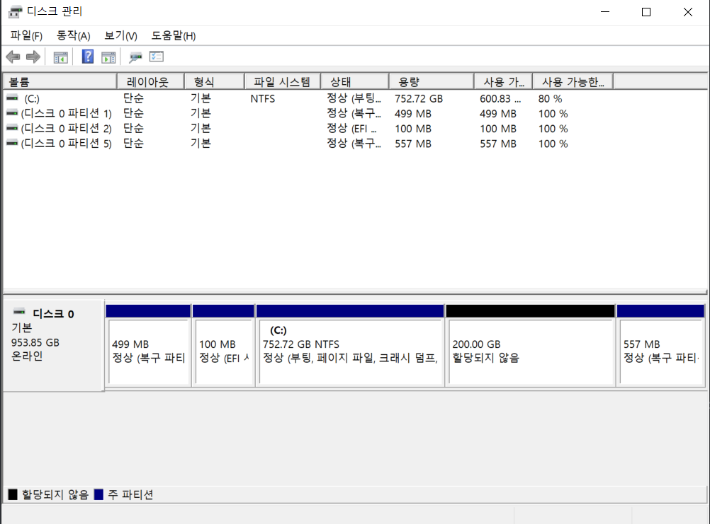

#### 기능 정리(기기별)

##### 적외선 센서

1. 움직임 감지
   1. 카메라 On
   2. 챗봇에게 전달 (인사해라)
2. 일정 시간 움직임 없을 경우 알림 전달


##### 스피커

1. 움직임 감지시 
2. 

# 오류  및 학습 모음

## 오류


## 학습

### TPU 란?

- CPU는 Central Processing Unit의 약자, GPU는 Graphics Processing Unit의 약자라면, TPU는 Tensor Processing Unit의 약자
- 구글에서 2016년에 발표한 데이터 분석 및 딥러닝 용 NPU를 모아놓은 하드웨어 (NPU = Neural Processing Unit 신경망처리장치. 인공지능 학습과 실행에 최적화된 프로세서)
- 왜 쓰는가? => 빠르니까(최신 GPU CPU보다 15배 이상 빠름)
- google의 오픈 소스인 TensorFlow에 맞게 제작된 맞춤형 회로


### Coral USB Accelerator 

- Edge TPU를 제공하는 USB 장치
- 호스트 컴퓨터와 연결되어 기계 학습 모델에 대한 추론을 가속화함

##### 사용법

- Edge TPU runtime 설치
  - windows에서는 Microsoft Visual C ++ 다운
  - 런파일.zip 압축 해제 후 install.bat 클릭
- TenseorFlow Lite 설치
  - tflite_runtime 라이브러리 설치
  - [참고사이트](https://www.tensorflow.org/lite/guide/python)
- 참고한 사이트
  - http://john-home.iptime.org:8085/xe/index.php?mid=board_JNvo38&document_srl=2248


### 낙상 방지 코드

- GPU가 따로 없으므로 분석을 CPU에서 할 수 있도록 바꿔줘야함
- 곳곳에 숨어있기 때문에 찾아서 해야함...
- requirements.txt 사용시 버전 지우기 (버전 때문에 오류남)
- main.py, load 함수에서 map_location 바꿔주기


### Coral 사용하기

- 파이썬 버전 3.7로 통일
- Microsoft Visual C++ 설치
- 최신 edge TPU zip 파일 다운 및 압축 해제
- install.bat 파일 실행
- pytorch 설치
- tensorflow lite 설치


## Linux 와 Ubuntu

> https://la-nube.tistory.com/190
>
> https://hanamon.kr/%EB%A6%AC%EB%88%85%EC%8A%A4%EB%8A%94-%EB%AC%B4%EC%97%87%EC%9D%B4%EA%B3%A0-%EC%9A%B0%EB%B6%84%ED%88%AC%EB%8A%94-%EB%AC%B4%EC%97%87%EC%9D%B8%EA%B0%80/
>
> https://unit-15.tistory.com/104

### Linux

- Linux는 UNIX 기반의 무료 오픈 소스 운영체제
- 리누스 토르발스가 출시한 운영체제 커널인 리눅스 커널에 기반을 둔 운영체제
  - 커널이란?
    - 운영체제의 핵심이 되는 프로그램의 하나로 시스템의 모든 것을 통제하며 운영체제의 다른 부분 및 응용프로그램 수행에 필요한 여러가지 서비스를 제공
    - 보안, 자원관리, 추상화 같은 역할을 함
    - 운영체제는 사용자 영역과 커널 영역으로 나누어져 있음
    - 사용자 영역은 사용자가 응용프로그램을 이용하기 위한 공간이며 커널 영역은 사용자 영역에서 사용자가 이용하는 프로그램을 안전하고 효율적으로 작동하기 위해서 컴퓨터의 자원들을 관리하는 영역
    - 메모리관리, 프로세스 관리, 장치 관리 등 컴퓨터의 모든 자원을 초기화하고 제어하는 기능을 수행
    - 리눅스는 커널, 셸, 디렉토리로 구성되어 있음

### Ubuntu

- 다양한 Linux 배포판(Red Hat, CentOS, Debian, Fedora, Linux Mint 등) 중 하나
  - 배포판 
    - 리눅스에서 수행할 수 있는 여러 종류의 프로그램을 모아놓은 것
    - 리눅스 프로그램은 제각각 작동할 수 있지만 두가지 이상의 프로그램이 만나서 주어진 일을 처리하는 경우도 잇음
    - 이처럼 상호작용이 잘되는 것들을 모아놓은 것이 배포판
    - 배포판 현황을 사람에 비유하면 리눅스에는 3대 명문 가문으로 데비안, 레드햇, 슬랙웨어가 있고 각 가문에 후손 격인 배포판들이 여러 개 있다.
- 데비안을 기반으로 만들어졌음. 즉, **배포판 중 하나인 데비안에서 또 한번 파생된 배포판**
- 캐노니컬 회사가 개발한 운영체제이며 Edubuntu, Kubuntu, Lubuntu 등 우분투를 바탕으로 하는 다양한 배포판들이 만들어졌음(이를 Ubuntu flavours 라고 함)
- APT를 이용하여 패키치를 관리하며 우분투용으로 빌드하거나 데비안용으로 빌드한 .deb 파일을 모두 사용할 수 있음
- Ubuntu Server와 Desktop 버전이 있으며 Server는 CLI를 Desktop은 GUI를 제공한다.

### Debian 

- 개발자들이 자발적으로 모여 만든 리눅스 기반 운영체제
- 우분투와 다르지 않게 APT를 패키지 및 소프트웨어 관리자로 사용하고 있음
- 우분투의 핵심 유틸리티는 데비안에서 나왔음
- 우분투에 비해 상대적으로 더 자유로움(우분투는 법인에 의해 배포되므로 수익이 필요함)
- .deb 파일을 다운로드하여 직접 설치할 수 있음. 우분투용으로 빌드한 .deb 파일은 사용할 수 없는 경우가 많음
  - 데비안은 안정성에 중점을 둔 운영체제라서 안전성의 검증이 덜 된 최신의 패키지는 사용하지 않거나 안정성이 검증된 이전 버전을 이용하는 경우가 많기 때문
  - 과장을 보태 새로 나온 것들은 전혀 안돌아간다고 할 정도
- 안정성을 매우 중시하는 리눅스 배포판
- 안정성을 매우 중요시여기기에 서버 쪽에서 상당한 인기를 끌고 있음


### Linux 명령어

| 명령어                                                       | 기능                                                         | 옵션                                                         | pwsh 명령어                                                  | pwsh 옵션                                                    |
| ------------------------------------------------------------ | ------------------------------------------------------------ | ------------------------------------------------------------ | ------------------------------------------------------------ | ------------------------------------------------------------ |
| man [명령어]                                                 | 특정 명령어의 매뉴얼을 출력함                                |                                                              |                                                              |                                                              |
| clear                                                        | 터미널에 있는 내용 모두 지우기                               |                                                              |                                                              |                                                              |
| pwd                                                          | 내가 현재 있는 곳의 전체 경로를 출력                         |                                                              |                                                              |                                                              |
| ls                                                           | 현재 경로에 어떤 폴더와 파일들이 있는지 확인                 | `-l` : 파일에 대한 더 상세한 정보 확인 가능<br />`-a` : 숨겨진 항목도 확인 가능<br />같이 사용하려면? → `-la`<br />`폴더이름` : 해당 폴더 내부의 내용 확인 |                                                              | `-name`: 간단하게 이름만 확인 <br />`-force`: 숨김 파일 포함 확인 |
| open [경로]                                                  | 해당 경로의 디렉토리 혹은 파일 실행                          |                                                              | explorer                                                     |                                                              |
| cd [경로]                                                    | 경로 이동                                                    | `~`: 홈 디렉토리 즉, 최상위 경로로 이동 <br />`-`: 바로 이전에 있었던 경로로 이동 (==Ctrl+Z) <br />`..`: 상위 디렉토리 |                                                              |                                                              |
| find [경로]                                                  | 특정 경로 (주로 현재 위치 사용)에 옵션으로 지정한 파일이 있는지 확인<br />예시<br /> - find . -type file -name "*.txt" <br />- find . -type directory -name "\*2" | `type`: file, directory 등 찾고자 하는 파일 타입 <br />`name`: 찾고자 하는 파일의 이름 표현식 | get-childitem<br /><br />예시<br />get-childitem -Directory -Filter "*2" | `-File`: type이 파일인 것만 탐색 <br />`-Directory`: type이 폴더인 것만 탐색 <br />`-Filter`: 이름에 대한 조건 표현식 작성 <br />`-Recursive`: 하위 폴더로 계속 내려가도록 설정 |
| which [프로그램명 or 명령어명]                               | 내가 지금 실행하고자 하는 프로그램의 실행 경로를 확인할 수 있음 |                                                              | get-command <br />또는 <br />gcm                             |                                                              |
| touch [파일이름]                                             | 해당 이름의 파일이 없으면 새로운 파일 생성, 있으면 수정날짜 업데이트 |                                                              |                                                              |                                                              |
| cat [파일1이름] [파일이름2] ...                              | 파일 안의 내용 확인 가능                                     |                                                              | new-item [파일명]                                            |                                                              |
| echo                                                         | 문자열 출력                                                  | `> [파일명]`: 새로운 파일을 생성하고 입력한 문자열을 해당 파일의 컨텐츠로 덮어씌워줌<br />`>> [파일명]`: 입력한 문자열을 해당 파일에 추가 |                                                              |                                                              |
| mkdir [폴더 이름]                                            | 폴더 생성                                                    | `-p [경로]`: 원하는 경로 작성시 경로에 필요한 모든 폴더 생성 |                                                              |                                                              |
| cp [파일명] [경로]                                           | 지정한 경로에 해당하는 파일 복사                             |                                                              |                                                              |                                                              |
| mv [파일명] [경로]                                           | 지정한 경로에 해당하는 파일 이동                             |                                                              |                                                              |                                                              |
| rm [파일명]                                                  | 해당 파일 삭제                                               | `-r`: 폴더 삭제시 사용                                       |                                                              | `-Recurse`: 폴더 삭제(가장 뒤에 입력)                        |
| grep [검색키워드] [파일 또는 경로(표현식)]                   | 지정한 파일 내에 키워드가 있는지 검색                        | `-n`: 몇번째 줄에 있는지도 확인 가능<br />`-i`: 대소문자 상관없이 검색<br />`-r`: 해당 경로 포함 및 하위 디렉토리 검색 | select-string [경로 혹은 파일]                               | `-pattern`: 검색 키워드 (맨 뒤에 입력)<br />`-CaseSensitive`: 대소문자 구분 하여 검색 |
| export [변수명]="원하는내용"                                 | 환경 변수 설정. 환경 변수 설정 후 `$환경변수명` 형식으로 터미널이나 PC에서 사용 가능<br />예시<br />export MY_DIR="dir1" |                                                              | $env:[변수명] = "원하는 내용"<br /><br />환경변수 사용시<br />$env:변수명 |                                                              |
| env                                                          | 모든 환경 변수 출력                                          | ls env:                                                      |                                                              |                                                              |
| unset [환경변수명]                                           | 지정된 환경변수 삭제                                         | $env:변수명 = ""<br />빈값을 넣어줘야함                      |                                                              |                                                              |
| \|                                                           | 두개의 명령어 순차적으로 적용<br />예시<br />cat "aa.txt" \| grep "apple" |                                                              |                                                              |                                                              |
| history                                                      | 내가 사용했던명령어 출력                                     |                                                              |                                                              |                                                              |
| chomd [변경사항] [파일명]                                    | 권한 변경<br />                                              |                                                              |                                                              |                                                              |
| head [파일명]                                                | 파일의 첫 라인부터 약 10개의 라인 출력                       | 라인 수 조정 가능                                            |                                                              |                                                              |
| tail [파일명]                                                | 파일의 마지막 라인부터 약 10개의 라인 출력                   | `-f`: 파일마지막 부분에 데이터가 추가되는 즉시 출력 (디버깅 혹은 데이터값 확인에 자주 사용) |                                                              |                                                              |
| less [파일명]                                                | 파일을 열고 내용을 볼 수 있는 뷰어 기능                      |                                                              |                                                              |                                                              |
| tar cvfz [압축파일명] [압축하고자 하는 파일 데릭토리1] [디렉토리 or 파일2] [디렉토리 or 파일3] | 파일과 디렉토리를 압축                                       |                                                              |                                                              |                                                              |
| tar xvfz [파일명]                                            | 압축 해제                                                    |                                                              |                                                              |                                                              |
| sudo [명령어] [옵션]                                         | root는 슈퍼관리자로 시스템의 중요 자원을 변경하기 위해서는 root 권한으로 작업해야함<br />이러한 root의 권한을 부여하는 명령어 | `sudo vi /etc/sudoers` 명령어로 루트 권한을 부여할 계정을 등록해야함f |                                                              |                                                              |
| chown [소유자]:[그룹명] [소유자나 그룹명을 변경할 파일이나 디렉토리] | 소유자와 그룹 변경                                           |                                                              |                                                              |                                                              |
| top                                                          | 운영적인 서버의 CPU나 메모리 상태를 확인할 수 있음           | `-d`: 갱신 시간 조정                                         |                                                              |                                                              |
| w                                                            | 현재 Linux 장비에 접속한 사용자 확인 (who는 간단한 내용 출력) |                                                              |                                                              |                                                              |
| ps                                                           | 현재 Linux 서버에 구동중인 프로세스 정보를 출력 <br />즉, 실행중인 파일이 무엇인지 알아보는 명령어 | `-ef`: 모든 프로세스 출력<br />파이프라인과 grep을 같이 사용하기도 함 |                                                              |                                                              |
| kill -9 [프로세스 ID]                                        | 프로세스를 강제로 중단시키는 명령어<br />해당 프로세스가 본인 소유이거나 root 권한이여야만 동작 | `-9`:                                                        |                                                              |                                                              |
| adduser [계정이름]                                           | 사용자 계정 추가 (sudo 필요)                                 |                                                              |                                                              |                                                              |
| su -l [계정명]                                               | 계정 변경                                                    |                                                              |                                                              |                                                              |
| deluser                                                      | 사용자 계정 삭제 (sudo 필요)                                 |                                                              |                                                              |                                                              |
| uname                                                        | 시스템 정보 출력                                             | `-a`: 더 상세한 정보 출력                                    |                                                              |                                                              |
| hostname                                                     | 서버의 별명 출력                                             |                                                              |                                                              |                                                              |
| reboot                                                       | 재부팅 (sudo 필요)                                           |                                                              |                                                              |                                                              |
| halt                                                         | 셧다운                                                       | `-p`: 전원까지 셧다운                                        |                                                              |                                                              |
|                                                              |                                                              |                                                              |                                                              |                                                              |

- 권한이란?
  - 형식 : O OOO OOO OOO
  - 각 부분 : 파일타입(file=`-`, directory=`d`, link=`l`), 소유자의 권한, 그룹의 권한, 타인의 권한
  - 권한은 rwx (읽기, 쓰기, 실행)
  - rwx를 이진수로 표현
    - 예시
      - 읽기 권한이 있다 r--. 따라서 2의 2제곱 == 4
      - 읽기와 실행 권한이 있다. r-x. 따라서 2의 2제곱 + 2의 0제곱 = 5
  - 이진수 사용이 싫다면 `chomd [u 또는 g 또는 o] [+ 또는 -] [r 또는 w 또는 x]` 으로 사용
  - 이진수라면? `chomd 666` 처럼 사용
- vim 에서 명령어
  - `w`: 저장
  - `q`: 나가기
    - 저장하면서 나가기 == `wq`
  - `i`: Insert 모드 진입
  - `ESC`: Insert 모드 종료
  
  

## 우분투 듀얼부팅

> 1. 파티션 줄이기
> 2. 우분투 리눅스 설치용 USB 만들기

### 1. 파티션 줄이기

- 기존의  파티션을 분할하여 새로운 OS를 설치할 파티션을 만들어야함

- `window`+`R`로 실행창을 열고 `diskmgmt.msc` 입력 후 실행

  - 혹은 시작메뉴에서 `하드 디스크 파티션 만들기 및 포맷` 검색 후 실행
  - 디스크 관리 실행됨

- C 드라이브 (혹은 분할할 파티션)을 선택 후 우클릭 → 볼륨 축소 클릭 → 축소할 공간 입력 (MB 단위)

  - 사이즈는 모든 자료마다 달라서 우선 200GB 정도로 설정함

- 완료 

  


### 2. 설치 USB 만들기

#### Ubuntu ISO 파일 다운로드 (20.04버전)

- 공식 페이지에서 다운로드해도 도지만 Ubuntu 홈페이지에서 공식적으로 안내하는 Mirror 사이트를 이용하면 빠르게 다운 가능 (한국에서는 Kakao)
- 공식 페이지에서는 시간이 오래걸린다고 함
- [미러 페이지](https://mirror.kakao.com/ubuntu-releases/)로 이동
- 안전을 위해 20.04 버전 설치

#### Rufus 설치

> Rufus는 USB 메모리 및 플래시 드라이브를 포맷하고 부팅할 수 있도록 만드는 도구
>
> 언제 사용?
>
> - 부팅 가능한 ISO 파일을 USB로 설치해야 할 때
> - OS가 설치되지 않은 시스템에서 작업해야 할 때
> - DOS 환경에서 BIOS나 기타 펌웨어를 설치해야 할 때
> - 로우포맷 유틸리티를 실행해야 할 때

- 공식 홈페이지에서 다운로드 
  - 포터블 버전으로 다운로드 
  - 설치판을 사용할 경우 레지스트리에 프로그램을 등록하게 되는데 이 레지스트리 항목이 늘어나면 늘어날 수록, 시스템의 불안정과 성능 저하의 가능성이 높아지기 때문이라고 한다.
  
- 다음과 같이 설정

  - 

  - 파티션 구성, 포맷 옵션 등에 대한 설명
    - [내 BIOS 확인하기](https://forbes.tistory.com/582), [부팅 방법 차이](https://zkim0115.tistory.com/514), [포맷 차이](https://m.blog.naver.com/myrikason/221353874580)
  
  - ISO Hybrid 이미지 설정은 권장 옵션 선택 (ISO 이미지 모드로 쓰기)
  
  - USB 삭제 내용 확인
  
  - 실행

### 3. 부팅

- BIOS 설정 진입
  - Boot 설정에서 USB를 가장 위로 이동 (우선순위를 1순위로 변경)
    - Boot Priority 메뉴

  - UEFI 펌웨어이므로 Secure Boot 해제 필요
    - Secure Boot 비활성화 후 UEFI 모드로 설정
    - 만약 UEFI 펌웨어가 아니면 필요 없는 과정

  - 저장 후 나가면 Ubuntu 설치 시작

- 언어 설정(한국어) → 키보드 설정(추후 변경 가능)
- 업데이트 및 기타 소프트웨어
  - 기타 설정 모두 선택 (만약 secure boot 설정 안했으면 밑에 비밀번호 입력란 뜨므로 다시 설정할 것)

- **설치 형식**
  - 남은 공간 (파티션 분할시 설정한 공간) 선택 후 하단에 + 버튼 클릭(파티션 만들기 버튼)
  - 다음과 같이 옵션 지정 후 OK 클릭
    - 크기: 최대치
    - 새 파티션의 종류: 주
    - 새 파티션의 위치: 이 공간이 시작하는 지점
    - 용도: EXT4 저널링 파일 시스템
    - 마운트 위치: /

  - 부트로더를 설치할 위치
    - 기본적으로 자동 지정됨
    - 윈도우와 우분투가 Legacy인지 UEFI인지 통일되지 않으면 오류 발생 가능
    - Legacy 바이오스 환경이라면 윈도우가 설치된 디스크의 최상단으로 지정
    - UEFI 바이오스 환경이라면 윈도우 부트 매니저가 설치된 EFI 형식의 파티션 지정

  - 선택한 파티션에 포맷 체크 되어있는지 확인하고 지금 설치 클릭
  - 계속하기

- 개인 설정
  - 지역 설정
  - 이름 및 비밀번호 설정

- 설치 완료시 재부팅
  - 재부팅 할 때 안내 문구 뜨면 USB 제거하고 Enter 클릭

- 이후, 컴퓨터 재부팅시 window boot manager를 선택하면 window가 ubuntu를 선택하면 ubuntu 실행


### 4. 기타

- 크롬 설치
  - `wget https://dl.google.com/linux/direct/google-chrome-stable_current_amd64.deb`
  - `sudo apt install ./google-chrome-stable_current_amd64.deb`
- curl 설치 
- apt 미러 설정 (카카오로)
  - `sudo sed -i 's/kr.archive.ubuntu.com/mirror.kakao.com/g' /etc/apt/sources.list`
- 마크다운, vscode 설치
- pip 설치
  - `sudo apt-get install python3-pip`
  - `sudo apt-get install python3-venv`


## wget 

> wget은 웹에서 파일을 다운로드하기 위한 명령줄 유틸리티 (GNU 프로젝트의 일부)
>
> HTTP,HTTPS 및 FTP 프로토콜을 사용하여 파일을 다운로드 할 수 있음

#### 명령어

- 설치

  ```bash
  sudo apt install wget
  ```

- 기본구문

  ```bash
  wget [옵션] [url]
  ```

  - url 은 다운로드하거나 동기화할 파일 또는 디렉토리의 URL

  - 옵션 지정없이 사용할 경우 현재 디렉토리에 다운

- 옵션

  - `-O [파일명]`: 다운로드 할 파일 다른 이름으로 저장
  - `-P [경로]`: 지정한 위치에 저장

  - `-c`: 파일을 다운로드하는 동안 연결이 끊긴 경우 끊긴 부분부터 다시 다운로드를 시작
  - `-b`: 백그라운드에서 다운로드
  - `-i [경로]`: 여러 파일 한번에 다운로드하기. 다운로드할 URL 목록이 포함된 로컬 또는 외부파일의 경로를 작성해야하며 각 파일 목록은 별도의 줄에 있어야함

## apt-get

> 데비안 계열의 리눅스에서 쓰이는 패키지 관리 도구
>
> apt는 apt-get, atp-cache에서 가장 일반적으로 사용되는 명령어들을 모아놓은 것
> 즉, apt-get은 apt보다 훨씬 많은 옵션과 기능을 갖고 있으나 apt가 더 깔끔하고 예쁘게 출력됨
>
> 결론은 별 차이 없음 (apt가 더 최신...느낌?)
>
> apt를 이용해 설치된 .deb 패키지는 `/var/cache/apt/archive/`에 설치됨

#### 명령어

- update

  ```bash
  sudo apt-get update
  ```

  - 레포지토리에 `새로 추가된 패키지`, `변경된 패키지 정보` 등을 업데이트 시킴

- upgrade

  ```bash
  sudo apt-get upgrade
  ```

  - 현재 설치된 모든 패키지를 업그레이드

  - 특정 패키지만 업그레이드하고 싶다면?

    ```bash
    sudo apt-get upgrade [패키지명]
    ```

  - 의존성 검사와 업그레이드 동시 진행

    ```bash
    sudo apt-get dist-upgrade
    ```

    

- install

  ```bash
  sudo apt-get install [패키지명]
  ```

  - 패키지 설치
  - 패키지 이름을 일부만 입력한 후 TAB 입력시 해당 글자로 시작하는 패키지 확인 가능
  - `--reinstall` : 재설치 옵션

- remove

  ```bash
  sudo apt-get remove [패키지명]
  ```

  - 패키지 삭제
  - 패키지 이름을 일부만 입력한 후 TAB 입력시 해당 글자로 시작하는 패키지 확인 가능

- purge

  ```bash
  sudo apt-get purge [패키지명]
  ```

  - 패키지 뿐 아니라 패키지 관련 설정 파일 모두 삭제
  - remove는 패키지만 삭제

- autoremove

  ```bash
  sudo apt-get autoremove
  ```

  - 불필요한 의존성 패키지 모두 삭제
  - 더 이상 사용되지 않는 패키지들 정리

- apt-cache는 검색, 조회에 사용됨

  - `sudo apt-cache search [패키지명]`: 패키지 검색
  - `sudo apt-cache show [패키지명]` : 패키지 정보 보기


## Ubuntu 22.04 에서의 Python 버전 문제

> Edge TPU 사용시 쓰이는 Pycoral 라이브러리는 Python3.6-3.9 에서만 사용 가능
>
> BUT, Ubuntu 20.04의 기본 Python이 3.8인 반면 Ubuntu 22.04는 3.10이라서 Pycoral 설치 불가
>
> 이를 위해, Ubuntu 22.04에서의 Python 버전을 변경해야함
>
> - but, ubuntu에 기본적으로 설치되어 있는 python에는 운영체제 관련 많은 디펜던시가 있음
> - 따라서, 해당 python을 고칠 경우 운영체제 전체에 문제가 생겨버림
>   - 실제, 부팅화면에서 넘어가지 않아서 ubuntu-desktop을 재설치한다던지, 설치되어있던 크롬이 없어진다던지, 터미널이 삭제된다던지 등의 문제가 있었음
> - 이를 해결하기 위해, 기본적으로 설치되어 있는 python을 건드리지 않고, 가상환경 내에서 새로운 파이썬을 설치하고, 해당 파이썬에 맞는 Pycoral을 받을 수 있도록 해야함

### 1. 가상환경 내에 새로운 파이썬 사용

> 일단 pip가 있는지 확인해봐야함! 

- ```bash
  pip3.8 install virtualenv --user
  ```

  - pip가 root 에 있다면 `--user` 삭제, 로컬에 있다면 사용
  - 위 코드로 진행할 경우 가상환경은 기본적으로 python3.8을 인터프리터로 함

- ```bash
  virtualenv [가상환경명] --python=python3.8
  ```

  - 가상환경 생성하기
  - 지정한 버전으로 파이썬 작동됨

- ```bash
  source [가상환경명]/bin/activate
  ```

  - 가상환경 작동시키기


### 2. pycoral 설치

- 만약 apt-get을 사용할 경우, root 폴더를 기준으로 하여 의존성 문제가 발생할 수도 있음.
  - 아직 테스트 안해봄
- 따라서, pip를 사용하여 pycoral을 설치하는데, 이때, window를 위해 주어진 코드를 사용해보자


